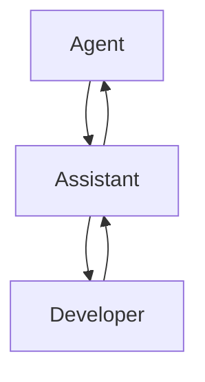
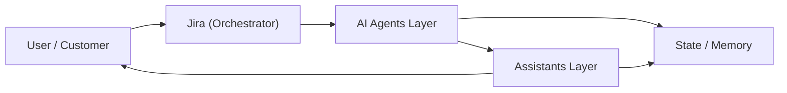
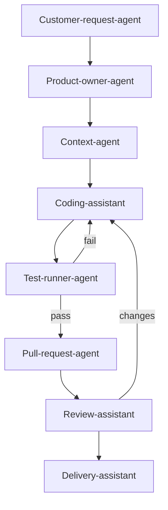
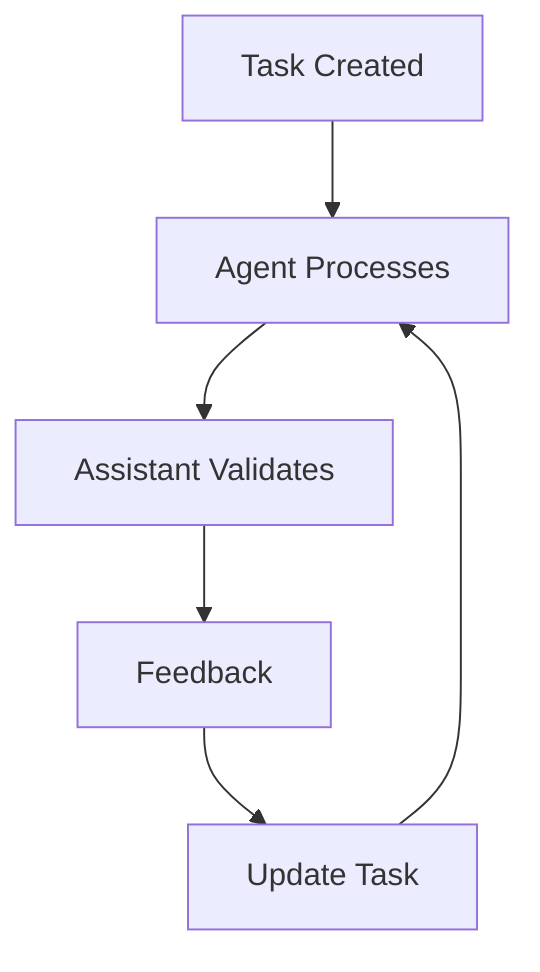
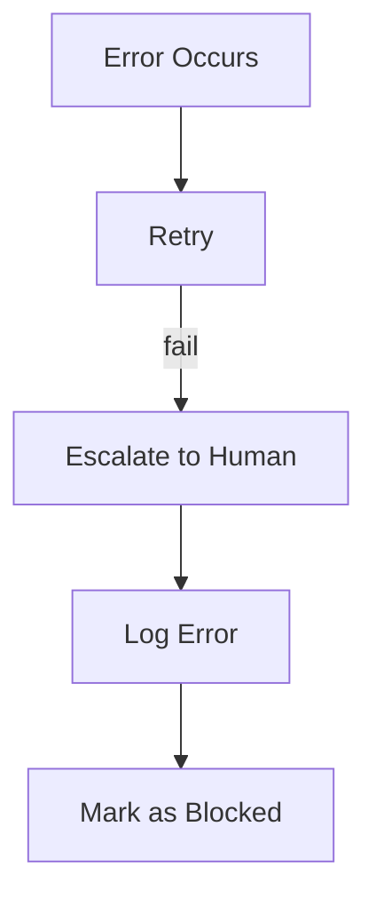
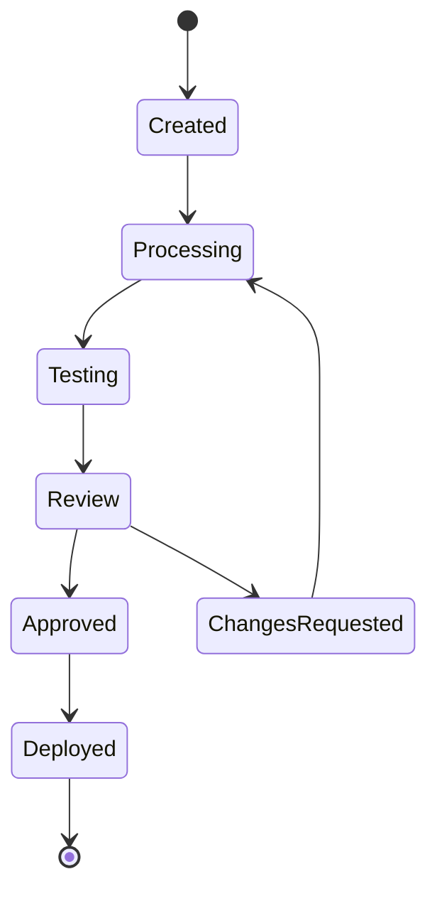

#  LEVEL 2 — Advanceret

## Struktureret Agent-arkitektur

Når systemet vokser, introducerer man en **pipeline af agenter og assistenter**.

---

##  Definitioner

| Rolle                                 | Beskrivelse                                                                                                                                                                                                                                                                                                                                                                                                 |
| ------------------------------------- | ----------------------------------------------------------------------------------------------------------------------------------------------------------------------------------------------------------------------------------------------------------------------------------------------------------------------------------------------------------------------------------------------------------- |
| Agent                                 | Automatisk, regelstyret, kører autonomt og er ansvarlige for et specifikt, afgrænset output. De har adgang til definerede ressourcer (kodebase, databaser, scripts) og handler inden for deres SKILL.md-kontrakt. Eksempler: customer-request-agent, TDD-agent, test-runner-agent, pull-request-agent.                                                                                                      |
| Assistant                             | Det er en co-pilot-agenter, der kræver menneskelig godkendelse på kritiske beslutninger. De præsenterer muligheder, forbereder udkast og oversætter teknisk output til forståeligt format. Eksempler: coding-assistant, review-assistant, delivery-assistant.                                                                                                                                               |
| Pipeline                              | Kæde af processer                                                                                                                                                                                                                                                                                                                                                                                           |
| Orchestrator                          | Starter flow og koordinerer flows. I praksis er det typisk løsninger som f.eks. Jira, en event-bus eller en timer, der trigger pipelines. Orchestratoren kender hele flowet, men udfører ingen opgaver selv — den delegerer til agents- og assistants-laget.                                                                                                                                                |
| State/ Memory                         | Persistenslag som alle agenter og assistenter kan læse og skrive til. Det gemmer opgave-historik, estimater, kodekontekst og beslutninger. Jo mere systemet kører, jo bedre bliver det — estimater, forslag og diagnostik forbedres automatisk over tid.                                                                                                                                                    |
| Shared Agent Protocol (SAP eller A2A) | Et fælles kommunikationsformat som alle agenter og assistenter taler. ASP definerer payload-struktur, fejlhåndtering og kontekst-overlevering. Uden en fælles protokol ville hver agent skulle håndtere kommunikation individuelt — ASP er limet i multi-agent-systemet.                                                                                                                                    |
| MCP (Model Context Protocol)          | Fokuserer på hvordan en Agent har adgang til redskaber og data.<br>Det kan være eksterne redskaber, og nye informationer udenfor deres originale træningsdata. <br>En MCP kan sættes op til et sikkert og lukket miljø, hvor der ikke deles information ud. Dette skal implementeres som en del af sikkerheden for MCP'en, for f.eks. at sikre TLS, for at sikre mod on-path angreb og reverse engineering. |
| Bruger / Kunde                        | Brugeren er både trigger og modtager. En kunde opretter en opgave (trigger), og modtager et valideret resultat til sidst (output). Udvikleren og PO er interne brugere der interagerer med assistents-laget undervejs — f.eks. godkender PR eller prioritering.                                                                                                                                             |

---
##  Human-in-the-loop



 Kritisk for kvalitet og sikkerhed, fordi det kræver menneskets overview på situationen. Agenter handler automatisk, Assistants hjælper --> Mennesket beslutter. 

Et loop kan gøres fuldt automatisk med kun Agenter, men det springer menneske-input over, hvor man mister muligheden for at opdage fejl, eller kontekst som AI'en ikke forstår. 

---

##  Eksempel: System Arkitektur



---

##  Eksempel: Development Flow (TDD)




| Handling                     | Beskrivelse                                                                                                                                                                                                                                                                                                                                                                     |
| ---------------------------- | ------------------------------------------------------------------------------------------------------------------------------------------------------------------------------------------------------------------------------------------------------------------------------------------------------------------------------------------------------------------------------- |
| Customer Request             | Modtager Jira-opgaven og skaber et struktureret payload med:<br>*Jira-task { title, description, labels } OUTPUT: StructuredSpec { domain, modules[], language, priority }*                                                                                                                                                                                                     |
| PO-Agent                     | Analyserer Jira-payload, evaluerer scope og opgaven risici. Samler dokumentation og historiske sprints fra State/ Memory, sender prioriteret kontekst-opgave videre:<br>*INPUT: StructuredSpec OUTPUT: ContextPackage { value_score, risk_level, refs[] }*                                                                                                                      |
| Context Agent                | Finder det relevante kodeafsnit, API-dokumentation og dependencies fra kodebasen. Den bygger en kompakt kontekst-pakke til Coding-Assistant, så mennesket der bruger CA, ikke skal manuelt navigere koden. <br>*INPUT: ContextPackage OUTPUT: EnrichedContext { files[], apis[], patterns[] }*                                                                                  |
| Coding-Assistant (CA)        | Implementationsforslag præsenteres til udvikleren. Udvikleren laver review, justerer og godender. Det kan kun sendes videre som godkent, ved manuelt input. <br>*INPUT: EnrichedContext OUTPUT: CodeDraft { files[], tests[], notes[] }*                                                                                                                                        |
| TDD-Agent/ Assistent (TDD-A) | TDD-Agenten skriver testene ud fra CA's CodeDraft. Udvikleren er enten med manuelt hvis dette sker via en Assistent, ellers køres det automatisk gennem et loop i en isoleret sandkasse. Godkendes testene, sendes output videre til PR-Agenten. Ved fejl, sendes det tilbage til CA, loop gentages. <br>*INPUT: CodeDraft OUTPUT: TestReport { status, failures[], coverage }* |
| PR-Agent                     | Ud fra det godkendte produkt fra TDD-A, oprettes der automatisk en Github/Jira PR, med beskrivelser og kodeændringerne. Det kan bla. tagges med holdets reviewers, så de får besked om ændringerne.<br>*INPUT: TestReport (pass) OUTPUT: PullRequest { url, reviewers[], summary }*                                                                                             |
| Review-Assistant (RA)        | Bruger reviewers en RA, gennemgår den PR for sikkerhedsproblemer og ydeevne. Dets fund præsenteres til revieweren der bruger RA'en. Hvis reviewer finder områder der skal ændres, sendes koden tilbage til CA.<br>*INPUT: PullRequest OUTPUT: ReviewDecision { action: approve\|changes, comments[] }*                                                                          |
| Delivery-Assistant           | Hjælper brugeren med at lave stakeholder-relevant kommunikation, release notes, statusopdateringer eller generelt summary. Sprog og detaljeniveau kan tilpasses til modtageren. PO godkender inden det sendes. <br>*INPUT: PullRequest OUTPUT: ReviewDecision { action: approve\|changes, comments[] }*                                                                         |


---

## Eksempel: Feedback Loop (kritisk)



 Systemet er ikke lineært – det **forbedrer sig selv løbende**. Tests kan fejle, derfor er der reviewers på opgaven, så de kan kræve rettelser. Det er et kontinuerligt feedback-loop, der kan gøre systemet mere robust over tid. 

---
### Fejlen: 
Testen fejler: der bliver automatisk lavet et nyt forsøg. Derefter eskaleres fejlen til menneske-review + der laves en log på fejlen. 



Når fejlen sker er det en subjektiv vudering af Agenten der sker - måske er det en triviel fejl, den hurtigt selv kan løse/ forslå et fix, og tilføje en beskrivelse på, der sendes videre til CA. 

Trivielle fejl kan gøres simple, og det der kræver opmærksomhed prioriteres.


```
Eksempel på regler for fejlhåntering og retry:
Retry 1 → Immediate
Retry 2 → 2 sek delay
Retry 3 → 10 sek delay
Retry 4 → Escalate
```

En fejl er fundet på andet forsøg i koden, hvor der mangler et null-check. Første forsøg forstår Agenten måske ikke helt kontekst af fejlen, men nu kan der laves en log på den:

```
{
  "error_type": "NullPointerException",
  "location": "UserService.java:42",
  "probable_cause": "Missing null check",
  "confidence": 0.87,
  "suggested_fix": "Add null guard"
}
``` 

Udvikleren kan tage stilling til fejlen, ændre eller instrukere at det skal ignores.

PO har måske lagt mærke til en høj retry-rate på fejlene via logging. PO ved der er noget specifikt dumt i koden, det kunne foresage dette, og kan oplyse udvikleren. Hverken PO eller udvikler bruger ekstra tid på den, og Agenten instrueres til at ignorer den. 

Måske ser PO, at fejlene indikerer der mangler definationer på scope, og acceptance kriterierne er svage. Det kan nu indarbejdes i processen og tage hånd om. 

--- 
##  TDD Agent Struktur

```
tdd-agent/
├── SKILL.md
├── scripts/
├── references/
└── assets/
```


## Eksempel: TDD-A SKILL.md

```
# Agent Name: TDD Test Agent

## Purpose
Generate and validate tests using TDD

## Capabilities
- Generate unit tests
- Execute tests
- Create reports

## Allowed
- Read code
- Run scripts
- Write reports

## Forbidden
- Modify production code
- Deploy
```

Hver Agent skal defineres i et SKILL.MD - TDD-A og RA kan og skal, ikke løfte de samme opgaver, fordi de skal forblive unikke. SKILL.MD beskriver hvad Agenten / Assistant må/ ikke må, hvad den kan/ ikke kan, og hvad dets output skal være. 
Det er det mest fundamentale for governance og kontrol. 

- Forbidden sektionen er kritisk: afgrænsningen sørger for at agenten, IKKE gør ting den ikke må - uanset hvad prompt instruktioner er. Det er bla. med til at sikre mod menneske-i-loopet fejl. 

## Eksempel RA: SKILL.MD

``` 
Eksempel til: SKILL.MD 
## Constraints
- Deterministic tests only
- No external API dependency

## Metrics
- Coverage ≥ 80%
- Runtime < threshold

## Failure Handling
- Structured error output
- Suggest next action

## Risk Threshold
- Trigger on Global indicators
- Trigger on inappropiate content
  
```

Review Agenten kunne være en Supervisor der handler automatisk på lav-risiko beslutninger, men kontinuerligt pauser og beder om input fra mennesket om godkendelse, hvis der er høj-risiko situationer. (Code review, backlog-estimering, runtime-deployment til staging.)

---

## State Machine 

Hele vejen igennem processen, skal der være status på kontrol af systemets opførsel, hvad der sker og *hvad der må ske*. 

| Regler       | Beskrivelse                                                                                                                         |
| ------------ | ----------------------------------------------------------------------------------------------------------------------------------- |
| Workflow     | Der er skabt formel konstrast mellem: Orchestrator, Agents, Assistants og State/Memory                                              |
| State        | Det nuværende State er udgangpunktet for resten af pipeline. Koden og testene er hvor de er, og derfor er det reglerne for fremgang |
| Agents       | Kan kun forholde sig til nu, og regler opsat for dets interaktioner                                                                 |
| Assistants   | --/--                                                                                                                               |
| Orchestrator | --/--                                                                                                                               |




```
Testing (meta-state)
  ├── UnitTesting
  ├── IntegrationTesting
  └── PerformanceTesting
```

For at undgå et overkompliceret system, kan states grupperes, så det blive uoverskueligt for udvikler/ AI. Den type gruppering (Meta). Når der udvikles og skabes nyt på en løsning, indgår det i den nye state. 

TDD-A forstår at der skal være en >80% test coverage, og at det ikke kan godkendes, hvis den metric ikke bliver opfyldt. 

Hele vejen igennem kæden, er der states der skal opfyldes, for at noget kan videregå til det næste led. Det sikrer transistionerne, løsningen (skarlerbarheden, debugging osv) og sikkerheden generelt. Det hindrer også uforudsigelig adfærd, og kan hjælpe med at finde skjulte fejl. 

Som udgangpunkt skal rækefølgen være: 
- States defineres 
- Regler defineres 
- Agenter tilføjes


## SkillToolset

For at binde det hele sammen, er der formuleret et Python pseudo SkillToolset (se fil af samme navn). 

| Skill	| Maps to | 
|-------------------------| -------------------------| 
| customer_request_skill |	Customer-request-agent|
| po_agent_skill |	Product-owner-agent |
| context_agent_skill |	Context-agent |
| coding_assistant_skill |	Coding-assistant (human-in-loop) |
| tdd_agent_skill	| TDD-agent (retry logic + sandkasse) |
| pr_agent_skill |	Pull-request-agent |
| review_assistant_skill |	Review-assistant (supervisor pattern) |
| delivery_assistant_skill |	Delivery-assistant (PO-godkendelse) |

