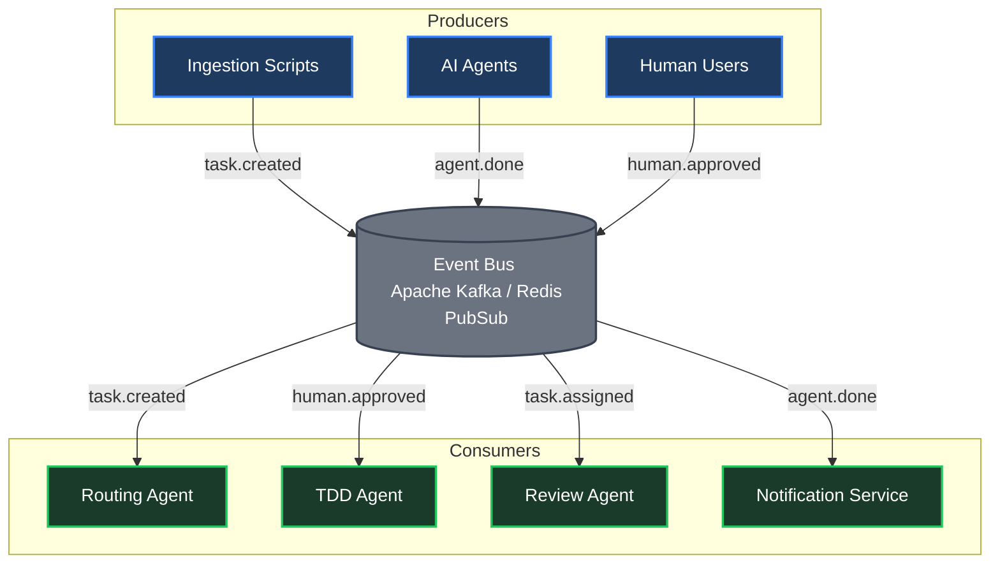
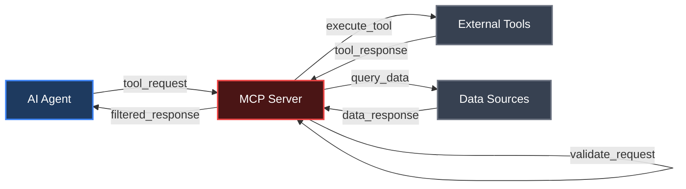
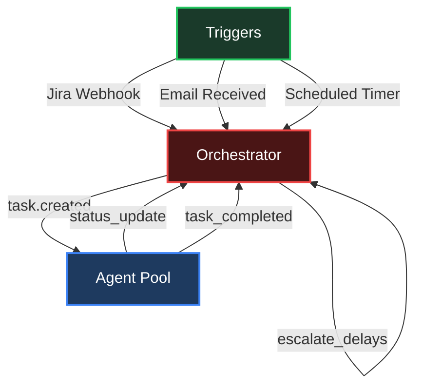
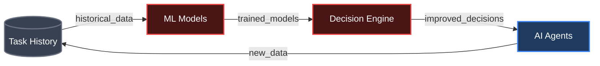
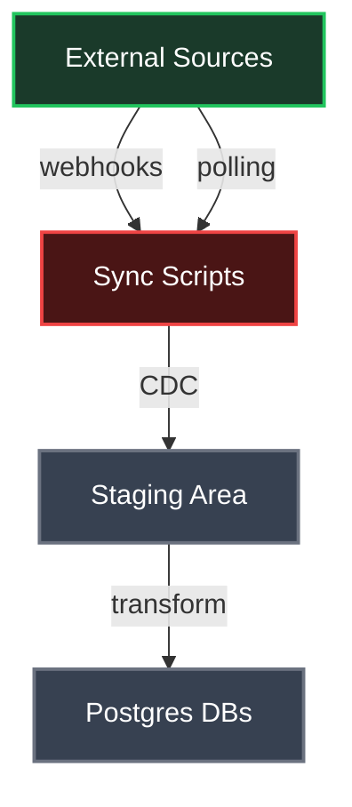
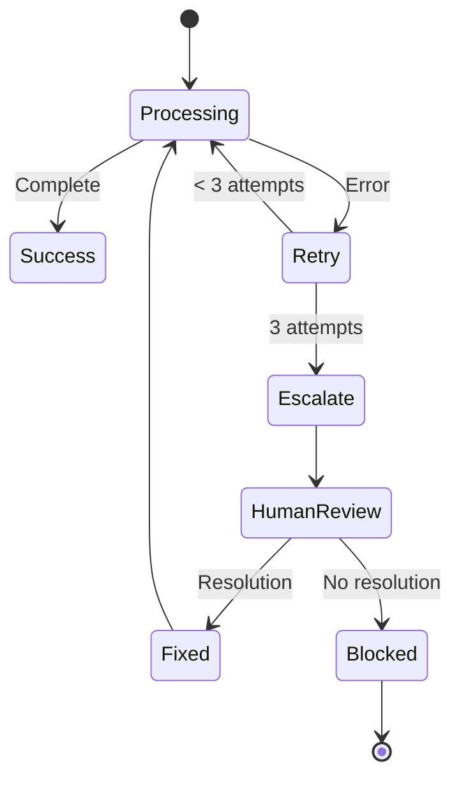
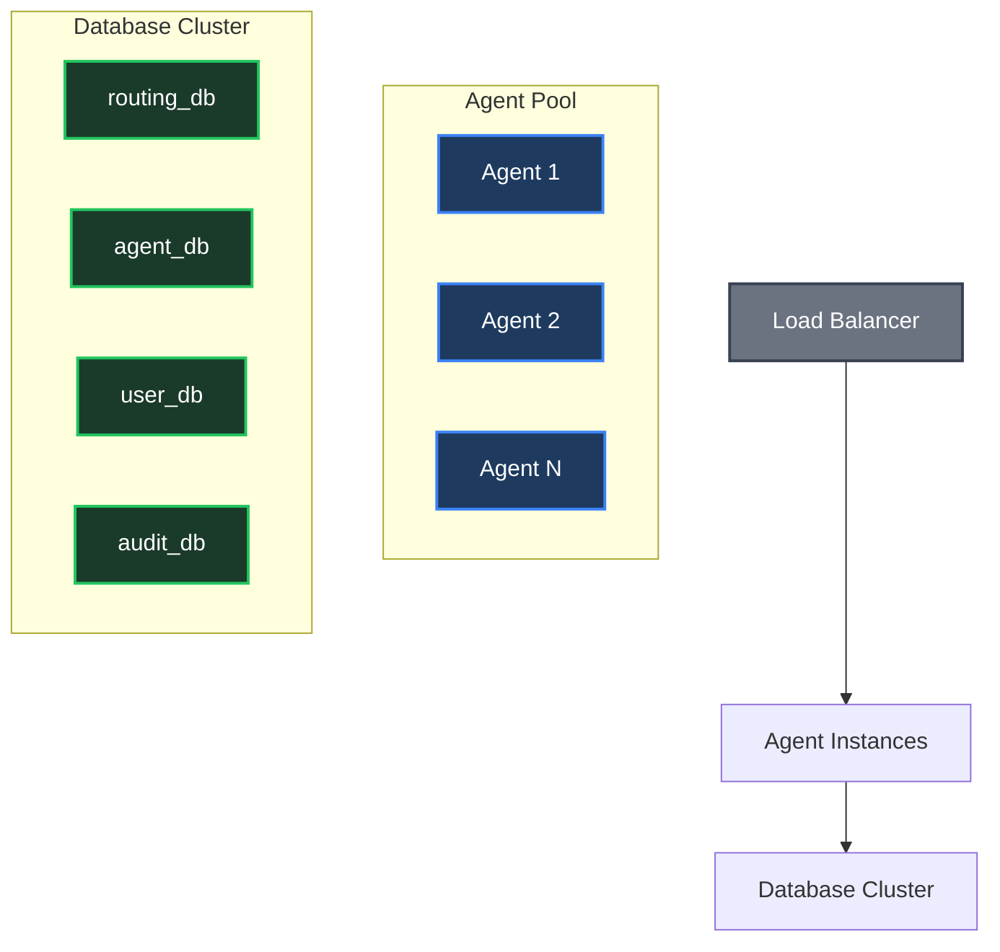
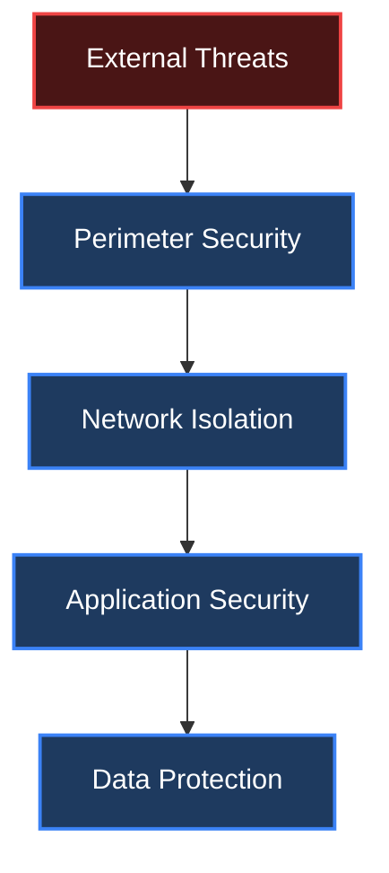
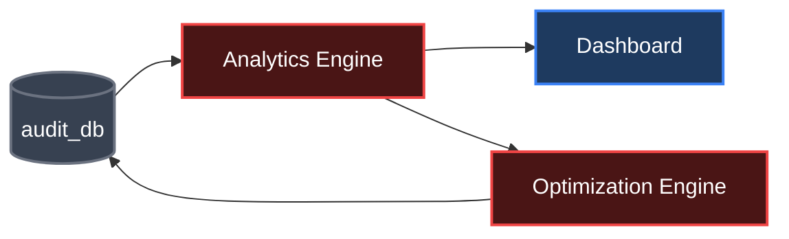

# Missing Architectural Components — Full Scope Implementation

This document covers the architectural components that were missing from the scenario implementations in `RegNord.md` and `Leader_Chain.md`. These elements provide the complete picture of the Postgres-based agent system, enabling scalability, security, and continuous improvement.

---

## 1. Event Bus Integration

The event bus serves as the central nervous system for agent communication, enabling loose coupling and asynchronous operations.

### Implementation Details



### Event Types & Payload Structure

```json
{
  "event_type": "task.created",
  "task_id": "uuid-regnord-2847",
  "source": "jira",
  "priority": "critical",
  "agent_required": "tdd_agent",
  "timestamp": "2026-04-13T10:00:00Z",
  "payload": {
    "title": "Patient export delay",
    "description": "...",
    "context_refs": ["slack_thread_001", "email_001"]
  }
}
```

### Benefits
- **Asynchronous Processing:** Agents can work independently without blocking
- **Scalability:** Easy to add new consumers without modifying producers
- **Reliability:** Events persist until processed, enabling retry mechanisms

---

## 2. Multi-Database Isolation Architecture

The system uses separate databases for different concerns, creating "fortress layers" that prevent cascading failures.

### Database Schema

```mermaid
erDiagram
    routing_db {
        TASK_ENTRIES
        AGENT_REGISTRY
        ESCALATION_LOG
    }

    agent_db {
        AGENT_OUTPUT
        AGENT_STATE
        AGENT_METRICS
    }

    user_db {
        USER_CHAIN
        USER_SESSIONS
        USER_PREFERENCES
    }

    audit_db {
        AUDIT_LOG
        COMPLIANCE_LOG
        SYSTEM_EVENTS
    }

    routing_db ||--o{ agent_db : "triggers"
    routing_db ||--o{ user_db : "assigns"
    agent_db ||--o{ audit_db : "logs"
    user_db ||--o{ audit_db : "audits"
```

### Isolation Benefits

| Database | Purpose | Failure Impact | Recovery |
|----------|---------|---------------|----------|
| **routing_db** | Task orchestration | New tasks can't be created | Quick restart, no data loss |
| **agent_db** | Agent operations | Specific agent unavailable | Other agents continue |
| **user_db** | User management | User assignments fail | Fallback to default users |
| **audit_db** | Immutable logs | No audit impact | Append-only, always available |

### Implementation Example

```sql
-- Cross-database communication via event bus
-- routing_db triggers agent via event
INSERT INTO audit_db.audit_log (event_type, entity_id, payload)
SELECT 'task_routed', id, json_build_object('agent', agent_pointer)
FROM routing_db.task_entries
WHERE status = 'routed';
```

---

## 3. Model Context Protocol (MCP)

MCP enables secure, controlled access to external tools and data sources without exposing sensitive information.

### MCP Architecture



### Security Features

- **TLS Encryption:** All MCP communications are encrypted
- **Access Control:** Tools define allowed operations per agent
- **Information Isolation:** Agents only see filtered, relevant data
- **Audit Logging:** All tool usage is logged for compliance

### Example Tool Definition

```json
{
  "tool_name": "codebase_search",
  "allowed_agents": ["context_agent", "coding_assistant"],
  "permissions": ["read_files", "search_code"],
  "data_filter": "exclude_sensitive_files",
  "rate_limit": "100_requests_per_hour"
}
```

---

## 4. Shared Agent Protocol (SAP/A2A)

SAP standardizes communication between agents, ensuring reliable interoperability.

### Protocol Structure

```json
{
  "sap_version": "1.0",
  "message_id": "uuid-msg-001",
  "sender_agent": "tdd_agent",
  "receiver_agent": "pr_agent",
  "timestamp": "2026-04-13T11:00:00Z",
  "message_type": "task_handover",
  "payload": {
    "task_id": "uuid-regnord-2847",
    "status": "completed",
    "artifacts": ["test_results.json", "code_changes.patch"],
    "metadata": {
      "coverage": "81%",
      "duration": "45_minutes"
    }
  },
  "error_handling": {
    "retry_policy": "exponential_backoff",
    "max_retries": 3,
    "timeout": "300_seconds"
  },
  "context_preservation": {
    "session_id": "uuid-session-001",
    "conversation_history": ["previous_message_ids"]
  }
}
```

### Benefits
- **Standardization:** All agents speak the same language
- **Error Resilience:** Built-in retry and timeout handling
- **Context Awareness:** Maintains conversation state across agents
- **Debugging:** Structured logging for troubleshooting

---

## 5. Orchestrator Role

The orchestrator initiates and coordinates workflows without executing tasks itself.

### Orchestrator Types



### Orchestrator Responsibilities

1. **Workflow Initiation:** Detect triggers and create tasks
2. **Agent Assignment:** Route tasks to appropriate agents
3. **Progress Monitoring:** Track SLA compliance and deadlines
4. **Escalation Management:** Handle delays and failures
5. **Resource Allocation:** Balance load across agent pool

---

## 6. State/Memory Persistence & Learning

The system accumulates knowledge over time, improving performance through historical data.

### Learning Architecture



### Learning Examples

- **Estimate Improvement:** Historical task completion times improve future estimates
- **Pattern Recognition:** Common error patterns lead to preventive measures
- **Personalization:** User preferences and working styles are learned
- **Risk Assessment:** Past project risks inform current evaluations

---

## 7. Sync Scripts & Data Synchronization

Automated scripts keep data synchronized across all sources.

### Sync Architecture



### Sync Methods

| Method | Use Case | Frequency | Example |
|--------|----------|-----------|---------|
| **Webhooks** | Real-time updates | Immediate | Jira issue updates |
| **Polling** | Regular checks | 5-15 minutes | Email inbox scanning |
| **CDC** | Change detection | Continuous | Database replication |

---

## 8. Embeddings & Semantic Search

pgvector enables intelligent knowledge retrieval through semantic similarity.

### Vector Search Implementation

```sql
-- Create embeddings table
CREATE TABLE task_embeddings (
    task_id UUID PRIMARY KEY,
    embedding vector(1536), -- OpenAI ada-002 dimensions
    content_type text,
    created_at timestamp
);

-- Semantic search query
SELECT task_id, content_type,
       1 - (embedding <=> '[user_query_embedding]') as similarity
FROM task_embeddings
WHERE content_type = 'bug_report'
ORDER BY similarity DESC
LIMIT 5;
```

### Use Cases

- **Context Retrieval:** Find similar historical tasks
- **Code Search:** Locate relevant code patterns
- **Knowledge Base:** Retrieve related documentation
- **Duplicate Detection:** Identify similar issues

---

## 9. Comprehensive Error Handling & Retry Logic

Robust error handling ensures system resilience.

### Retry Strategy



### Error Classification

```json
{
  "error_types": {
    "transient": ["network_timeout", "service_unavailable"],
    "permanent": ["invalid_input", "permission_denied"],
    "logic": ["business_rule_violation", "data_inconsistency"]
  },
  "retry_policies": {
    "transient": {"max_attempts": 3, "backoff": "exponential"},
    "permanent": {"max_attempts": 1, "backoff": "none"},
    "logic": {"max_attempts": 1, "escalate": true}
  }
}
```

---

## 10. Scalability & Concurrent Task Handling

The system handles multiple tasks simultaneously without interference.

### Horizontal Scaling



### Concurrency Controls

- **Task Isolation:** Each task runs in separate context
- **Resource Limits:** Per-agent resource allocation
- **Queue Management:** Priority-based task scheduling
- **Load Shedding:** Reject tasks when capacity exceeded

---

## 11. Security & Isolation Layers

Multiple security layers create a "fortress" architecture.

### Security Architecture



### Security Layers

1. **Perimeter:** Firewalls, DDoS protection, API gateways
2. **Network:** VPC isolation, encrypted connections
3. **Application:** Authentication, authorization, input validation
4. **Data:** Encryption at rest, access controls, audit logging

---

## 12. Continuous Improvement & Analytics

Analytics drive system optimization through data-driven insights.

### Analytics Dashboard



### Key Metrics

- **Performance:** Task completion times, SLA compliance
- **Quality:** Error rates, human intervention frequency
- **Efficiency:** Resource utilization, cost per task
- **Learning:** Prediction accuracy improvements

### Continuous Improvement Loop

1. **Collect:** Gather metrics from all system components
2. **Analyze:** Identify patterns and bottlenecks
3. **Optimize:** Update agent logic and system configuration
4. **Validate:** A/B test improvements before deployment

---

This comprehensive architecture provides the missing pieces for a production-ready, scalable, and secure agent system. Each component works together to create a robust platform that can handle complex workflows while maintaining security, reliability, and continuous improvement capabilities.
