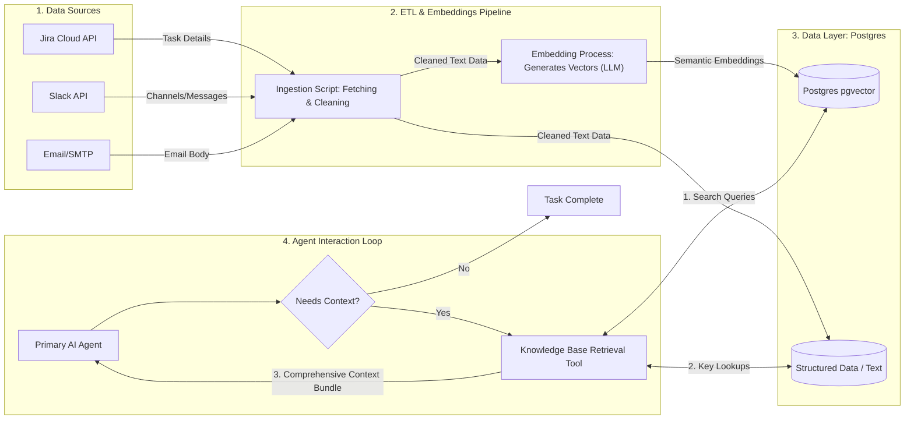
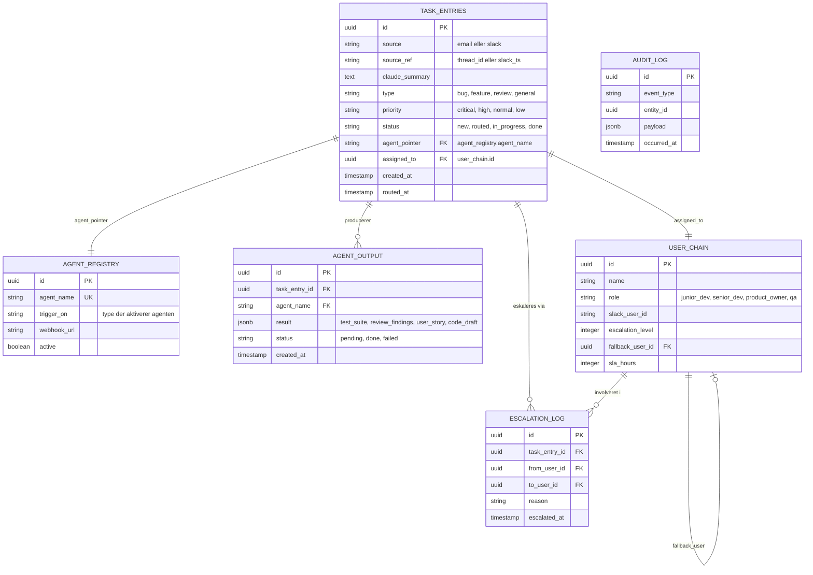

# Mindre MCP mere Postgres 

Når en agent får en opgave, sker der automatisk en ETL process, ekslusivt til den. Den ETL process kræver en del ressourcer (tokens), og forbliver ekslusivt i selve agenten. Det forhindrer potentielt proper logging og back-tracking af f.eks. opgaver eller behandlingen af dataene i en opgave. 

For at bevare en konstant record af hvad der sker i et større setup, og skrue ned for token-forbruget, kan en Postgres (eller anden DB) være "hjernen" i en pipeline. Det repræsenterer et deterministisk orkestreret system. Agenter møder aldrig rå data, og det løser nogle økonomiske og sikkerheds-mæssige aspekter.

Antag der skrives en ny opgave i Jira, hvor der er sat et automatisk script up, der oversætter opgaven til et kortere format. 

I diagrammet vises en overfladisk løsning, hvor AI agenten først får viden om opgaven, efter den er blevet scrapet med kontekst og gemt. 

Processen er automatiseret, men via scripts, frem for agenter der initierer hvert step. Agenterne tager først fat i dataene, når de er blevet konkretiseret (efter ETL processerne), og så kan initiere arbejdet. 

Dataene bliver statiske, og lettere at kontrollere. Ligeledes er der færre led i kæden, hvor AI har haft det begyndende arbejde, før opgaven kan løses. 

| **Postgres** | **AI swarm** |
|----------|----------|
| Intelligens starter efter data registreringen | "Intelligens" er brugt til at kunne finde dataene |
| Dataene er gemt som "intelligens" | "Intelligensen" konstituerer hvad dataene er | 
| Labels bestemmer hvad, hvor eller hvorfor dataene har relevans | AI'en skal regne det ud baseret på labels |
| Deterministisk system | Indbyrdes koordinering |
| Alt er auditabilitet | Ting kan forsvinde |
-----------

Er  "dataene gemt som intelligens" — det vil sige at de beslutninger der normalt kræver AI-inferens (hvad er dette, hvad betyder det, hvad er det relateret til?) allerede er konverteret til strukturerede felter og vektorer. Intelligensen er krystalliseret i databasen.

I Postgres-modellen er ingestion-scriptet skrevet til at prioritere Jira-labelens værdi og gemme den som priority: critical i **[TASK_ENTRIES*]**. Det er en menneskelig beslutning, nedfældet i kode, der gælder én gang for alle.

Labels ift. en AI swarm (flere agenter) er spændende, fordi det måske er en difference mellem angivelsen på Slack vs. Jira. Har opgaven på Jira fået "Kritisk" label, og parsed igennem til Postgres DB'en, bliver det reglen for opgaven når den samles op af agenten, men kunne med anden fortolkning af en anden agent. 

## Postgres med agenter

Med Postgres løsningen, bliver der inkluderet flere led i kæden, der er menneske-bestemete, og kan sepereres ligesom ved microservice arkitektur under et monorepo-lignende system. Fordele er igen; kontrol og bestemmelse over setup, hvor ambiguøst arbejde ikke går tabt i agenternes funktioner og processer. 

Ved opdelingen af den monorepo-lignende struktur, kan der bevares strukturel sikkerhed, og isoleres mod andre isolerede agenter. 

------------ 

## Sammenspillet

Scriptet der tager og håndterer opgaver fra Jira, laver fundamentet for et nyt datalag for sematiske vektorer, hvor en routing agent, kunne tage opgaven at dirigere de opgaven via en event bus, til en passende modtager. Den sematiske vektor i opgaven beskrevet af en LLM (efter ETL-script delen), bliver også mere betydningsfuld mht. traceability og normaliseringen af processerne, fordi det er det eneste sted, hvor "rå data" bliver behandlet ud fra strenge regler. 

Agenterne der modtager det input, har også den samme forståelse af dette pga. normaliserignen, og den ensartede proess. 

Derefter kommer agent-fasen, hvor får opgaven, og stille spørgsmålene til *"har jeg brug for mere kontekst?"* (laver kald til knowledge base via Retrieval Tool(del af agent SKILL.md)), eller kører direkte ud med f.eks. en TDD-implementering. 

Postgres-laget fungerer som et monorepo-lignende fundament: én autoritativ kilde til opgave-state, routing-beslutninger og audit trail. Men de individuelle agenter — TDD-agenten, code review-agenten, PO-agenten og udvikler-agenten — kan isoleres og deployes som selvstændige services med egne databaser *(agent_db, user_db, audit_db)*, forbundet via en event bus. 
Der opnåes sammenspil og kontinuerlighed i et kontrolleret multi-isoleret system. 

Det er her den hybride styrke opstår. Postgres-fundamentet giver det deterministiske lag: **[TASK_ENTRIES]** er single source of truth, **[AGENT_REGISTRY]** definerer hvilke agenter der eksisterer og hvad der trigger dem, og **[AUDIT_LOG]** er den immutable kæde af hvad der skete. Event bus-laget giver det distribuerede lag: agenter abonnerer på events som task.created og task.assigned, handler uafhængigt, og publicerer *agent.done* tilbage til bussen uden at kende til hinandens interne tilstand.

Det kritiske designvalg er at **routing-agenten** — den agent der fordeler opgaver til de specialiserede agenter — ikke er en AI-agent i traditionel forstand. Den er et deterministisk script der læser **[agent_pointer]** fra **[TASK_ENTRIES]** og kalder den rette webhook. AI'en er allerede brugt til at sætte **[agent_pointer]**-værdien under klassificering. Routing-steget selv kræver ingen inferens — det er tabelopslag.
Det er den grundlæggende arkitektoniske indsigt: sæt AI der hvor der er reel ambiguitet, og sæt deterministisk kode alle andre steder. Postgres er det sted hvor de to mødes.

## Skalerbarhed og gentagelser

Når den monorepo-lignende struktur splittes på tværs af fire databaser — **routing_db, agent_db, user_db, audit_db** — bevares den strukturelle sikkerhed fra det samlede system, men isolationen øges markant.
En fejl i agent_db påvirker ikke routing_dbs evne til at modtage nye opgaver. En tung load på TDD-agentens output-tabeller sænker ikke eskaleringslogikkens responstid. Og audit_db er append-only og isoleret, hvilket betyder at en kompromitteret agent aldrig kan slette sine egne spor.

Det kan kopires og genbruges, eller køres tilbage med databasernes elementer som backup, hvis nødvendigt. 