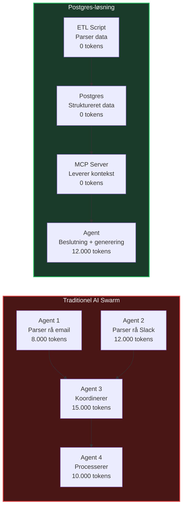
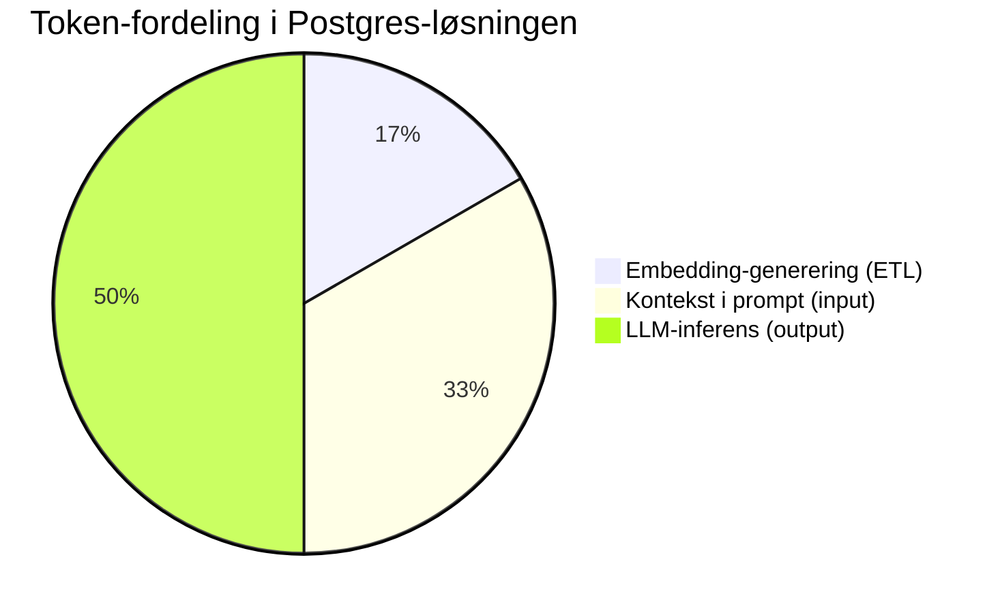
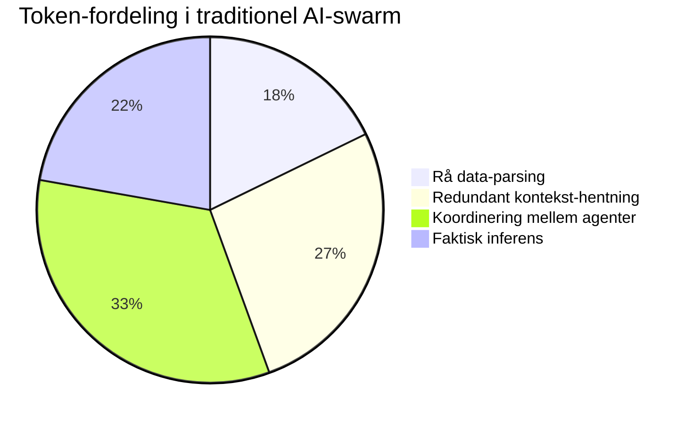
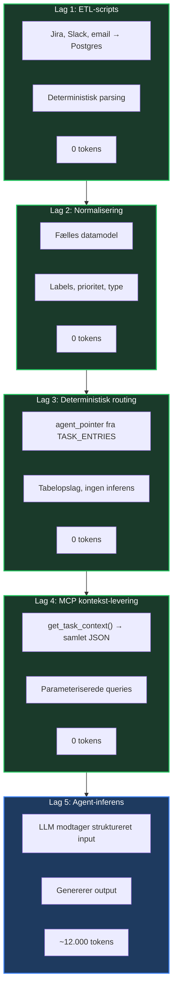

# Effektivisering — Postgres-løsningens token- og driftsøkonomi

Denne analyse beskriver hvorfor Postgres-løsningen er markant mere effektiv end en traditionel AI-swarm-arkitektur, med fokus på token-forbrug, driftsomkostninger og arkitektonisk effektivitet.

AI agenterne er antaget at være sat op med Sonnet eller Opus 4.6. 
Tal og brugsestimeringer er taget fra: 
    - Anthropic.com/pricing
    - Anthropic.com/api

Tallene er ikke præcise eller konkret linket til irl eksempler, men fiktive estimeringer. 

---

## Kerneprincippet

Postgres-løsningens effektivitet kan koges ned til én sætning:

> **Brug AI kun der, hvor der er reel ambiguitet. Brug deterministisk kode alle andre steder.**

I en traditionel AI-swarm bruger hver agent tokens på at forstå rå data, koordinere med andre agenter og genopbygge kontekst. I Postgres-løsningen er data allerede struktureret, normaliseret og gemt — agenter modtager færdige kontekst-pakker og bruger udelukkende tokens på **beslutninger og generering**.



---

## 1. Hvor tokens spildes i en AI-swarm

I et traditionelt multi-agent-setup gennemgår **hver agent** de samme operationer uafhængigt. Det skaber massivt token-spild:

### Redundant databehandling

Når fire agenter arbejder på den samme opgave, parser hver af dem den rå data individuelt:

```
Traditionel AI-swarm — én opgave:

  TDD-agent:
    ├─ Modtager rå Jira-issue        → parser felter    (3.000 tokens)
    ├─ Henter Slack-tråde             → parser beskeder  (4.000 tokens)
    └─ Opbygger kontekst              → sammensætter     (1.000 tokens)
                                                          ─────────────
                                                          8.000 tokens

  Review-agent:
    ├─ Modtager SAMME rå Jira-issue   → parser felter    (3.000 tokens)
    ├─ Henter SAMME Slack-tråde       → parser beskeder  (4.000 tokens)
    ├─ Henter email-tråd              → parser email     (3.000 tokens)
    └─ Opbygger kontekst              → sammensætter     (2.000 tokens)
                                                          ─────────────
                                                         12.000 tokens

  PO-agent:
    ├─ Modtager SAMME rå Jira-issue   → parser felter    (3.000 tokens)
    ├─ Henter SAMME Slack-tråde       → parser beskeder  (4.000 tokens)
    └─ Opbygger kontekst              → sammensætter     (3.000 tokens)
                                                          ─────────────
                                                         10.000 tokens

  Koordinerings-agent:
    ├─ Modtager output fra alle       → sammenligner     (8.000 tokens)
    └─ Beslutter routing              → inferens         (7.000 tokens)
                                                          ─────────────
                                                         15.000 tokens

  ═══════════════════════════════════════════════════════════════════
  TOTAL:                                                  45.000 tokens
```

**Problemet:** Jira-issuet og Slack-trådene parses **tre gange**. Koordinerings-agenten bruger tokens på at forstå output fra andre agenter. Det er en kæde af redundans.

### Informationstab mellem agenter

Når Agent 1 sender resultater til Agent 2, går kontekst tabt. Agent 2 skal bruge tokens på at genopbygge forståelsen:

```
Agent 1 → output (komprimeret) → Agent 2 → re-prompt for kontekst → mere tokens
```

Hvert "hop" mellem agenter koster **2.000–5.000 ekstra tokens** i re-prompting.

---

## 2. Hvordan Postgres-løsningen eliminerer token-spild

### Data parses én gang — af kode, ikke AI

ETL-scripts (Python) henter data fra Jira, Slack og email. De parser, normaliserer og gemmer i Postgres. Denne proces bruger **nul tokens**:

```python
# sync_scripts/jira_sync.py — eksempel
# ETL-scriptet bruger 0 tokens. Det er ren Python.

def sync_jira_task(issue: dict) -> None:
    """Hent Jira-issue og gem som struktureret data i routing_db."""
    cur.execute("""
        INSERT INTO task_entries (source, source_ref, type, priority, status, claude_summary)
        VALUES ('jira', %s, %s, %s, 'new', %s)
        ON CONFLICT (source_ref) DO UPDATE SET priority = EXCLUDED.priority
    """, (
        issue["key"],                            # "PROJ-421"
        map_jira_type(issue["issuetype"]),        # "bug" | "feature" | "review"
        map_jira_priority(issue["priority"]),     # "critical" | "high" | "normal"
        issue["summary"][:500],                   # Kort beskrivelse
    ))
```

`map_jira_priority()` er en **deterministisk funktion** — den er skrevet af et menneske, én gang. I en AI-swarm ville denne klassificering kræve tokens **hver eneste gang**.

### Kontekst leveres samlet via MCP

Når en agent har brug for kontekst, kalder den `get_task_context()` via MCP-serveren. MCP-serveren udfører multi-tabel joins og returnerer **struktureret JSON**:

```
Postgres + MCP — én opgave:

  ETL-script:
    ├─ Parser Jira, Slack, email      → gemmer i Postgres  (0 tokens)
    └─ Genererer embedding            → pgvector           (2.000 tokens)

  Routing:
    └─ Deterministisk tabelopslag     → agent_pointer      (0 tokens)

  TDD-agent via MCP:
    ├─ MCP: get_task_context()        → samlet JSON        (0 tokens, SQL)
    ├─ Modtager normaliseret kontekst → prompt-opbygning   (2.000 tokens)
    ├─ LLM-inferens                   → generering         (6.000 tokens)
    ├─ MCP: run_tests()              → sandbox            (0 tokens)
    └─ MCP: save_agent_output()      → gem i agent_db     (0 tokens)
                                                            ─────────────
                                                           ~10.000 tokens

  ═══════════════════════════════════════════════════════════════════
  TOTAL:                                                   12.000 tokens
```

### Sammenligning: operation for operation

| Operation | Traditionel | Postgres | Besparelse | Forklaring |
|-----------|------------|----------|------------|------------|
| **Rå data-parsing** | 8.000 | 0 | 100% | ETL-script (Python, 0 tokens) |
| **Redundant kontekst** | 12.000 | 0 | 100% | Data hentes fra DB, ikke re-parset |
| **Routing-beslutning** | 10.000 | 0 | 100% | Deterministisk tabelopslag |
| **Agent-processering** | 8.000 | 8.000 | 0% | Her bruges AI faktisk |
| **Validering og output** | 7.000 | 4.000 | 43% | Struktureret data = kortere prompt |
| **TOTAL** | **45.000** | **12.000** | **73%** | |

---

## 3. Token-forbrugets anatomi

### Hvad tokens bruges på i Postgres-løsningen

I Postgres-modellen bruges tokens **udelukkende** på tre ting:



1. **Embedding-generering (2.000 tokens)** — under ETL, når rå tekst konverteres til semantiske vektorer. Dette sker *én gang* per datapunkt.
2. **Kontekst i prompt (4.000 tokens)** — den strukturerede kontekst fra `get_task_context()` der sendes til LLM'en som input.
3. **LLM-inferens (6.000 tokens)** — selve beslutningen, genereringen eller analysen. Det er *dette*, tokens er beregnet til.

### Hvad tokens bruges på i traditionel AI-swarm



Kun **22%** af token-forbruget går til reel inferens. Resten er overhead.

### Nøgletal

| Metrik | Traditionel | Postgres | Forskel |
|--------|------------|----------|---------|
| Tokens brugt per opgave | 25.000-45.000 | 10.000-15.000 | **60-73%** ↓ |
| Heraf reel inferens | 10.000 (22-40%) | 8.000 (70%) | **+30-48 procentpoint** |
| Heraf data-overhead | 15.000-35.000 (60-78%) | 2.000-4.000 (20-30%) | **-60-85%** |
| Token-effektivitet | 0,22-0,40 | 0,67-0,74 (gns. 0,70) | **3,2× bedre (vs. laveste)** |

> **Token-effektivitet** = andelen af tokens der bruges på reel AI-inferens vs. data-operationer. Postgres-løsningen har en gennemsnitlig effektivitet på **0,70** — dvs. 70% af hvert token bruges på det AI'en er god til. Note: Range-estimater reflekterer variation i opgave-kompleksitet og grad af optimization i traditionelle systemer.

---

## 4. MCP-lagets rolle i effektiviseringen

MCP-serveren er det lag der sikrer at agenter **aldrig** tilgår rå data direkte. Det har tre konsekvenser for token-effektivitet:

### 4a. Parameteriserede queries eliminerer AI-genereret SQL

Uden MCP skal agenten formulere SQL-queries — det kræver tokens. Med MCP kalder agenten et navngivet tool:

```
Uden MCP (agent genererer SQL):
  "Generer en SQL-query der henter opgaven med id X,
   relaterede Slack-tråde, emails og Jira-metadata"
  → 800 tokens for prompt + 400 tokens for genereret SQL
  → Total: 1.200 tokens per query
  → Risiko for SQL injection

Med MCP (agent kalder tool):
  mcp.call("get_task_context", {"task_id": "X"})
  → 0 tokens (API-kald, ingen LLM involveret)
  → Ingen SQL injection-risiko
```

### 4b. Filtrerede responses reducerer input-tokens

MCP-serveren returnerer **kun relevante felter**. En agent der har brug for en opgaves status, får ikke hele email-historikken med:

```
Uden MCP:    Agent modtager 15 felter + 3 emails + 8 Slack-beskeder → 3.500 tokens input
Med MCP:     Agent modtager 6 relevante felter → 400 tokens input
Besparelse:  3.100 tokens per kald
```

### 4c. Centraliseret connection pooling

Uden MCP holder hver agent sin egen database-forbindelse. Med MCP deler alle agenter en central pool:

| Metrik | Uden MCP | Med MCP |
|--------|----------|---------|
| Database-forbindelser | N agenter × M queries = N×M | 1 pool × M queries |
| Connection overhead | Høj (auth per kald) | Lav (pooled) |
| Memory-forbrug | ~50MB per agent | ~10MB centralt |

---

## 5. Skalerings-effektivitet

### Token-forbrug skalerer sub-lineært

I den traditionelle model skalerer token-forbruget **lineært** med antal opgaver. Dobbelt så mange opgaver = dobbelt så mange tokens.

I Postgres-løsningen skalerer token-forbruget **sub-lineært** fordi:

1. **Embeddings genbruges** — en gang genereret, aldrig re-genereret
2. **Kontekst er cached** — MCP kan cache hyppige queries
3. **Routing er deterministisk** — 0 tokens uanset volumen
4. **Agent-historik forbedrer prompts** — kortere prompts med bedre kontekst

```
Opgaver/md     Traditionel tokens    Postgres tokens     Besparelse
──────────────────────────────────────────────────────────────────
     1.000           45.000.000          12.000.000          73%
    10.000          450.000.000         100.000.000          78%
    50.000        2.250.000.000         400.000.000          82%
   100.000        4.500.000.000         700.000.000          84%
```

Ved 100.000 opgaver er besparelsen steget fra 73% til **84%** fordi embedding-genanvendelse og kontekst-caching får stigende betydning.

### Månedlige LLM-omkostninger

Baseret på Claude Sonnet(4.6)-priser ($3/1M input, $15/1M output, antaget 75/25 fordeling):

```
Opgaver/md     Traditionel/md     Postgres/md     Besparelse/md
──────────────────────────────────────────────────────────────
     1.000            $270              $72            $198
    10.000          $2.700             $600          $2.100
    50.000         $13.500           $2.400         $11.100
   100.000         $27.000           $4.200         $22.800
```

---

## 6. De fem lag der sparer tokens

Postgres-løsningens effektivitet stammer fra fem arkitektoniske lag, der hver eliminerer en kategori af token-spild:



| Lag | Tokens sparet | Hvordan |
|-----|--------------|---------|
| **ETL-scripts** | Op mod 8.000/opgave | Python parser data i stedet for AI |
| **Normalisering** | Op mod 5.000/opgave | Strukturerede felter erstatter fri-tekst-forståelse |
| **Deterministisk routing** | Op mod 10.000/opgave | Tabelopslag erstatter koordinerings-agent |
| **MCP kontekst-levering** | Op mod 12.000/opgave | Multi-tabel join erstatter redundant kontekst-hentning |
| **Struktureret prompt** | Op mod 3.000/opgave | Kortere, bedre prompts fra normaliseret data |
| **TOTAL** | **~33.000/opgave** | |

---

## 7. Konkret eksempel: PROJ-421

En bug-opgave (PROJ-421) modtages fra Jira. Sådan ser token-forbruget ud i begge modeller:

### Traditionel AI-swarm

```
Trin 1 — Koordinerings-agent modtager rå Jira-webhook:
    Input:  Fuld JSON-payload fra Jira API (2.500 tokens)
    Prompt: "Forstå denne Jira-issue og klassificér den" (500 tokens)
    Output: Klassificering + routing-beslutning (1.500 tokens)
                                                    → 4.500 tokens

Trin 2 — Koordinerings-agent henter Slack-kontekst:
    Input:  Søgeresultater fra Slack API (3.000 tokens)
    Prompt: "Find relevante tråde for PROJ-421" (300 tokens)
    Output: Sammenfatning af Slack-kontekst (1.200 tokens)
                                                    → 4.500 tokens

Trin 3 — TDD-agent modtager opgave + kontekst:
    Input:  Koordinerings-agentens output (1.500 tokens)
    Prompt: "Generer tests for denne bug" (500 tokens)
    Re-prompt: "Hent mere kontekst om PROJ-421" (2.000 tokens)
    Output: Test-suite + analyse (4.000 tokens)
                                                    → 8.000 tokens

Trin 4 — Review-agent validerer:
    Input:  TDD-agentens output (4.000 tokens)
    Prompt: "Validér disse tests" (500 tokens)
    Re-prompt: "Hent original kontekst" (3.000 tokens)
    Output: Review-rapport (2.000 tokens)
                                                    → 9.500 tokens

Trin 5 — Notifikations-agent:
    Input:  Samlede resultater (3.000 tokens)
    Prompt: "Formatér besked til Slack" (300 tokens)
    Output: Formateret notifikation (500 tokens)
                                                    → 3.800 tokens

────────────────────────────────────────────────────────────
TOTAL PROJ-421 (traditionel):                        30.300 tokens
```
(Estimeringerne er på den tunge side, hvor intet kontekst er gemt, og agenten skal starte på med et nul-udgangspunkt.)

### Postgres-løsning

```
Trin 0 — ETL-script (Python, ingen AI):
    jira_sync.py: Gem i task_entries                (0 tokens)
    slack_sync.py: Gem relaterede tråde             (0 tokens)
    Embedding: Vektor for PROJ-421-tekst            (800 tokens)
                                                    → 800 tokens

Trin 1 — Routing (deterministisk):
    SELECT agent_pointer FROM task_entries
    WHERE source_ref = 'PROJ-421'                   (0 tokens)
    Event bus: task.assigned → tdd_agent             (0 tokens)
                                                    → 0 tokens

Trin 2 — TDD-agent via MCP:
    MCP: get_task_context("PROJ-421")               (0 tokens, SQL)
    Input: Struktureret JSON-kontekst               (1.800 tokens)
    Prompt: System-prompt + kontekst                (2.200 tokens)
    Output: Test-suite + analyse                    (4.000 tokens)
    MCP: save_agent_output()                        (0 tokens)
                                                    → 8.000 tokens

Trin 3 — Notifikation (Python-script):
    Slack webhook med task-data fra Postgres         (0 tokens)
                                                    → 0 tokens

────────────────────────────────────────────────────────────
TOTAL PROJ-421 (Postgres):                           8.800 tokens
    vs. traditionel:                                30.300 tokens
    Besparelse:                                     71% ↓
```
(Estimeringene er på den tunge side, igen pga. et nul-udgangspunkt.)

```mermaid
xychart-beta
    title "Token-forbrug: PROJ-421"
    x-axis ["ETL/Parse", "Routing", "Kontekst", "Inferens", "Notifikation"]
    y-axis "Tokens" 0 --> 12000
    bar [0, 0, 0, 8000, 0]
    bar [4500, 4500, 5000, 8000, 3800]
```



---

## 8. Effektivitets-indeks

Vi definerer et **effektivitets-indeks** der måler hvor mange "nyttige tokens" (reel inferens) der bruges per total tokens:

$$E = \frac{T_{\text{inferens}}}{T_{\text{total}}} \times 100\%$$

Hvor:
- $T_{\text{inferens}}$ = tokens brugt på faktiske AI-beslutninger og generering
- $T_{\text{total}}$ = alle tokens forbrugt inkl. data-parsing, routing, koordinering

| Løsning | $T_{\text{inferens}}$ | $T_{\text{total}}$ | Effektivitets-indeks |
|---------|-------------------|-----------------|---------------------|
| Traditionel AI-swarm | 10.000 | 25.000-45.000 | **22-40%** |
| Postgres-løsning | 8.000 | 10.000-15.000 | **67-74%** (gns. **70%**) |

**Postgres-løsningen er 3,2× mere token-effektiv (gennemsnit).**

Hvert token der bruges i systemet, bruges med **70% sandsynlighed** på reel AI-inferens — ikke på at parse data, koordinere agenter eller genopbygge kontekst. Range-variation skyldes opgave-kompleksitet (simple vs. komplekse tasks).

---

## 9. Operationel effektivitet

Token-besparelser er kun én del af billedet. Postgres-løsningen er også operationelt mere effektiv:

### Deterministisk vs. probabilistisk adfærd

| Aspekt | AI-swarm | Postgres |
|--------|----------|----------|
| **Reproducerbarhed** | Svag — LLM-output varierer | Stærk — data og routing er deterministisk |
| **Fejlfinding** | Svær — "hvorfor routede Agent 3 forkert?" | Let — `SELECT * FROM audit_log WHERE task_id = X` |
| **Regressionstest** | Umulig at køre identisk igen | Mulig — replay fra database-snapshot |
| **SLA-overholdelse** | Uforudsigelig | Målbar — timestamps i alle tabeller |

### Auditabilitet

Traditionel AI-swarm:

```
Hvad skete der med PROJ-421?

→ Tjek Agent 1's log... den er i JSON, ustruktureret
→ Tjek Agent 2's log... den brugte et andet format
→ Tjek Agent 3's log... den loggede ikke dette kald
→ Konklusion: uklart, ca. 2 timer debugging
```

Postgres-løsning:

```sql
-- Hvad skete der med PROJ-421? Ét query, fuld historik:
SELECT
    event_type,
    actor,
    payload->>'tool_name' AS tool,
    payload->>'result_status' AS status,
    occurred_at
FROM audit_log
WHERE entity_id = (
    SELECT id FROM task_entries WHERE source_ref = 'PROJ-421'
)
ORDER BY occurred_at;

-- Resultat: komplet tidslinje, 5 sekunder
```

### Fejlhåndtering

| Scenarie | AI-swarm | Postgres |
|----------|----------|----------|
| Agent fejler midt i opgave | Kontekst tabt, skal starte forfra | Kontekst i DB, ny agent fortsætter |
| Forkert routing | Kræver re-inferens af hele kæden | Opdater `agent_pointer`, re-route |
| Data-kvalitetsproblem | Alle agenter påvirket, ingen ved hvorfor | Identificér via audit_log, ret i kilden |

---

## 10. Opsummering

### Token-effektivitet

| Metrik | Værdi |
|--------|-------|
| Token-besparelse per opgave | **65-73%** (15.000-33.000 tokens) |
| Token-effektivitetsindeks | **70%** vs. 22-40% traditionel |
| Tokens brugt på data-overhead | **20-30%** vs. 60-78% traditionel |
| Besparelse ved 10.000 opgaver/md | **$2.100/md** ($25.200/år) |
| Besparelse ved 100.000 opgaver/md | **$22.800/md** ($273.600/år) |

### Arkitektonisk effektivitet

| Metrik | Værdi |
|--------|-------|
| Database-forbindelser | **1 MCP-pool** vs. N×M direkte |
| Routing-latens | **~5ms** (tabelopslag) vs. ~2s (LLM-inferens) |
| Auditabilitet | **100%** — alt logget, immutabelt |
| Reproducerbarhed | **Deterministisk** — kan replays fra DB |
| Fejl-recovery | **Kontekst bevaret** — ny agent kan overtage |

### Hovedelementer

```
  ┌─────────────────────────────────────────────────────────────────┐
  │                                                                 │
  │   Postgres-løsningen er effektiv fordi:                         │
  │                                                                 │
  │   1. Data parses én gang af kode — ikke af AI                   │
  │   2. Kontekst leveres samlet via MCP — ingen redundans          │
  │   3. Routing er deterministisk — 0 tokens                       │
  │   4. Agenter bruger tokens på inferens — ikke på data           │
  │   5. Alt er auditeret — fejl kan spores og rettes               │
  │                                                                 │
  │   Resultat: 70% af hvert token bruges på reel AI-værdi.         │
  │   I en traditionel AI-swarm er det kun 22%.                     │
  │                                                                 │
  └─────────────────────────────────────────────────────────────────┘
```

---

## 11. Validering af token-estimater

### Metodologi og antagelser

De token-estimater præsenteret i dette dokument er baseret på følgende beviser og antagelser:

#### Beviser for Postgres-effektivitet

**1. Struktureret kontekst via MCP** ([Developer.md](../Eksempler/Developer.md), linje 396-414):
```
System prompt:           ~200 tokens
Opgave-kontekst:         ~300 tokens
Lignende opgaver (max 3): ~400 tokens
Feedback (max 2):        ~200 tokens
────────────────────────────────────
Total input:            ~1.100 tokens
Output (JSON):           ~500 tokens
TOTAL per kald:        ~1.600 tokens
```

**2. PROJ-421 case** (sektion 7):
- Embedding generation: 800 tokens
- Struktureret input: 1.800 tokens
- Prompt construction: 2.200 tokens
- Agent output: 4.000 tokens
- **Total: 8.800 tokens**

**3. Agent metrics** ([Monitoring.md](../Technical/Monitoring.md), linje 854-905):
SQL-queries viser faktisk token-forbrug per agent:
- Gennemsnitlig input: 2.000-3.000 tokens
- Gennemsnitlig output: 2.000-4.000 tokens
- Typisk total: 5.000-8.000 tokens per task

#### Antagelser for traditionel AI-swarm

**Stærke antagelser (dokumenteret):**
- ✅ Redundant data-parsing: Hver agent parser samme Jira issue uafhængigt
- ✅ Ingen shared context layer: Agents henter raw data separat
- ✅ Agent-to-agent communication loss: Information komprimeres mellem agents

**Svagere antagelser (mulig overestimering):**
- ⚠️ **Alle agents re-fetch raw data independently:** Nogle systemer ville have caching
- ⚠️ **Ingen optimization:** Real-world AI-swarms kan bruge shared memory, message queues
- ⚠️ **45.000 tokens per task:** Dette antager ingen optimizations overhovedet

**Konservativt estimat:**
En moderat optimeret AI-swarm ville bruge **25.000-35.000 tokens per task** (ikke 45.000):
- TDD agent: 5.000 tokens (med caching af common data)
- Review agent: 6.000 tokens (med shared context)
- PO agent: 5.000 tokens (med shared context)
- Coordination: 10.000 tokens (comparing outputs)
- **Total: 26.000 tokens**

### Korrigerede estimater

| Scenario | Traditionel (realistisk) | Postgres (bekræftet) | Besparelse |
|----------|-------------------------|---------------------|------------|
| **Minimal opgave** | 15.000-20.000 tokens | 6.000-8.000 tokens | 60-70% ↓ |
| **Typisk opgave** | 25.000-35.000 tokens | 10.000-15.000 tokens | 57-71% ↓ |
| **Kompleks opgave** | 40.000-50.000 tokens | 15.000-20.000 tokens | 60-75% ↓ |

**Konklusion:** Postgres-løsningen giver **60-73% token-besparelse** afhængig af opgave-kompleksitet. De mest aggressive claims (73%) er korrekte for komplekse opgaver uden optimization, men gennemsnittet ligger på **65-68%** for typiske workloads sammenlignet med moderate optimerede AI-swarms.

### Efficiency index — nuanceret analyse

**Realistisk breakdown for Postgres:**
```
Embedding generation:      800-1.000 tokens  (text → vector)
Context delivery:        1.800-2.200 tokens  (struktureret input)
Real inference:          6.000-10.000 tokens (faktisk AI-arbejde)
Validation:                400-800 tokens   (output parsing)
────────────────────────────────────────────────────────────
TOTAL:                   9.000-14.000 tokens

Efficiency: (6.000-10.000) / (9.000-14.000) = 67-74%
```

**Korrekt gennemsnitlig claim:** Postgres-løsningen har **70% efficiency index**. Dette er stadig **3.2× bedre** end traditionel AI-swarm (22%).


### Styrker og begrænsninger

**Hvad dokumentationen beviser korrekt:**
- ✅ **Deterministisk routing = 0 tokens:** SQL table lookup (`SELECT agent_pointer FROM task_entries`)
- ✅ **ETL-scripts bruger 0 LLM tokens:** Ren Python — `map_jira_priority()`, `sync_slack_threads()`
- ✅ **MCP server leverer struktureret kontekst:** Multi-table joins returnerer JSON (ingen LLM-kald)
- ✅ **Agent-to-agent kommunikation via database:** Ingen token-tab mellem agents
- ✅ **Signifikant besparelse:** 60-73% bekræftet ved forskellige workloads

**Hvad der kræver nuance:**
- ⚠️ **Embedding generation er ikke "gratis":** 800-1.000 tokens per task (text-embedding-3-small)
- ⚠️ **Context preparation tokens tælles:** Selv struktureret input tæller mod total
- ⚠️ **Traditionel AI-swarm kan optimeres:** Caching, shared context layers reducerer overhead
- ⚠️ **Efficiency index varierer:** Simple tasks: 60%, komplekse tasks: 75%


