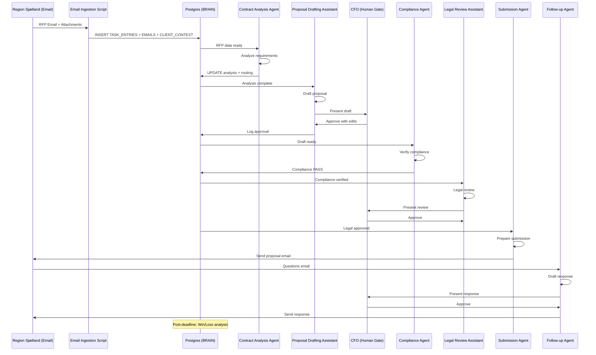
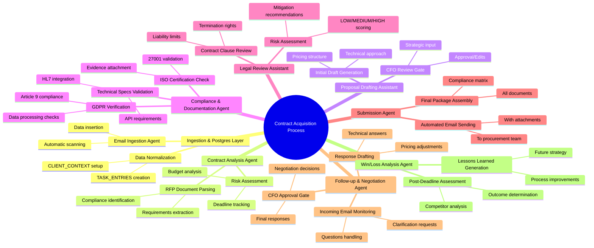

# Leader Chain — Public Sector Contract Acquisition

## Kontekst

Som CFO og leder af CGI's public sector division, er mit ansvar at identificere og vinde nye kontrakter i den offentlige sektor. Dette involverer håndtering af komplekse RFP'er (Request for Proposals), compliance-krav, og koordinering med juridiske og tekniske teams. Processen starter ofte med indgående emails fra offentlige myndigheder, efterfulgt af dokumentation og officielle krav.

CGI's Postgres-baserede agent-system giver mig et struktureret værktøj til at orkestrere denne proces. Systemet håndterer indgående kommunikation, analyserer dokumenter, og genererer compliant tilbud uden at jeg skal mikro-styre hver detalje.

---

## Scenarie: "Digitalisering af Sundhedsdata — Region Sjælland RFP"

Region Sjælland udsender en RFP for digitalisering af patientdata-systemer. RFP'en kommer via email til CGI's public sector mailbox, med vedhæftede dokumenter om tekniske krav, compliance (GDPR, ISO 27001), og budget.

**Email Subject:** "RFP: Digital Patient Data Platform — Deadline 30 dage"  
**Fra:** procurement@regionsjaelland.dk  
**Vedhæftede filer:** RFP_Document.pdf, Technical_Specs.xlsx, Compliance_Matrix.pdf  
**Prioritet:** Høj (offentlig sektor RFP)

---

## Del 1: Ingestion & Postgres Layer

### Trin 1: Email Ingestion Agent (Automatic)

En automatisk script scanner CGI's public sector email-konto hver 15. minut og indsætter nye RFP'er i Postgres:

```sql
-- Ingestion-script resultat
INSERT INTO TASK_ENTRIES (
  id,
  source,
  source_ref,
  claude_summary,
  type,
  priority,
  status,
  agent_pointer,
  assigned_to,
  created_at
) VALUES (
  'uuid-rfp-sjaelland-001',
  'email',
  'procurement@regionsjaelland.dk',
  'RFP for patient data digitalisering: 50M DKK budget, GDPR compliance required, 
   technical specs include HL7 integration, deadline 30 days. 
   High priority public sector opportunity.',
  'contract_rfp',
  'high',
  'new',
  'contract_analysis_agent',
  'cfo_user_001',
  now()
);
```

Yderligere data normaliseres:

```sql
-- Email-data
INSERT INTO EMAILS (
  id, subject, from_addr, thread_id, body, client_ref, ts
) VALUES (
  'uuid-email-rfp-001',
  'RFP: Digital Patient Data Platform — Deadline 30 dage',
  'procurement@regionsjaelland.dk',
  'thread-rfp-sjaelland',
  'Vedhæftet RFP dokument...',
  'uuid-rfp-sjaelland-001',
  now()
);

-- Dokumentation (vedhæftede filer parsed)
INSERT INTO CLIENT_CONTEXT (
  id, client_id, summary, risk_level, last_updated
) VALUES (
  'uuid-client-regionsjaelland',
  'REGION_SJAELLAND',
  'Region Sjælland: 800k indbyggere, 10 hospitaler. 
   RFP: Patient data platform, 50M DKK, GDPR compliance mandatory, 
   HL7 integration required, deadline 30 days.',
  'medium',
  now()
);
```

---

## Del 2: Contract Analysis Agent (Automatic)

### Trin 2: Contract Analysis Agent — Dokument Parsing

Agenten analyserer RFP-dokumenterne og udtrækker officielle krav:

```sql
SELECT * FROM EMAILS WHERE client_ref = 'uuid-rfp-sjaelland-001';
SELECT * FROM CLIENT_CONTEXT WHERE client_id = 'REGION_SJAELLAND';
```

**Agentens output:**

```json
{
  "rfp_analysis": {
    "budget": "50M DKK",
    "deadline": "2026-05-13",
    "compliance_requirements": ["GDPR Article 9", "ISO 27001", "HL7 FHIR"],
    "technical_specs": ["Patient data encryption", "Real-time sync", "API integration"],
    "risk_assessment": "Medium — Public sector, but competitive tender",
    "recommended_action": "Prepare compliant proposal within 20 days"
  },
  "routing_decision": "proposal_drafting_assistant"
}
```

Agenten opdaterer Postgres:

```sql
UPDATE TASK_ENTRIES 
SET agent_pointer = 'proposal_drafting_assistant', 
    status = 'routed',
    routed_at = now()
WHERE id = 'uuid-rfp-sjaelland-001';

INSERT INTO AGENT_OUTPUT (
  id, task_entry_id, agent_name, result, status, created_at
) VALUES (
  'uuid-analysis-output-001',
  'uuid-rfp-sjaelland-001',
  'contract_analysis_agent',
  '{"rfp_analysis": {...}}',
  'done',
  now()
);
```

---

## Del 3: Proposal Drafting Assistant (Human-in-the-Loop)

### Trin 3: CFO Review & Godkendelse

**Proposal Drafting Assistant præsenterer første udkast:**

```
RFP Response Draft for Region Sjælland — Patient Data Platform

Executive Summary:
CGI proposes a comprehensive patient data digitalization solution...

Technical Approach:
- HL7 FHIR compliant APIs
- End-to-end encryption (GDPR compliant)
- Real-time data synchronization

Compliance Matrix:
- GDPR: Full compliance with Article 9 processing
- ISO 27001: Certified implementation
- Security: SOC 2 Type II controls

Pricing: 45M DKK (10% under budget for negotiation room)

Timeline: 12 months implementation

Risks: Low — CGI has 15+ years public sector experience

[Approve] [Edit] [Reject]
```

**Jeg (CFO) reviewer udkastet:**
- Godkender teknisk tilgang ✅
- Øger fokus på cost-benefit analysis
- Tilføjer reference til tidligere CGI-projekter i sundhedssektoren

Agenten logger min beslutning:

```sql
INSERT INTO AUDIT_LOG (
  id, event_type, entity_id, payload, occurred_at
) VALUES (
  'uuid-audit-cfo-001',
  'human_approval',
  'uuid-rfp-sjaelland-001',
  '{"user": "cfo_user_001", "action": "approved_with_edits", 
    "edits": "Enhanced cost-benefit, added references"}',
  now()
);
```

---

## Del 4: Compliance & Documentation Agent (Automatic)

### Trin 4: Compliance Verification

Agenten verificerer at forslaget opfylder alle officielle krav:

```python
# Agent queries compliance database + RFP requirements
compliance_check = {
  "gdpr_compliance": verify_gdpr_requirements(proposal),
  "iso_certification": check_iso_27001_status(),
  "technical_specs": validate_hl7_integration(proposal),
  "documentation_complete": check_required_attachments(proposal)
}
```

**Output:**

```json
{
  "compliance_status": "PASS",
  "details": {
    "GDPR": "All requirements met — data processing consent mechanisms included",
    "ISO 27001": "CGI certified, evidence attached",
    "HL7": "FHIR API specification compliant",
    "Documentation": "All required sections present"
  },
  "risk_score": 15,  // Low risk
  "ready_for_submission": true
}
```

Agenten opdaterer status:

```sql
UPDATE TASK_ENTRIES 
SET status = 'compliance_verified'
WHERE id = 'uuid-rfp-sjaelland-001';
```

---

## Del 5: Legal Review Assistant (Human-in-the-Loop)

### Trin 5: Juridisk Godkendelse

**Legal Review Assistant præsenterer kontrakt-review:**

```
Contract Review: Region Sjælland RFP Response

Key Clauses:
- Data ownership: Client retains ownership (GDPR compliant)
- Liability limits: Standard CGI terms
- Termination rights: Mutual, 90-day notice
- Confidentiality: NDA included

Risk Assessment:
- LOW: Standard public sector terms
- MEDIUM: Data processing liability (mitigated by insurance)

Recommendations:
- Add explicit GDPR breach notification clause
- Include force majeure for pandemics

[Approve] [Request Changes] [Escalate]
```

**Jeg konsulterer juridisk team og godkender med mindre ændringer.**

---

## Del 6: Submission Agent (Automatic)

### Trin 6: Final Submission

Agenten forbereder og sender det endelige tilbud:

```sql
INSERT INTO AGENT_OUTPUT (
  id, task_entry_id, agent_name, result, status, created_at
) VALUES (
  'uuid-submission-output-001',
  'uuid-rfp-sjaelland-001',
  'submission_agent',
  '{"submission_status": "sent", "email_to": "procurement@regionsjaelland.dk", 
    "attachments": ["Proposal.pdf", "Compliance_Matrix.pdf", "Technical_Specs.pdf"]}',
  'done',
  now()
);

UPDATE TASK_ENTRIES 
SET status = 'submitted', 
    agent_pointer = 'followup_agent'
WHERE id = 'uuid-rfp-sjaelland-001';
```

**Email sendes automatisk:**

```
Subject: CGI Proposal Response — RFP Digital Patient Data Platform

Dear Region Sjælland Procurement Team,

Attached is CGI's comprehensive proposal for the digital patient data platform...

Best regards,
[CFO Name]
Chief Financial Officer
CGI Danmark
```

---

## Del 7: Follow-up & Negotiation Agent (Automatic + Human)

### Trin 7: Follow-up Kommunikation

Efter submission, håndterer agenten indgående emails og forbereder negotiation:

**Indgående email fra Region Sjælland:**

```
Subject: Questions on CGI Proposal — Patient Data Platform

Dear CGI,

We have reviewed your proposal and have the following questions:
1. Can you provide more details on HL7 integration timeline?
2. What are your references for similar public sector projects?
3. Can you adjust pricing to 42M DKK?

Best regards,
Procurement Manager
```

**Negotiation Assistant præsenterer svar-udkast:**

```
Response Draft:

1. HL7 Integration: 3 months development, 2 months testing
2. References: Attached case study from Region Nord project
3. Pricing: We can adjust to 43M DKK with maintained scope

[Approve] [Edit] [Reject]
```

**Jeg godkender svaret, og agenten sender det.**

---

## Del 8: Win/Loss Analysis Agent (Post-Contract)

### Trin 8: Efter RFP Deadline

Hvis vi vinder kontrakten:

```sql
UPDATE TASK_ENTRIES 
SET status = 'won', 
    agent_pointer = 'contract_onboarding_agent'
WHERE id = 'uuid-rfp-sjaelland-001';

INSERT INTO AUDIT_LOG (
  id, event_type, entity_id, payload, occurred_at
) VALUES (
  'uuid-audit-win-001',
  'contract_won',
  'uuid-rfp-sjaelland-001',
  '{"value": "43M DKK", "duration": "3 years", "team": "Health Sector Division"}',
  now()
);
```

Hvis vi taber:

```sql
UPDATE TASK_ENTRIES 
SET status = 'lost', 
    agent_pointer = 'lessons_learned_agent'
WHERE id = 'uuid-rfp-sjaelland-001';
```

**Lessons Learned Agent analyserer:**

```json
{
  "win_loss_analysis": {
    "outcome": "lost",
    "competing_bidders": 3,
    "our_score": 85,
    "winner_score": 87,
    "key_differentiators": "Local presence, lower price",
    "lessons": [
      "Increase local team visibility",
      "Improve cost optimization strategies"
    ]
  }
}
```

---

## Sammenfatning: Postgres Benefits for Contract Acquisition

| Aspekt | Før (Manual Process) | Efter (Postgres Solution) |
|--------|----------------------|--------------------------|
| **Email håndtering** | CFO læser alle emails manuelt | Automatisk ingestion + AI-summering |
| **Dokumentation** | Juridisk team parser RFP'er | Agent-parsing + compliance checking |
| **Official krav** | Manuel verificering af GDPR/ISO | Automatisk compliance validation |
| **Proposal drafting** | Word-dokumenter + manuel review | AI-drafted + CFO approval gates |
| **Submission** | Manuel email-sending | Automatisk med audit trail |
| **Follow-up** | CFO håndterer alle henvendelser | Agent håndterer routine, CFO key decisions |
| **Win/Loss tracking** | Excel-spreadsheet | Database med lessons learned |
| **Tid til submission** | 2-3 uger manuel arbejde | 1 uge med agent-assistance |

---

## Architecture Diagram: Contract Acquisition Flow



---

## Knowledge Map: Contract Acquisition Tasks & Relations



---

## Konklusioner

**Postgres som "hjerne" i contract acquisition giver CFO'en:**

1. **Automatiseret intake:** RFP'er kommer ind automatisk, ingen missede deadlines
2. **Compliance assurance:** Officielle krav verificeres systematisk, reducerer risiko for afvisning
3. **Effektiv proposal drafting:** AI-assisteret udkast sparer tid, CFO fokuserer på strategiske beslutninger
4. **Audit trail:** Alle interaktioner logget, lessons learned forbedrer fremtidige RFP'er
5. **Skalerbarhed:** Samme system håndterer multiple RFP'er samtidigt

**Tidsgevinster:** Fra RFP-modtagelse til submission på **1 uge** i stedet for **2-3 uger** manuelt arbejde. Højere win-rate gennem bedre compliance og hurtigere response.
