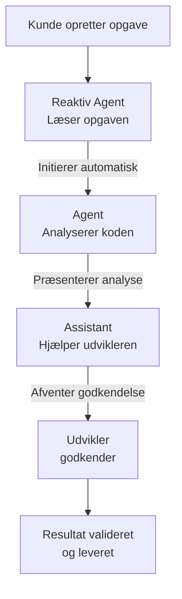
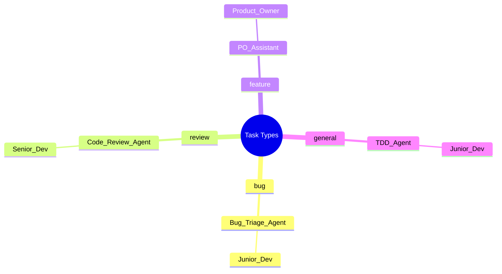

# LEVEL 1 — INTRO

## Hvad er AI Agenter og Assistenter?

AI-agenter og assistenter er en måde at strukturere AI-arbejde på i softwareudvikling, så opgaver bliver:

* Mere automatiserede
	* Minder om menneskets evne til at tage beslutninger og kan løse problemer i real time.
* Mere konsistente
	* Specificeres til at arbejde på sub-opgaver
* Mere skalerbare

###  Grundidé

I stedet for én AI, der gør alt, kan man opdele arbejdet i **specialiserede enheder**:

* **Agent** → Arbejder automatisk ud fra faste regler
* **Assistant** → Hjælper mennesker og kræver godkendelse, arbejder også ud fra regler

##  Simpel Use Case

Når en kunde opretter en opgave:

1. En agent læser opgaven
	1. Den er reaktiv!
2. En anden analyserer koden
	1. Handlingen startet af den første reaktive Agent
3. En assistant hjælper udvikleren
	1. Mennesket starter opgaven, og får hjælp fra Assistenten
4. Resultatet valideres og leveres

## Agenten
 En **Agent** kører autonomt ud fra foruddefinerede regler og triggers. Den har adgang til værktøjer (databaser, APIs, kode), tager beslutninger og udfører handlinger _uden at vente på menneskelig godkendelse_. Agenter er ideelle til repetitive, regelbaserede opgaver som at generere tests, analysere kode eller opdatere ticket-status.
 
 Den overvåger kontinuerligt systemer, data eller processer og _initierer selv handling_ baseret på det den observerer. Den behøver ikke blive spurgt — den notificerer, eskalerer eller handler, når en betingelse udløses. Eksempel: sender en alert, når en CI-pipeline fejler.

## Assistant
En **Assistant** arbejder i tæt samspil med et menneske. Den presenterer muligheder, genererer udkast og giver anbefalinger — men _afventer altid godkendelse_, inden handlingen udføres. Assistenter er velegnede til opgaver der kræver skøn, kreativitet eller faglig vurdering.

## Hvorfor bruge det?

* Mindre manuelt arbejde
	* Når den nye Jira-opgave oprettes, tager den  reaktive Agent opgaven, laver en analyse, estimerer opgavens størrelse og kompleksitet. Den kan f.eks. oprette sagen som en TDD opgave.
* Hurtigere iteration
	* Backlog og nye opgaver kan køres igennem hurtigere, med f.eks. fokus på prioritering af opgaver ud fra business-value, afhængigheder, eller tiden i det igangværende sprint. 
	* Milestones opnås og den overvågende Agent gør opmærk på det!
* Bedre kvalitet (via tests & struktur)
	* Går man op i TDD, løftes koden automatisk med flere test, højere dækning og indirekte mere dokumentation. 
	* Sæt en bonus Agent igang med at skrive inline kommentare, eller seperat dokumentation
* Uddeligering af opgaver baseret på opgaven i sig selv og roller involveret
	* Task type bestemmer hvor opgaven skal hen, og går igennem processer opsat til hvert scenarie

## Grundregler for Agents og Assistants

Alle AI-implementationer som Agent eller Assistant skal følge en relativt simpel opsætning. 

| Krav          | Beskrivelse    |
| ------------- | ------------------ |
| Må/ Må ikke   | AI'en får beskrivelser for, hvad den må og ikke må. |
|Triggers| Opsatte triggers aktiverer processer|
| Input/ output | AI'en får beskrevet hvad der må komme ind og ud, hvor det må komme fra, hvornår og hvordan. Det er afgrænset efter behov. Der skrives til log med timestamp og hash på in- og output. (Del af Auditrail) |
| Logs | AI'en skal producere logs på forslag og ændringer. Audit-trail for dets arbejde skal være dokumenterbart og direkte at følge. |
| Breakers| AI'en stopper ved for mange fejl, regelbrud eller menneske input.|
| Alerts | AI'en giver information på unormaler der falder uden for den angivne struktur |
| Metrics | AI'en har rater for latency, fejl, retry, menneske-intervention-rate |
| Modtager | Assigned modtager på input/ output med ovenstående inkluderet |

