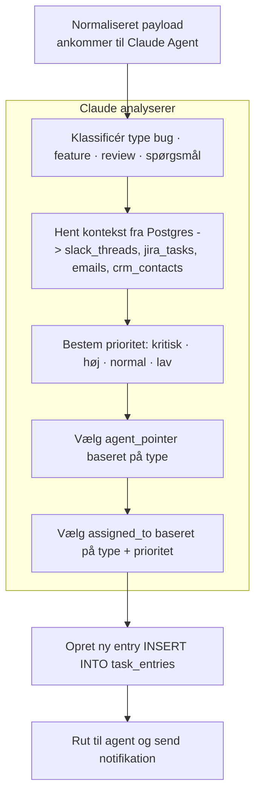
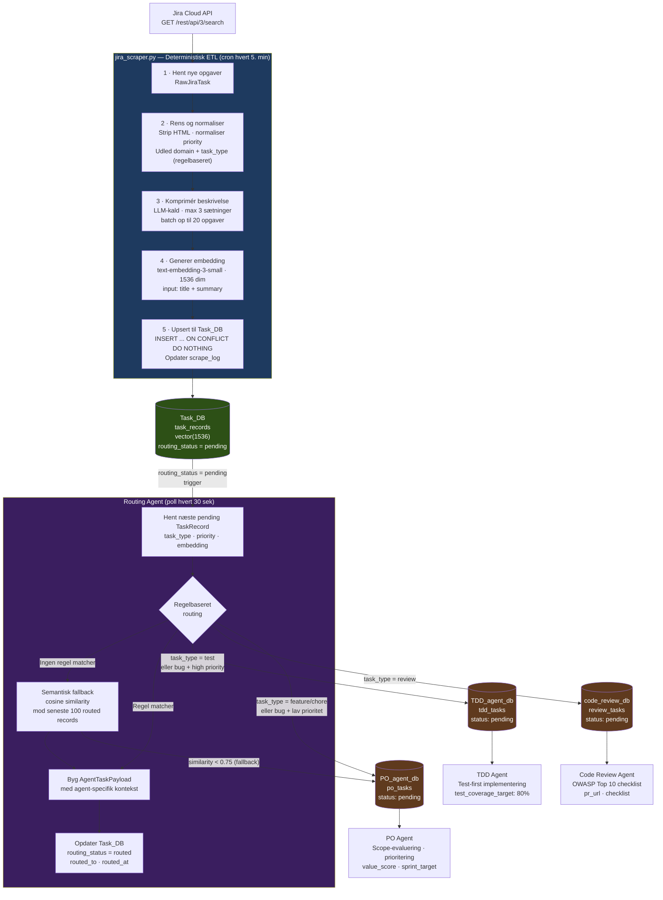


# Overskrift

### Claude Agent: Analyse og entry-oprettelse

```mermaid

flowchart TD

    IN["Normaliseret payload\nankommer til Claude Agent"]

  

    subgraph ANALYSE["Claude analyserer"]

        C1["Klassificér type bug · feature · review · spørgsmål"]

        C2["Hent kontekst fra Postgres -> slack_threads, jira_tasks, emails, crm_contacts"]

        C3["Bestem prioritet: kritisk · høj · normal · lav"]

        C4["Vælg agent_pointer baseret på type"]

        C5["Vælg assigned_to baseret på type + prioritet"]

    end

  

    C1 --> C2 --> C3 --> C4 --> C5

  

    ENTRY["Opret ny entry INSERT INTO task_entries"]

  

    IN --> C1

    C5 --> ENTRY

  

    ENTRY --> ROUTE["Rut til agent og send notifikation"]

```
---

### Postgres-drevet Pipeline (Pseudo_toolset.py)

```mermaid
flowchart TD
    JIRA["Jira Cloud API\nGET /rest/api/3/search"]

    subgraph SCRAPER["jira_scraper.py — Deterministisk ETL (cron hvert 5. min)"]
        S1["1 · Hent nye opgaver\nRawJiraTask"]
        S2["2 · Rens og normaliser\nStrip HTML · normaliser priority\nUdled domain + task_type (regelbaseret)"]
        S3["3 · Komprimér beskrivelse\nLLM-kald · max 3 sætninger\nbatch op til 20 opgaver"]
        S4["4 · Generer embedding\ntext-embedding-3-small · 1536 dim\ninput: title + summary"]
        S5["5 · Upsert til Task_DB\nINSERT ... ON CONFLICT DO NOTHING\nOpdater scrape_log"]
        S1 --> S2 --> S3 --> S4 --> S5
    end

    JIRA --> S1

    TASK_DB[("Task_DB\ntask_records\nvector(1536)\nrouting_status = pending")]
    S5 --> TASK_DB

    subgraph ROUTING["Routing Agent (poll hvert 30 sek)"]
        R1["Hent næste pending TaskRecord\ntask_type · priority · embedding"]
        R2{"Regelbaseret\nrouting"}
        R3["Semantisk fallback\ncosine similarity\nmod seneste 100 routed records"]
        R4["Byg AgentTaskPayload\nmed agent-specifik kontekst"]
        R5["Opdater Task_DB\nrouting_status = routed\nrouted_to · routed_at"]
        R1 --> R2
        R2 -- "Ingen regel matcher" --> R3
        R3 --> R4
        R2 -- "Regel matcher" --> R4
        R4 --> R5
    end

    TASK_DB -- "routing_status = pending\ntrigger" --> R1

    TDD_DB[("TDD_agent_db\ntdd_tasks\nstatus: pending")]
    CR_DB[("code_review_db\nreview_tasks\nstatus: pending")]
    PO_DB[("PO_agent_db\npo_tasks\nstatus: pending")]

    R2 -- "task_type = test\neller bug + high priority" --> TDD_DB
    R2 -- "task_type = review" --> CR_DB
    R2 -- "task_type = feature/chore\neller bug + lav prioritet" --> PO_DB
    R3 -- "similarity < 0.75 (fallback)" --> PO_DB

    TDD_DB --> TDD_AGENT["TDD Agent\nTest-first implementering\ntest_coverage_target: 80%"]
    CR_DB --> CR_AGENT["Code Review Agent\nOWASP Top 10 checklist\npr_url · checklist"]
    PO_DB --> PO_AGENT["PO Agent\nScope-evaluering · prioritering\nvalue_score · sprint_target"]

    style SCRAPER fill:#1e3a5f,color:#fff
    style ROUTING fill:#3a1e5f,color:#fff
    style TASK_DB fill:#2d5016,color:#fff
    style TDD_DB fill:#5f3a1e,color:#fff
    style CR_DB fill:#5f3a1e,color:#fff
    style PO_DB fill:#5f3a1e,color:#fff
```