# Modeller i dokumenterne

## Intro modeller

| Simpelt flow
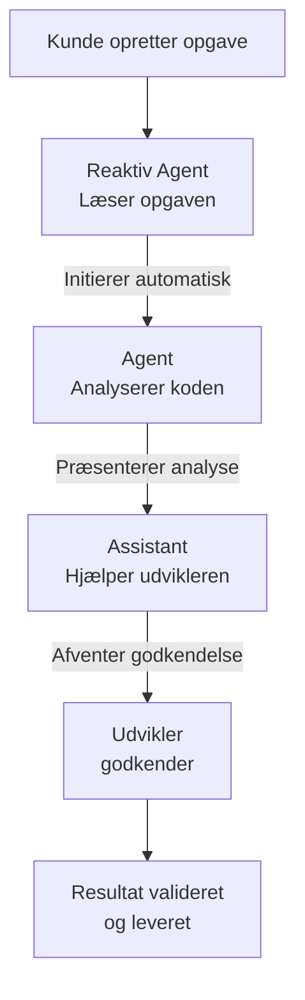
---------- 

| Flere typer modtagere baseret på task og rolle

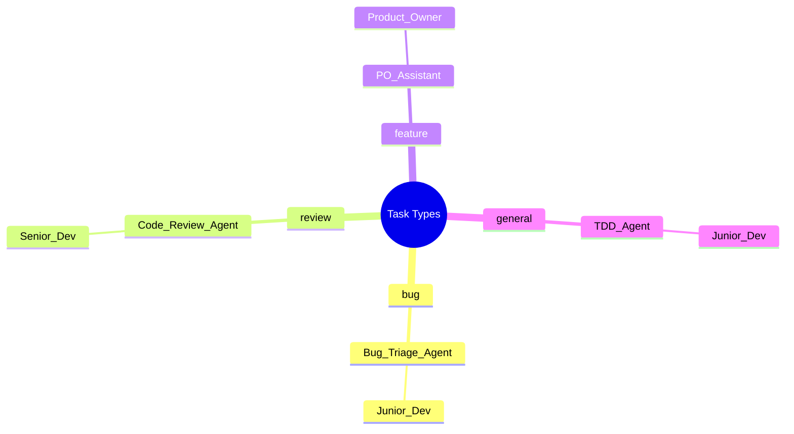

## Advanced modeller

| Agent til assistant til developer
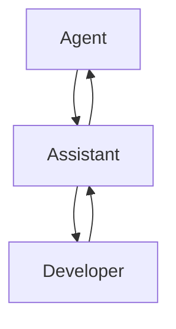
--------------

| Fire lag, statememory

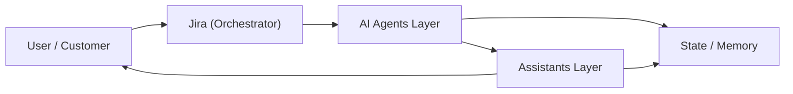
----------------

| Flere agenter og assistants i serie

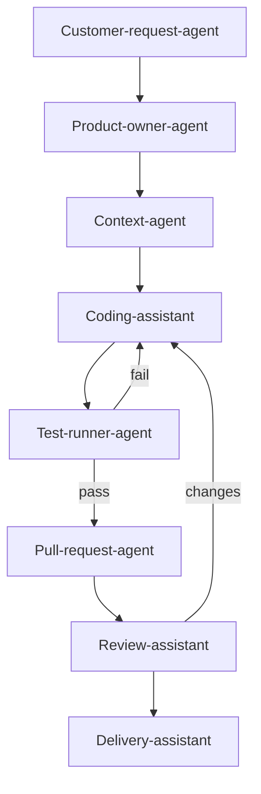
----------------

| Simpel chain

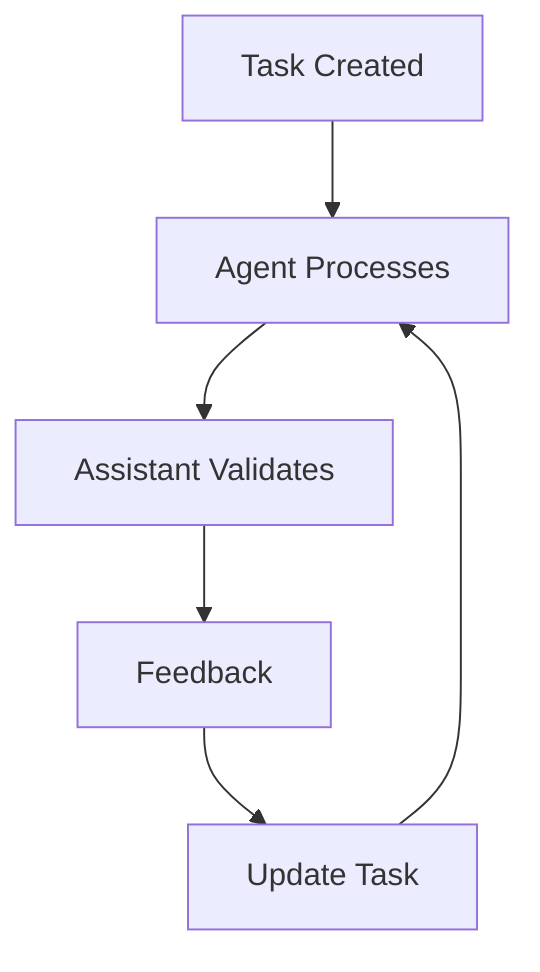
-----------------

| Super simpel chain

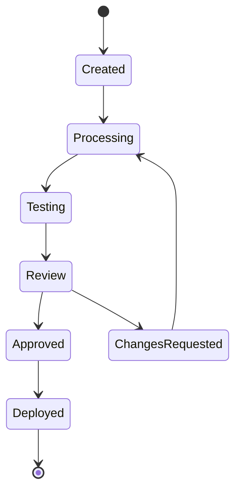
------------------

| Flere input, agenter, task databaser
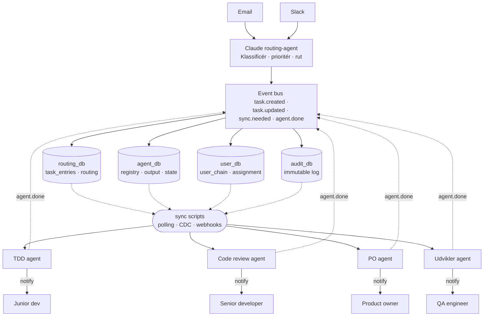
----------------

| Flere agenter, flere states, flere outcomes

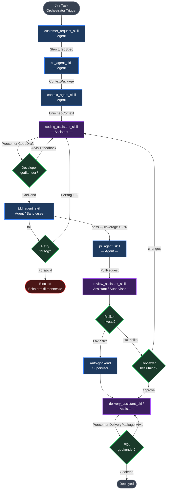

## Postgres modeller

| Flere typer input, script til datahåndtering, --> agent
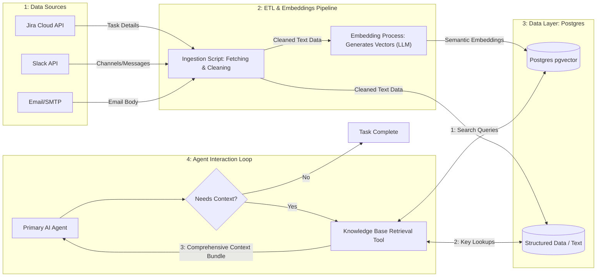
------------------

| Claude ex. ud fra projekt-opgave m. ID

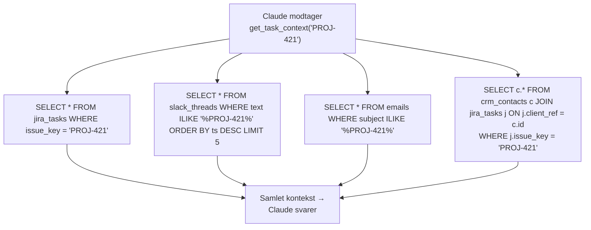
-------------------

| PO til Jira Agent "Hvad sker der med Projekt 421? (Tak, gør det rigtigt, ingen fejl.)" 

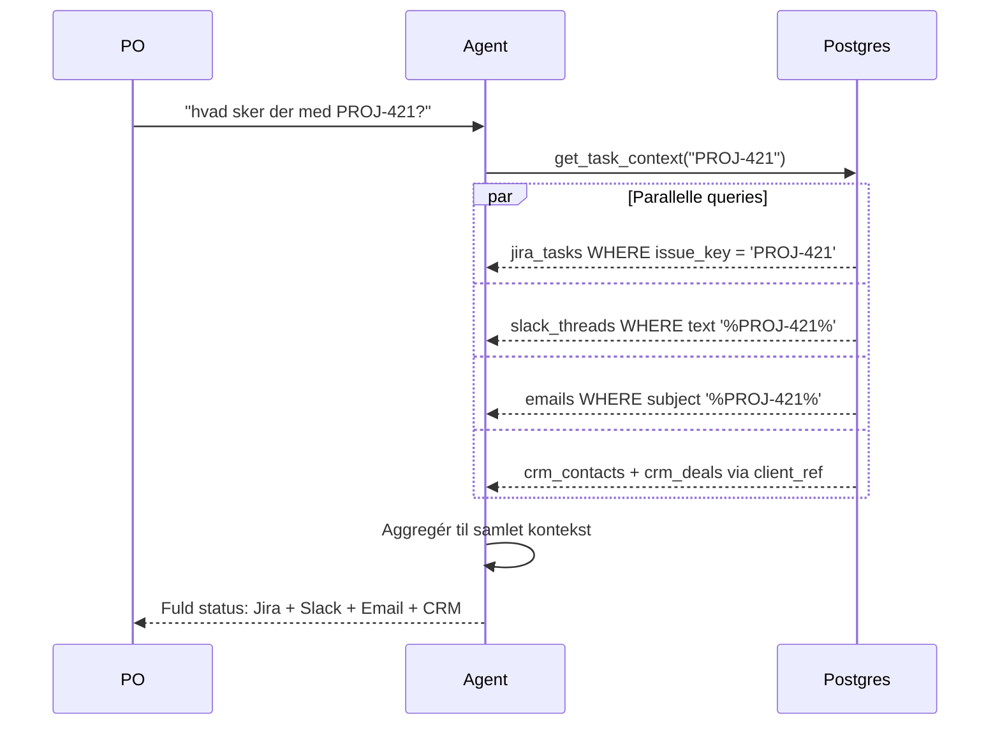

---------------

| Ex. data struktur til input til agent

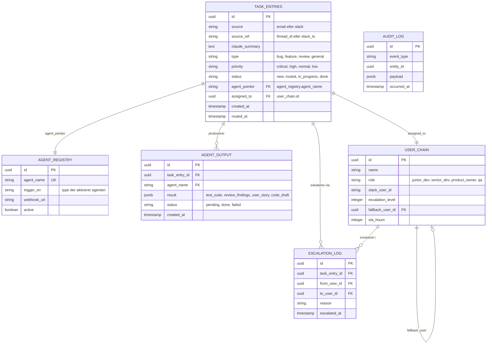
-------------

| Flere input, flere db's
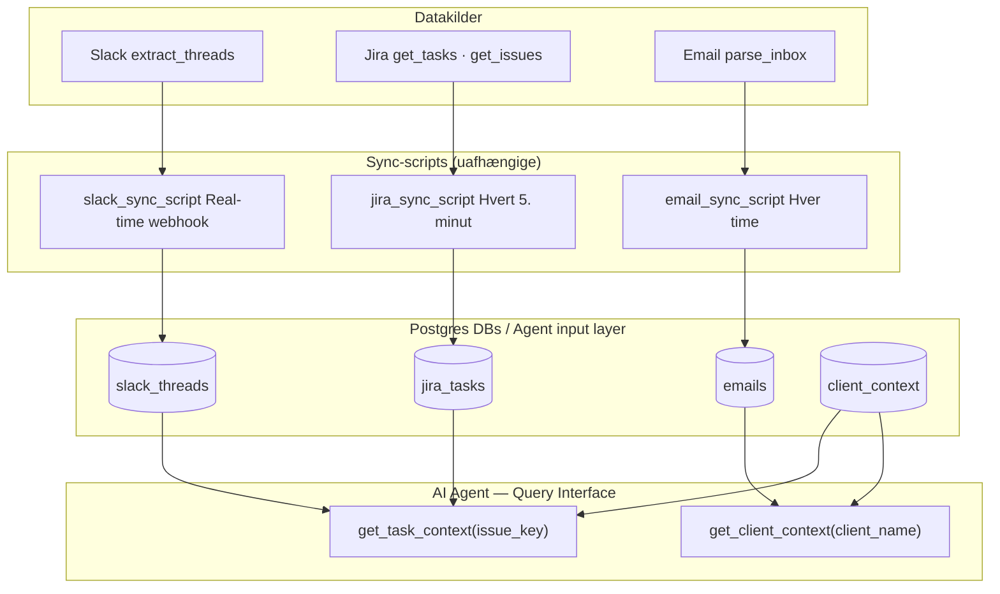

--------------------

| Den store med agenter, automatiseret led, flere modtagere, godkendt/ ikke godkendt

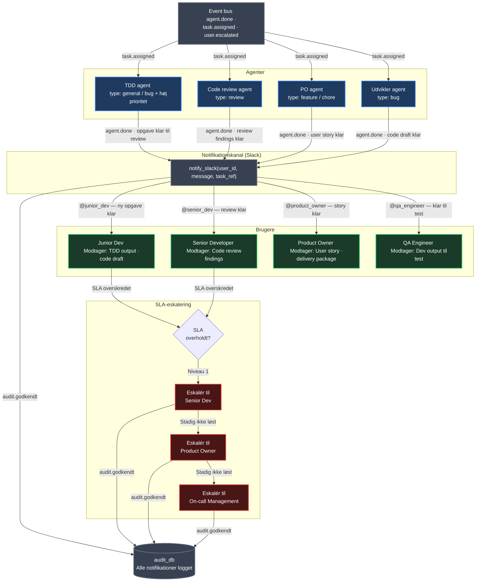