
# Overskrift

### Claude Agent: Analyse og entry-oprettelse

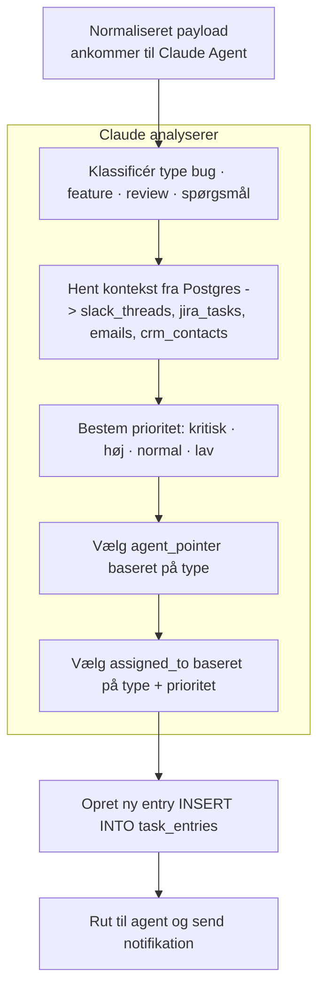
---

### Postgres-drevet Pipeline (Pseudo_toolset.py)

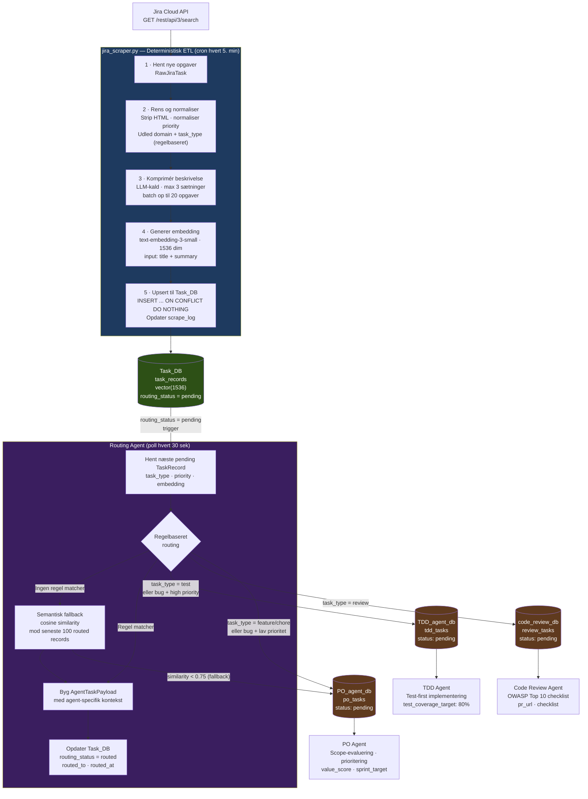

# Build My Brain — Postgres Agent Setup
**Softwareteam-edition** · Slack · Jira · Email · CRM

> Fire datakilder, én hjerne, én query-interface.  
> Claude stiller ét spørgsmål — og kender hele konteksten. Ingen manuel tab-jumping.

---

## Indhold

1. [Overordnet arkitektur](#overordnet-arkitektur)
2. [Databaseskema — The Brain](#databaseskema--the-brain)
3. [Synkroniseringsflow per datakilde](#synkroniseringsflow-per-datakilde)
4. [Claude query-interface](#claude-query-interface)
5. [Fejlhåndtering og resiliens](#fejlhåndtering-og-resiliens)
6. [/build-my-brain prompt](#build-my-brain-prompt)
7. [Eksempel-output: Claude ved](#eksempel-output-claude-ved)

---

## Overordnet arkitektur

Fire uafhængige sync-agenter skriver til Postgres. Claude læser derfra med ét kald.

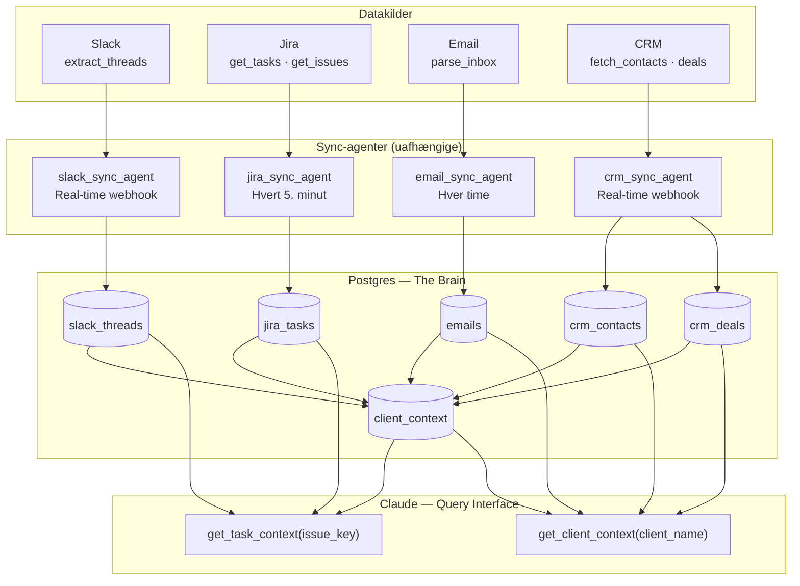

---

## Databaseskema — The Brain

### Tabel-oversigt og afhængigheder

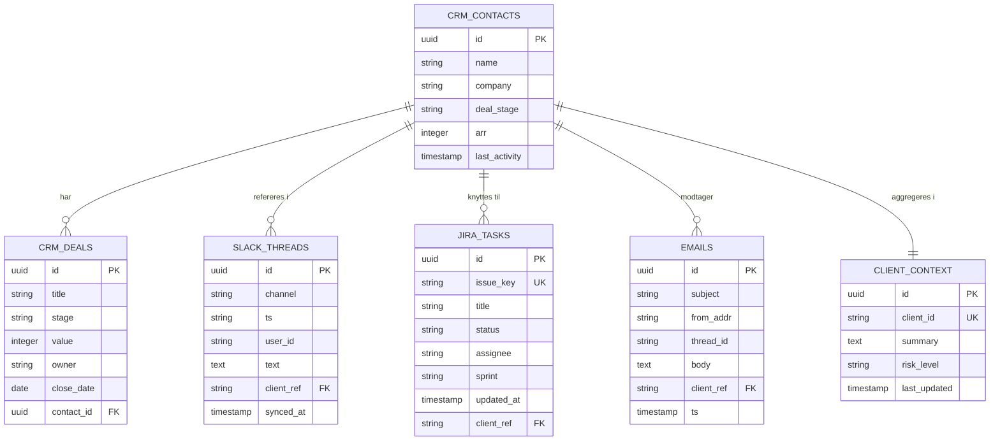

### Loading order

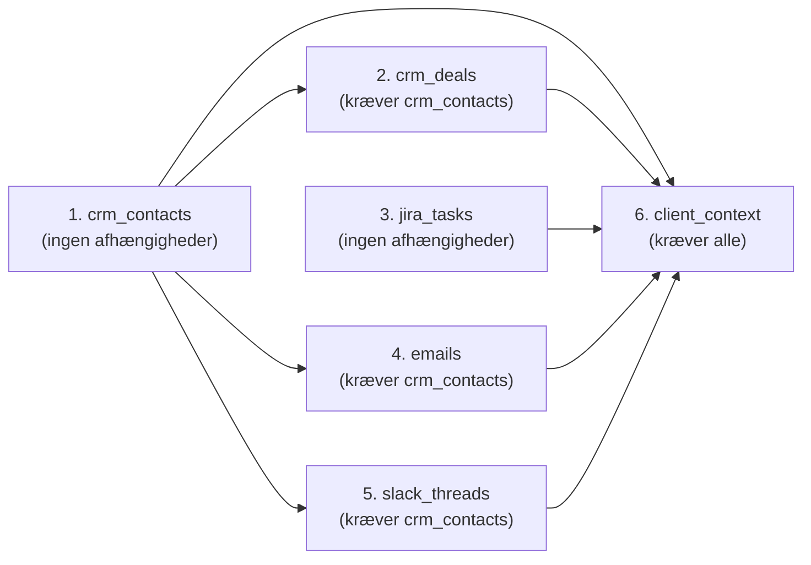

---

## Synkroniseringsflow per datakilde

### Slack — extract_threads

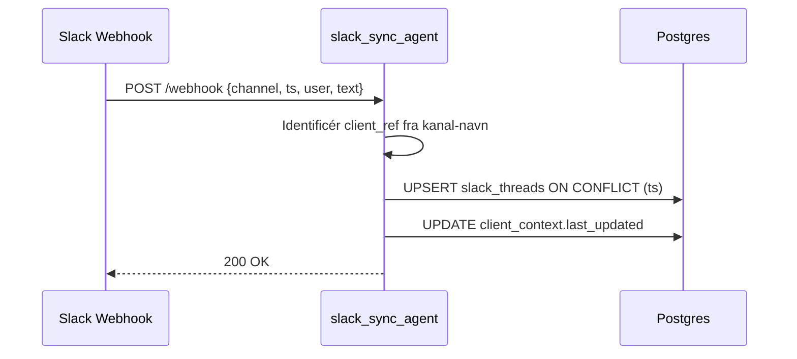

### Jira — get_tasks + get_issues

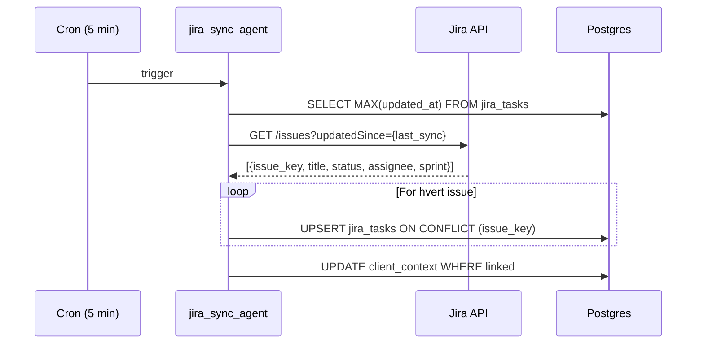

### Email — parse_inbox

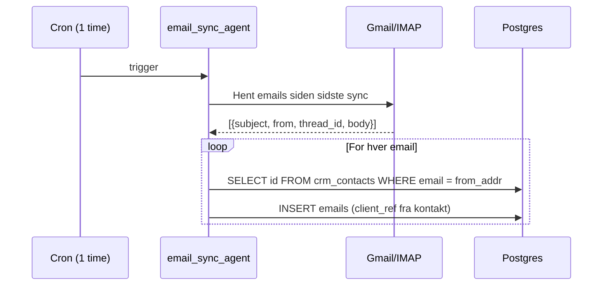

### CRM — fetch_contacts + deals

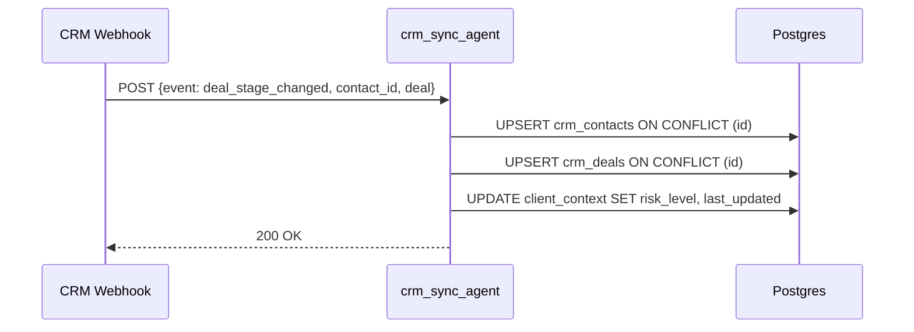

---

## Claude query-interface

### get_task_context — flow

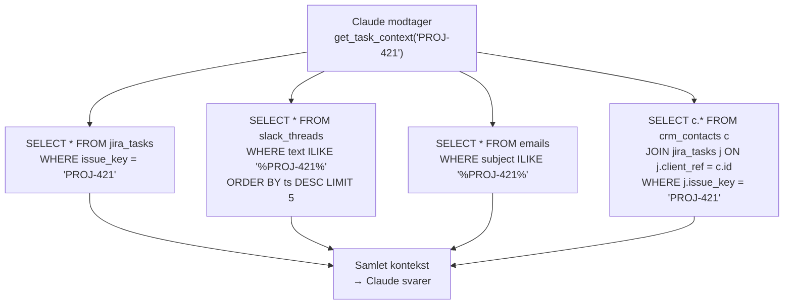

### get_client_context — flow

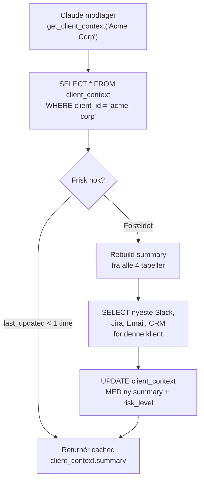

---

## Fejlhåndtering og resiliens

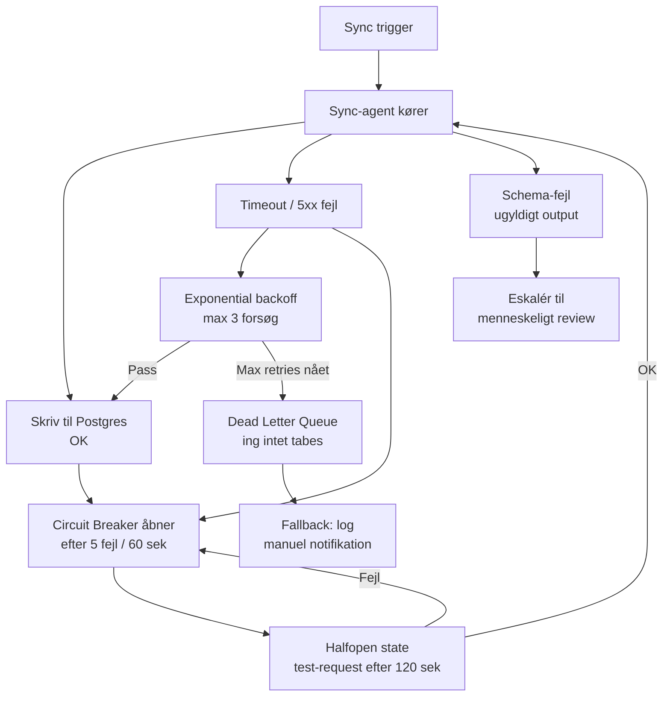

---

## /build-my-brain Prompt

Kopiér denne prompt direkte ind i Claude. Udfyld de tre sektioner — Claude stiller opfølgende spørgsmål, inden den genererer schema + loading order + sync-scripts.

```
/build-my-brain

// Mine værktøjer og MCP-forbindelser:
MCP_tools: [Slack, Jira, Gmail, HubSpot]

// Hvad vi laver som team:
business: [beskriv jeres primære arbejde og workflows]

// Hvilken kontekst mister AI'en oftest:
biggest_gap: [fx "ved ikke hvad der sker i en Jira-task
             uden at åbne tre forskellige tools"]

---

Design min Postgres-hjerne.

1. Schema (tabeller + kolonner + typer)
2. Loading order (afhængigheder)
3. Én sync-funktion per datakilde
4. get_task_context([issue_key])     — Claude-tool
5. get_client_context([client_name]) — Claude-tool

// Start med jira_tasks og slack_threads.
// Stil mig spørgsmål først.
// Generer derefter fuld SQL + Python-sync.
```

---

## Eksempel-output: Claude ved

Når en udvikler spørger **"hvad sker der med PROJ-421?"** trækker Claude fra alle fire kilder og svarer med fuld kontekst:

| Kilde | Felt | Værdi |
|---|---|---|
| **Jira** | Issue | PROJ-421 · In Review |
| | Assignee | Kode Karsten |
| | Sprint | Sprint 14 · 2 dage tilbage |
| **Slack** | Kanal | #proj-421-review |
| | Seneste besked | "Venter på QA sign-off" |
| | Tidspunkt | 23 minutter siden |
| **Email** | Emne | PROJ-421 review notes |
| | Fra | kunde@acme.com |
| | Tidspunkt | I dag 09:14 |
| **CRM** | Klient | Acme Corp |
| | Deal | Negotiation · 85k ARR |
| | Risiko | Medium — følg op |

### Dataflow for dette eksempel

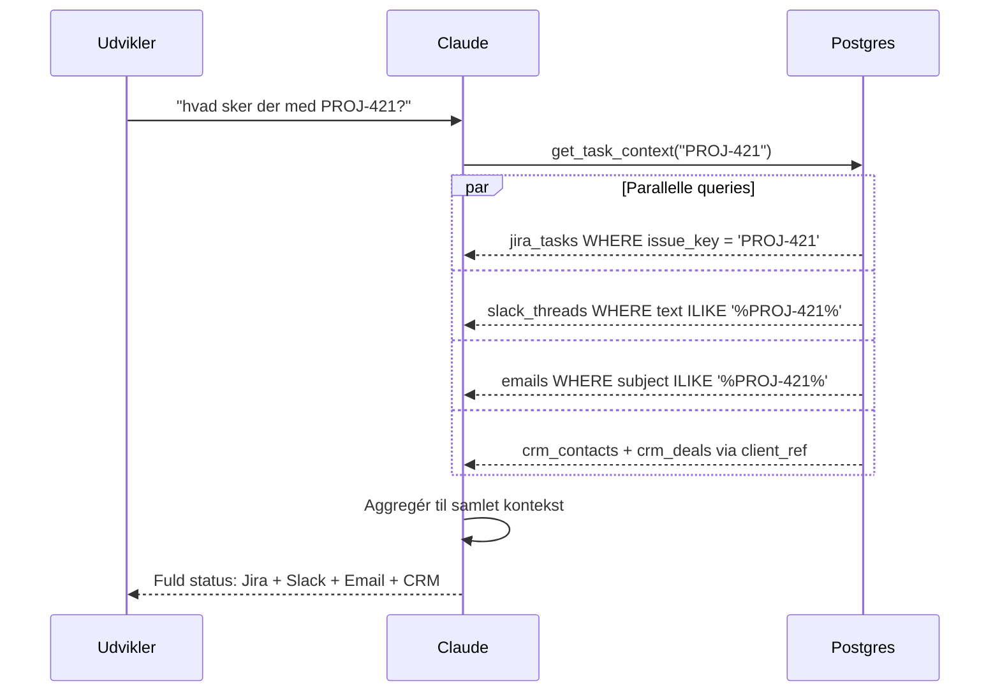

---

*Genereret som del af AI Agenter og Assistenter — Level 3 · Softwareteam-edition*
# Knowledge Maps from Build My Brain v2

This file contains knowledge maps extracted and converted from the mindmap-style diagrams in build_my_brain_v2.md.

## Task Status Lifecycle Knowledge Map

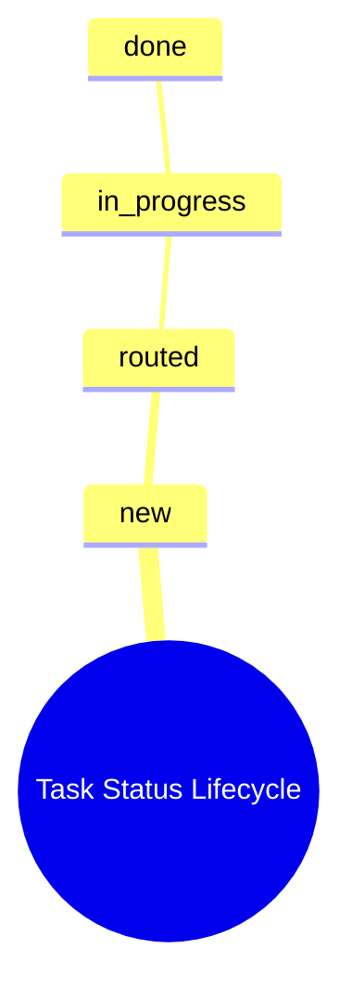

## Task Type to Agent to Person Routing Knowledge Map

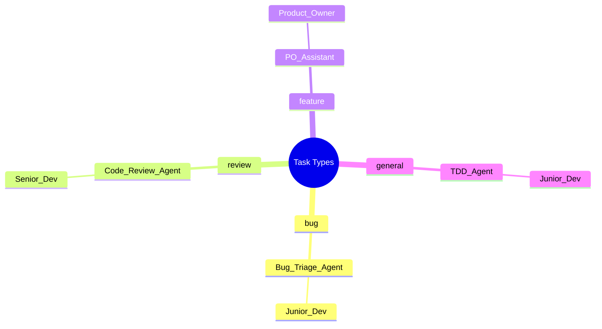

## SLA Escalation Chain Knowledge Map

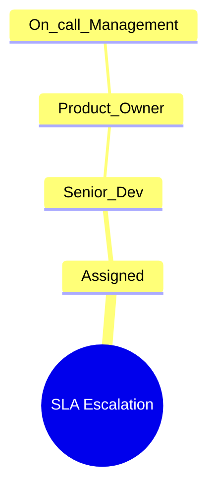

## Agent Output Knowledge Map

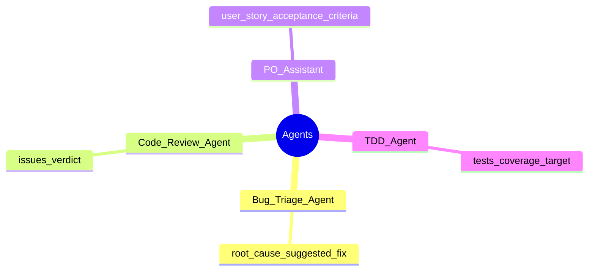

## Message Normalization Knowledge Map

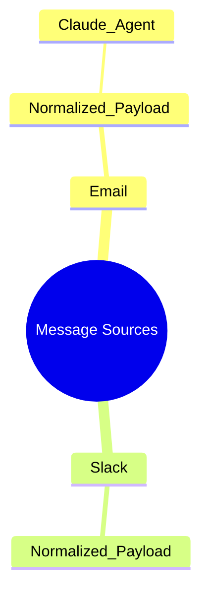

## Message Processing Flow Knowledge Map

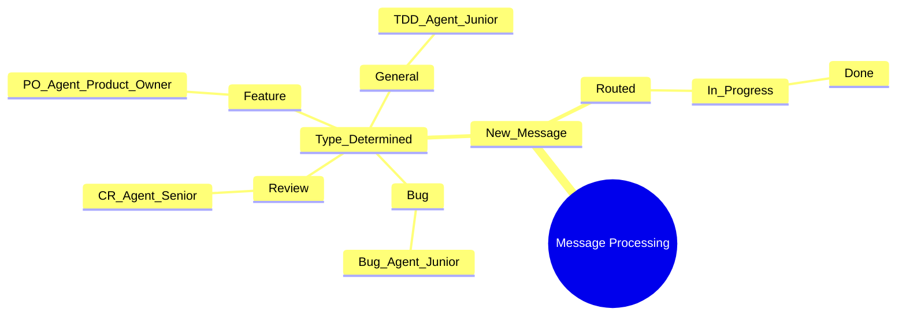
# Multi-database arkitektur — Mermaid diagrammer
**Splittet Postgres · Event Bus · AI Agenter · Bruger-kæde**

---

## Diagram 1 — Overordnet arkitektur

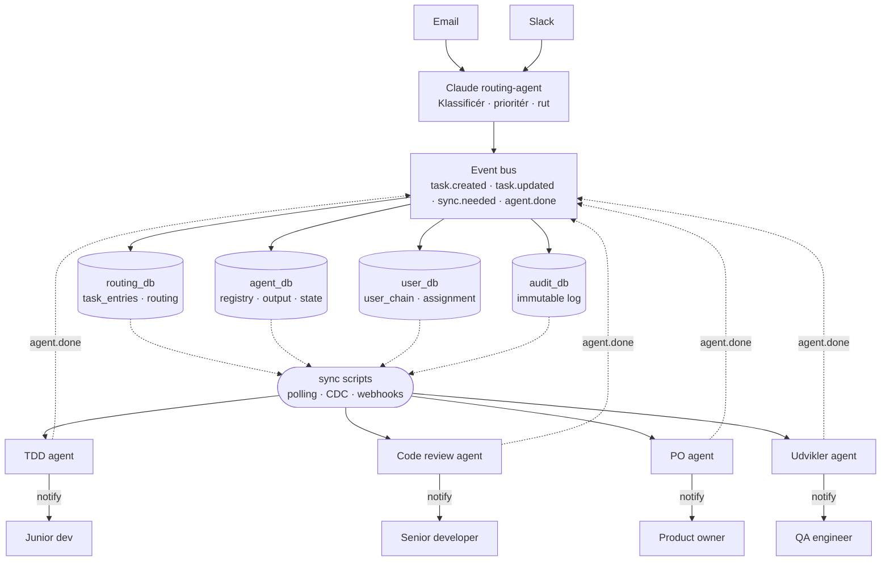

---

## Diagram 2 — Sync-lag og scripts

```mermaid
flowchart TD
    BUS["Event bus"]

    subgraph DBS["Databaser"]
        RDB[("routing_db\ntask_entries")]
        ADB[("agent_db\nagent_output")]
        UDB[("user_db\nuser_chain")]
        AUDB[("audit_db\nimmutable log")]
    end

    BUS -->|"task.assigned"| RDB
    BUS -->|"agent.triggered"| ADB
    BUS -->|"user.resolved"| UDB
    BUS -->|"audit.written"| AUDB

    subgraph SCRIPTS["Sync scripts"]
        CDC["cdc_routing_sync.py\nLytter på WAL · CDC"]
        POLL["poll_agent_output.py\nPoller hvert 30s"]
        WHOOK["sync_user_assignment.py\nWebhook-drevet"]
        AW["audit_writer.py\nAlle events · append-only"]
    end

    RDB  --> CDC
    ADB  --> POLL
    UDB  --> WHOOK
    AUDB --> AW

    CDC   -->|"task.created / task.updated"| BUS
    POLL  -->|"agent.done"| BUS
    WHOOK -->|"user.assigned"| BUS
    AW    -->|"audit.write"| AUDB
```

---

## Diagram 3 — Agent-kommunikation og event-flow

```mermaid
sequenceDiagram
    participant RDB as routing_db
    participant ADB as agent_db
    participant UDB as user_db
    participant AUDB as audit_db
    participant BUS as Event bus
    participant TDD as TDD agent
    participant CR as Code review agent
    participant PO as PO agent
    participant DEV as Udvikler agent
    participant USR as Bruger-kæde

    Note over BUS: task.created modtaget fra Claude routing-agent

    BUS->>RDB: Gem task_entry (type, prioritet, agent_pointer)
    BUS->>AUDB: audit.write — task oprettet

    RDB->>BUS: task.assigned (cdc_routing_sync.py)

    par Parallel agent-routing baseret på type
        BUS->>TDD: task.assigned — type: general
        TDD->>ADB: INSERT test_suite output
        TDD->>BUS: agent.done
        TDD->>USR: notify — Junior dev

    and
        BUS->>CR: task.assigned — type: review
        CR->>ADB: INSERT review_findings
        CR->>BUS: agent.done
        CR->>USR: notify — Senior developer

    and
        BUS->>PO: task.assigned — type: feature
        PO->>ADB: INSERT user_story
        PO->>BUS: agent.done
        PO->>USR: notify — Product owner

    and
        BUS->>DEV: task.assigned — type: bug
        DEV->>ADB: INSERT code_draft
        DEV->>BUS: agent.done
        DEV->>USR: notify — Junior dev / Senior dev
    end

    ADB->>BUS: agent.done (poll_agent_output.py · 30s)
    BUS->>RDB: UPDATE task_entries SET status = in_progress
    BUS->>AUDB: audit.write — agent færdig

    Note over UDB: Eskalering ved SLA-overskridelse
    UDB->>BUS: user.escalated (sync_user_assignment.py)
    BUS->>RDB: UPDATE assigned_to → næste niveau
    BUS->>USR: notify — eskaleret bruger
    BUS->>AUDB: audit.write — eskalering logget
```

---

## Diagram 4 — Databaseskema og relationer

```mermaid
erDiagram
    TASK_ENTRIES {
        uuid id PK
        string source "email eller slack"
        string source_ref "thread_id eller slack_ts"
        text claude_summary
        string type "bug, feature, review, general"
        string priority "critical, high, normal, low"
        string status "new, routed, in_progress, done"
        string agent_pointer FK "agent_registry.agent_name"
        uuid assigned_to FK "user_chain.id"
        timestamp created_at
        timestamp routed_at
    }

    AGENT_REGISTRY {
        uuid id PK
        string agent_name UK
        string trigger_on "type der aktiverer agenten"
        string webhook_url
        boolean active
    }

    AGENT_OUTPUT {
        uuid id PK
        uuid task_entry_id FK
        string agent_name FK
        jsonb result "test_suite, review_findings, user_story, code_draft"
        string status "pending, done, failed"
        timestamp created_at
    }

    USER_CHAIN {
        uuid id PK
        string name
        string role "junior_dev, senior_dev, product_owner, qa"
        string slack_user_id
        integer escalation_level
        uuid fallback_user_id FK
        integer sla_hours
    }

    ESCALATION_LOG {
        uuid id PK
        uuid task_entry_id FK
        uuid from_user_id FK
        uuid to_user_id FK
        string reason
        timestamp escalated_at
    }

    AUDIT_LOG {
        uuid id PK
        string event_type
        uuid entity_id
        jsonb payload
        timestamp occurred_at
    }

    TASK_ENTRIES ||--|| AGENT_REGISTRY : "agent_pointer"
    TASK_ENTRIES ||--|| USER_CHAIN     : "assigned_to"
    TASK_ENTRIES ||--o{ AGENT_OUTPUT   : "producerer"
    TASK_ENTRIES ||--o{ ESCALATION_LOG : "eskaleres via"
    USER_CHAIN   ||--o{ ESCALATION_LOG : "involveret i"
    USER_CHAIN   ||--o| USER_CHAIN     : "fallback_user"
```

---

## Diagram 5 — Fejlhåndtering og resiliens

```mermaid
flowchart TD
    BUS["Event bus\ntask.assigned"]

    AG["Agent trigges\nvia webhook"]

    BUS --> AG

    AG --> OK["Output skrevet\ntil agent_db"]
    AG --> TIMEOUT["Timeout / 5xx"]
    AG --> SCHEMA["Schema-fejl\nugyldigt output"]

    TIMEOUT --> RETRY["Exponential backoff\nmax 3 forsøg · jitter"]
    RETRY -->|"Pass"| OK
    RETRY -->|"Max retries"| DLQ["Dead letter queue\nIntet tabes"]

    SCHEMA --> ESC["Eskalér til\nmenneskeligt review"]

    OK --> CB{"Circuit breaker\ncheck"}
    TIMEOUT --> CB

    CB -->|"5 fejl / 60 sek"| OPEN["Breaker åbner\nAgent lukkes ned"]
    OPEN --> FALLBACK["Fallback:\nHuman-in-the-loop"]
    OPEN --> HALF["Halfopen state\nEfter 120 sek"]
    HALF -->|"Test OK"| AG
    HALF -->|"Test fejl"| OPEN

    OK --> AUDB[("audit_db\nEvent logget")]
    DLQ --> AUDB
    ESC --> AUDB
```

---

*Genereret fra multi-database agent-arkitektur · Splittet Postgres-model*
```mermaid
flowchart TD
    Jira(["🔔 Jira Task\nOrchestrator Trigger"])

    CR["customer_request_skill\n— Agent —"]
    PO["po_agent_skill\n— Agent —"]
    CTX["context_agent_skill\n— Agent —"]
    CA["coding_assistant_skill\n— Assistant —"]
    DEV{"Developer\ngodkender?"}
    TDD["tdd_agent_skill\n— Agent / Sandkasse —"]
    RETRY{"Retry\nforsøg?"}
    BLOCKED(["🚨 Blocked\nEskaleret til menneske"])
    PRa["pr_agent_skill\n— Agent —"]
    RA["review_assistant_skill\n— Assistant / Supervisor —"]
    RISK{"Risiko-\nniveau?"}
    RA_AUTO["Auto-godkend\nSupervisor"]
    REVIEWER{"Reviewer\nbeslutning?"}
    DA["delivery_assistant_skill\n— Assistant —"]
    PO_GATE{"PO\ngodkender?"}
    DONE(["✅ Deployed"])

    Jira --> CR
    CR -->|StructuredSpec| PO
    PO -->|ContextPackage| CTX
    CTX -->|EnrichedContext| CA
    CA -->|Præsenter CodeDraft| DEV
    DEV -->|"Afvis + feedback"| CA
    DEV -->|Godkend| TDD

    TDD -->|"pass — coverage ≥80%"| PRa
    TDD -->|fail| RETRY
    RETRY -->|"Forsøg 1–3"| CA
    RETRY -->|"Forsøg 4"| BLOCKED

    PRa -->|PullRequest| RA
    RA --> RISK
    RISK -->|Lav-risiko| RA_AUTO
    RISK -->|Høj-risiko| REVIEWER
    RA_AUTO --> DA
    REVIEWER -->|approve| DA
    REVIEWER -->|changes| CA

    DA -->|Præsenter DeliveryPackage| PO_GATE
    PO_GATE -->|"Afvis"| DA
    PO_GATE -->|Godkend| DONE

    classDef agent fill:#1e3a5f,color:#ffffff,stroke:#3b82f6,stroke-width:2px
    classDef assistant fill:#3b1f5e,color:#ffffff,stroke:#a855f7,stroke-width:2px
    classDef gate fill:#1a3a2a,color:#ffffff,stroke:#22c55e,stroke-width:2px
    classDef terminal fill:#374151,color:#ffffff,stroke:#6b7280,stroke-width:2px
    classDef blocked fill:#4a1515,color:#ffffff,stroke:#ef4444,stroke-width:2px

    class CR,PO,CTX,TDD,PRa,RA_AUTO agent
    class CA,RA,DA assistant
    class DEV,RISK,REVIEWER,RETRY,PO_GATE gate
    class Jira,DONE terminal
    class BLOCKED blocked
```
