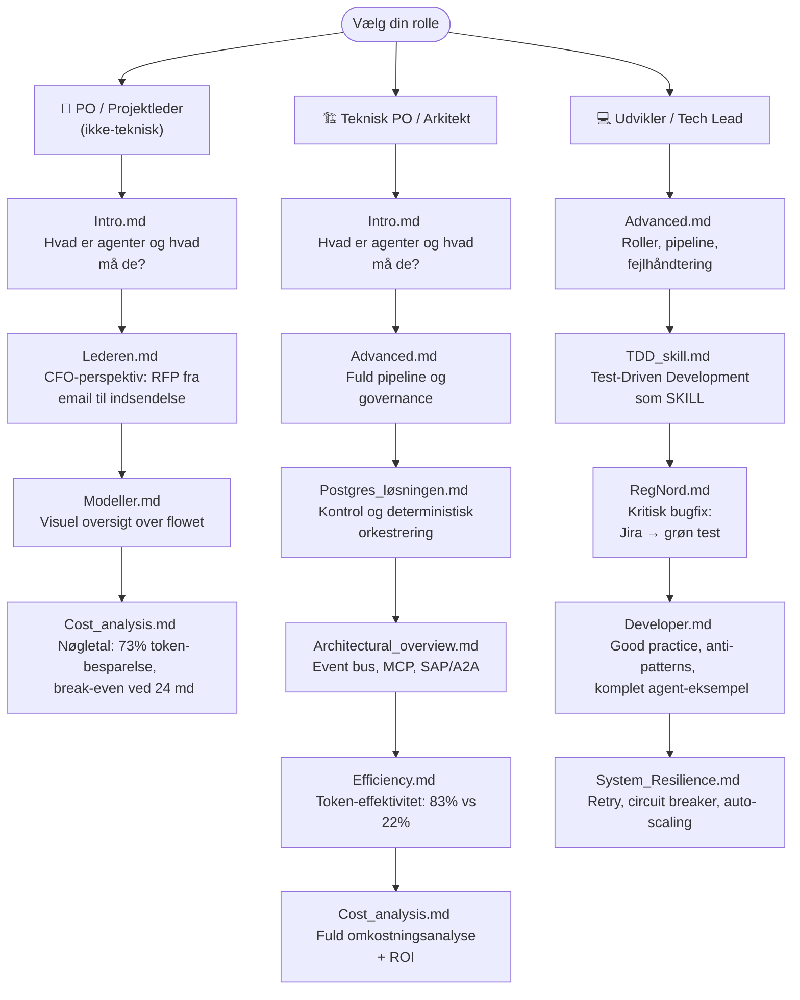

# CGI AI Agent Framework

> **Målgruppe:** Product Owner og ledere med interesse i AI-agenter som forretningsværktøj. Der er også masser information i repo til udviklere, sikkerheds personale og database hajer. 

---

## Hvad er dette repository?

Dette repository indeholder arkitektur, principper, eksempler og tekniske specifikationer for et AI agent-framework udviklet til CGI. Indholdet kan bruges som vidensgrundlag, præsentationsmateriale og teknisk blueprint for implementering af AI-agenter i professionelle softwareprocesser.

---

## Centrale begreber

| Begreb | Forklaring |
|--------|-----------|
| **Agent** | Kører autonomt og udfører opgaver uden menneskelig godkendelse — reagerer på triggers (fx ny Jira-opgave, email, CI-fejl) |
| **Assistant** | Hjælper et menneske og afventer altid godkendelse inden handling |
| **Orchestrator** | Koordinerer arbejdsflowet — modtager events og delegerer til de rette agenter |
| **Human-in-the-loop** | Kritiske beslutningspunkter hvor mennesket altid er suveræn |
| **SKILL.md** | Kontrakten for hver agent: hvad den *må*, *ikke må*, hvilke metrics den overvåges på |

---

## Forretningsværdi

Frameworket adresserer tre kernegevinster:

1. **Mindre manuelt arbejde** — Rutineopgaver (triage, analyse, dokumentation, PR-forberedelse) udføres automatisk.
2. **Hurtigere leverance** — Koden skrives, testes og reviewes i en kontinuerlig pipeline uden ventetid mellem handoffs.
3. **Højere kvalitet** — Agenter er forpligtet på TDD (Test-Driven Development): tests skrives *før* kode, og ingen leverance passerer uden grøn test.

---

## Nøgletal — effektivitet og økonomi

Postgres-løsningen bruger AI **kun** til reel inferens. Alt andet — databehandling, routing, kontekst-levering — er deterministisk kode med 0 tokens.

| Metrik | Postgres-løsning | Traditionel AI-swarm | Forskel |
|--------|-----------------|---------------------|----------|
| **Token-forbrug per opgave** | 12.000 | 45.000 | **73% reduktion** |
| **Token-effektivitetsindeks** | 83% | 22% | **3,8× bedre** |
| **LLM-omkostning (10.000 opgaver/md)** | $960/md | $2.850/md | **$1.890/md spart** |
| **Break-even** | 24 måneder | — | Positiv ROI fra år 2 |
| **Total besparelse (enterprise, 100k/md)** | — | — | **$22.900/md** |

> **Kerneprincip:** 83% af hvert token bruges på reel AI-værdi. I en traditionel AI-swarm er det kun 22%. Se [Efficiency.md](Effektiviseing/Efficiency.md) og [Cost_analysis.md](Bonus_informationer/Cost_analysis.md) for fuld analyse.

---

## Indhold i dette repository

### Introduktion og arkitektur

| Dokument | Indhold |
|----------|---------|
| [CGI_Agent/Intro](https://github.com/chrisstineline/CGI_Agent/blob/main/Intro.md) | Introduktion til AI-agenter — hvad de er, hvad de ikke er, og grundreglerne der styrer dem |
| [CGI_Agent/Advanced](https://github.com/chrisstineline/CGI_Agent/blob/main/Advanced.md) | Avanceret pipeline med alle roller, TDD-flow, fejlhåndtering og governance via SKILL.md-kontrakten |
| [CGI_Agent/Modeller](https://github.com/chrisstineline/CGI_Agent/blob/main/Modeller.md) | Visuel reference — alle Mermaid-diagrammer fra introduktion og avanceret niveau samlet ét sted |
| [CGI_Agent/Postgres_løsningen](https://github.com/chrisstineline/CGI_Agent/blob/main/Postgres_l%C3%B8sningen.md) | Postgres som systemets "hjerne": deterministisk orkestrering, auditabilitet og kontrol over AI-inferens |
| [CGI_Agent/TDD_skill](https://github.com/chrisstineline/CGI_Agent/blob/main/TDD_skill.md) | Test-Driven Development som SKILL — regler og praksis for agenter og udviklere |

### Konkrete eksempler

| Dokument | Scenarie |
|----------|---------|
| [CGI_Agent/Eksempler/Lederen](https://github.com/chrisstineline/CGI_Agent/blob/main/Eksempler/Lederen.md) | CGI CFO modtager RFP (50M DKK) på email — systemet analyserer, udarbejder tilbud og indsender, med CFO som beslutningsejer ved kritiske punkter |
| [CGI_Agent/Eksempler/RegNord](https://github.com/chrisstineline/CGI_Agent/blob/main/Eksempler/RegNord.md) | Kritisk bug på Aalborg Sygehus rammer 150+ kliniske brugere — fra Jira-ticket til grøn test og deployeret fix |
| [CGI_Agent/Eksempler/Developer](https://github.com/chrisstineline/CGI_Agent/blob/main/Eksempler/Developer.md) | Good practice for udviklere — mappestruktur, SKILL.md-kontrakter, MCP-adgang, fejlhåndtering, testing og anti-patterns |

### Teknisk dokumentation

| Dokument | Indhold |
|----------|---------|
| [CGI_Agent/Technical/Architectural_overview](https://github.com/chrisstineline/CGI_Agent/blob/main/Technical/Architectural_overview.md) | Event bus, multi-database isolation, MCP, SAP/A2A-protokol, orchestrator, sync scripts og semantisk søgning |
| [CGI_Agent/Technical/Security_Architectue](https://github.com/chrisstineline/CGI_Agent/blob/main/Technical/Security_Architectue.md) | 5-lags "fortress"-model: perimeter, netværk, applikation, data og monitoring — Zero Trust, TLS 1.3 |
| [CGI_Agent/Technical/System_Resilience](https://github.com/chrisstineline/CGI_Agent/blob/main/Technical/System_Resilience.md) | Fejltolerance: retry-logik, circuit breaker, bulkhead-mønster og auto-scaling |
| [CGI_Agent/Technical/MCP_Server](https://github.com/chrisstineline/CGI_Agent/blob/main/Technical/MCP_Server.md) | Komplet MCP-server med JWT-auth, tool registry, rate limiting og audit logging — agenternes eneste adgang til Postgres |
| [CGI_Agent/Technical/Monitoring](https://github.com/chrisstineline/CGI_Agent/blob/main/Technical/Monitoring.md) | Observability-setup: Prometheus, Grafana dashboards, alerting, audit trail som tracing og SQL-baseret monitoring |

### Effektivisering og økonomi

| Dokument | Indhold |
|----------|---------|  
| [CGI_Agent/Effektiviseing/Efficiency](https://github.com/chrisstineline/CGI_Agent/blob/main/Effektiviseing/Efficiency.md) | Token-effektivitetsanalyse (dansk): 5 besparelseslag, PROJ-421 eksempel, effektivitetsindeks 83% vs. 22% |
| [CGI_Agent/Bonus_informationer/Cost_analysis](https://github.com/chrisstineline/CGI_Agent/blob/main/Bonus_informationer/Cost_analysis.md) | Komplet omkostningsanalyse: LLM-priser, infrastruktur, personale, break-even ved 24 md, ROI-beregninger og skalerings-scenarier |

### Step-by-step og templates

| Dokument | Indhold |
|----------|---------|  
| [CGI_Agent/Step_by_step/Stage_1](https://github.com/chrisstineline/CGI_Agent/blob/main/Step_by_step/Stage_1.md) | Postgres-fundament: kernetabeller, ETL-scripts, routing og embeddings |
| [CGI_Agent/Step_by_step/Stage_2](https://github.com/chrisstineline/CGI_Agent/blob/main/Step_by_step/Stage_2.md) | Første AI-agent: SKILL.md, kontekst-hentning, output, retry og human-in-the-loop |
| [CGI_Agent/Step_by_step/Stage_3](https://github.com/chrisstineline/CGI_Agent/blob/main/Step_by_step/Stage_3.md) | Event bus, multi-database isolation, circuit breaker, bulkhead og metrics |
| [CGI_Agent/Step_by_step/Deployment_guide](https://github.com/chrisstineline/CGI_Agent/blob/main/Step_by_step/Deployment_guide.md) | Komplet deployment: database-setup, Docker Compose, Prometheus, Grafana og CI/CD |
| [CGI_Agent/Templates/Agent_code_template](https://github.com/chrisstineline/CGI_Agent/blob/main/Templates/Agent_code_template.md) | BaseAgent-klasse, TDD Agent-implementering, SKILL.md-skabelon og event bus-integration |

---

## Anbefalede læsestier




### For PO / projektleder (ikke-teknisk)
1. [Intro](https://github.com/chrisstineline/CGI_Agent/blob/main/Intro.md) — forstå hvad agenter er og hvad de må
2. [Lederen](https://github.com/chrisstineline/CGI_Agent/blob/main/Eksempler/Lederen.md) — se det i praksis fra et CFO-perspektiv
3. [Modeller](https://github.com/chrisstineline/CGI_Agent/blob/main/Modeller.md) — visuel oversigt over flowet
4. [Cost_analysis](https://github.com/chrisstineline/CGI_Agent/blob/main/Bonus_informationer/Cost_analysis.md) — nøgletal: 73% token-besparelse, break-even ved 24 md, ROI-beregninger

### For teknisk PO / arkitekt
1. [Intro](https://github.com/chrisstineline/CGI_Agent/blob/main/Intro.md)
2. [Advanced](https://github.com/chrisstineline/CGI_Agent/blob/main/Advanced.md) — fuld pipeline og governance
3. [Postgres_løsningen](https://github.com/chrisstineline/CGI_Agent/blob/main/Postgres_l%C3%B8sningen.md) — kontrol og deterministisk orkestrering
4. [Architectural_overview](https://github.com/chrisstineline/CGI_Agent/blob/main/Technical/Architectural_overview.md)
5. [Efficiency](https://github.com/chrisstineline/CGI_Agent/blob/main/Effektiviseing/Efficiency.md) — token-effektivitet: 83% nyttige tokens vs. 22% i AI-swarm
6. [Cost_analysis](https://github.com/chrisstineline/CGI_Agent/blob/main/Bonus_informationer/Cost_analysis.md) — fuld omkostningsanalyse med skalerings-scenarier

### For udvikler / tech lead
1. [Advanced](https://github.com/chrisstineline/CGI_Agent/blob/main/Advanced.md)
2. [TDD_skill](https://github.com/chrisstineline/CGI_Agent/blob/main/TDD_skill.md)
3. [RegNord](https://github.com/chrisstineline/CGI_Agent/blob/main/Eksempler/RegNord.md) — komplet bugfix-flow med TDD
4. [Developer](https://github.com/chrisstineline/CGI_Agent/blob/main/Eksempler/Developer.md) — good practice, anti-patterns og komplet agent-eksempel
5. [System_Resilience](https://github.com/chrisstineline/CGI_Agent/blob/main/Technical/System_Resilience.md)
6. [Deployment_guide](https://github.com/chrisstineline/CGI_Agent/blob/main/Step_by_step/Deployment_guide.md) — database-setup, Docker Compose, CI/CD

---

## Arkitektur på ét blik

```
Trigger (email / Jira / timer)
        │
        ▼
  Orchestrator ──► Event Bus
        │
        ├──► Reaktiv Agent (automatisk)
        │         │
        │         ▼
        │    Analyserende Agent (automatisk)
        │         │
        │         ▼
        └──► Assistant ──► Menneske godkender ──► Levering
```

Alle handlinger logges i en **immutable audit-log**. Intet sker uden sporing.

---

## Principper for sikkerhed og kontrol

- **Human-in-the-loop er ikke valgfrit** — alle kritiske beslutninger kræver menneskelig godkendelse
- **Forbidden-sektionen i SKILL.md er governance** — agenter har hårde grænser for hvad de *aldrig* må
- **Zero Trust** — ingen agent stoler implicit på en anden
- **Audit trail** — alle hændelser, godkendelser og eskalationer er sporbare

---

## Status

Dokumentationen er konceptuel og bruges som vidensdeling og præsentationsgrundlag. Kodeeksempler ([Pseudo_toolset.py](CGI_Agent/Pseudo_toolset.py)) er pseudokode til illustration af agenters arbejdsopgaver.
