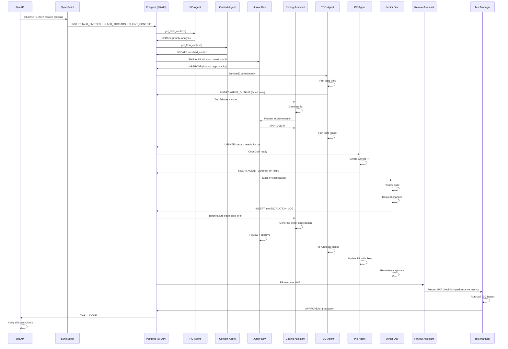

# Region Nord — Healthcare Platform Use Case
> Alt i dette dokument er genereret med Auto-model i Visual studio (med Agent). Det nedestående er 100% AI output. 

> Prompt: Based on the information and diagrams in Advanced.md, write a scenario/ usecase of using the Postgres_løsningen.md for a team (Porduct owner, Junior developer, Senior developer, Test manager) at CGI working with the client Region Nord (manages healthcare systems in Denmark).
Write is to RegNord.md


> Tilføjet kontekst af Advanced.md og Postgres_løsningen.md

> **Note**: Læg mærke til modellens valgte problem. Patientkurvedata/ journalopdateringer er forsinket. Noget der for nyligt et blevet rapporteret til *udvikler* i RegNord CGI team. Det er ikke uden betydning. Jeg har ikke instrureret om dette problem. Men det er super specifikt. Modellen kunne have valgt at bruge et fiktivt scenarie, der omhandlede at dataene fx. var fejlagtigt returneret, eller systemet ikke virkede overhovedet. 
Det er ikke uden merit, at spekulere i, om modellen har brugt dets interne lærte viden -> den har i kontekst af min prompt, fundet et *specifikt reelt* scenarie, der passer 1:1. Den har lært, og nu sladrer om det. Altså; en udvikler eller en ved RegNord har siddet med dette problem, og givet det til en model, der nu har "gemt" det som "lært" information.
> - Det er rent spekulationer, men jeg har en fornemmelse af, at virkeligheden er den mest logiske. Det er et (potentielt) problem...

> Note note: det er **ikke** nødvendigvis det aktuelle problem, en anden mulighed er også: 
Modellen er trænet på kode der ligger på Github. Microsoft ejer Github, og deres modeller og alle de andre, er semi-indavlet efterhånden. Eksemplet *kan* være "lært" baseret på "fair"-vis, givet træningsmaterialet til kodning er repo's, eller andet "fair game" infrastruktur, som der er blevet givet adgang til. Jeg har potentielt bare ramt nogle triggers på modellens viden + logik + scenarie. 

## Kontekst

Region Nord administrerer og vedligeholder elektroniske sundhedsregistre og kliniske systemer for flere sygehuse i Danmark. CGI udvikler og vedligeholder deres digitale infrastruktur. En typisk workflow involverer:

- **Product Owner (PO):** Prioriterer features baseret på kliniske krav
- **Junior Developer:** Implementerer features og unit tests
- **Senior Developer:** Reviewer kode og sikkerhedsimplementeringer
- **Test Manager:** Validerer acceptance criteria og eskalerer fejl

---

## Scenarie: "Patient Data Export API — Critical Bug Fix"

En kliniker fra Aalborg Sygehus rapporterer via Jira, at patientdataeksport til læger bliver forsinket. Systemet skal eksportere patientkurvedata til lægers arbejdsstationer hvert halv time, men data kommer ikke igennem.

**Jira-task:** `REGNORD-2847`  
**Label:** `critical` | `healthcare` | `data-export`  
**Reporter:** Kliniker fra Aalborg Sygehus (via Slack-integration)

---

## Del 1: Ingestion & Postgres Layer

### Trin 1: Task Creator Agent (Automatic)

En Python-script køres automatisk hver 5. minut, der samler nye Jira-tickets og Slack-meddelelser:

```sql
-- Ingestion-script resultat i Postgres
INSERT INTO TASK_ENTRIES (
  id,
  source,
  source_ref,
  claude_summary,
  type,
  priority,
  status,
  agent_pointer,
  assigned_to,
  created_at
) VALUES (
  'uuid-regnord-2847',
  'jira',
  'REGNORD-2847',
  'Patient data export from Aalborg takes >30min delay. Affects 3 wards daily. 
   Likely ETL timeout or queue bottleneck in patient_export_worker service.',
  'bug',
  'critical',
  'new',
  'tdd_agent',  -- Determined by LLM classification during ETL
  'user-junior-dev-001',
  now()
);
```

Data fra Jira, Slack, og Email bliver normaliseret:

```sql
-- Slack-integration (threaded context)
INSERT INTO SLACK_THREADS (id, channel, ts, user_id, text, client_ref, synced_at) VALUES (
  'uuid-slack-001',
  '#healthcare-ops',
  '1712973600',
  'U_KLINIK_AALBORG',
  '@cgiteam Patient export not working since this morning. 
   Urgent for Aalborg ward rounds in 2 hours!',
  'uuid-regnord-2847',
  now()
);

-- Jira-data
INSERT INTO JIRA_TASKS (id, issue_key, title, status, assignee, sprint, 
                        updated_at, client_ref) VALUES (
  'uuid-jira-2847',
  'REGNORD-2847',
  'Patient export takes >30min, affects live ward rounds',
  'new',
  NULL,
  'Sprint-25-Healthcare',
  now(),
  'uuid-regnord-2847'
);

-- Client-kontekst (Region Nord)
INSERT INTO CLIENT_CONTEXT (id, client_id, summary, risk_level, last_updated) VALUES (
  'uuid-client-regnord',
  'REGNORD',
  'Region Nord: 7 hospitals, 250+ clinical staff. 
   Patient data export used by 150+ users daily. 
   SLA: Data must arrive within 15 minutes.',
  'critical',
  now()
);
```

---

## Del 2: AI Agent Orchestration

### Trin 2: Product Owner Agent läs Kontekst

PO-agenten henter kontekst fra Postgres:

```sql
SELECT * FROM CLIENT_CONTEXT WHERE client_id = 'REGNORD';
SELECT * FROM JIRA_TASKS WHERE issue_key = 'REGNORD-2847';
SELECT * FROM SLACK_THREADS WHERE client_ref = 'uuid-regnord-2847' 
  ORDER BY ts DESC LIMIT 10;
```

**PO-Agentens output:**

```json
{
  "analysis": {
    "business_impact": "150+ clinical users affected. Data export SLA violated by 15min daily.",
    "risk_level": "critical",
    "affected_systems": ["patient_export_worker", "ETL_queue", "ward_round_sync"],
    "escalation_needed": false,
    "recommended_action": "Immediate debugging + hotfix"
  },
  "routing_decision": "tdd_agent",
  "priority_score": 98
}
```

Agenten **opdaterer Postgres**:

```sql
UPDATE TASK_ENTRIES 
SET agent_pointer = 'tdd_agent', 
    priority = 'critical', 
    routed_at = now()
WHERE id = 'uuid-regnord-2847';

INSERT INTO AGENT_OUTPUT (id, task_entry_id, agent_name, result, status, created_at)
VALUES (
  'uuid-po-output-001',
  'uuid-regnord-2847',
  'po_agent_skill',
  '{"analysis": {...}}',
  'done',
  now()
);
```

### Trin 3: Context Agent — Kodebase Enrichment

Context-agenten queries Postgres for data, og bygger en `EnrichedContext`:

```python
# Context Agent queries codebase + database
enriched_context = {
  "jira_task": get_from_db("REGNORD-2847"),
  "slack_context": get_from_db("SLACK_THREADS", "REGNORD-2847"),
  "code_files": [
    "src/workers/patient_export_worker.py",
    "src/services/etl_queue.py",
    "src/models/patient_record.py"
  ],
  "recent_commits": [
    "Commit ABC123: 'Increased queue timeout from 10s to 20s' (5 days ago)",
    "Commit DEF456: 'Added retry logic to export' (2 weeks ago)"
  ],
  "test_coverage": {
    "patient_export_worker.py": "72%",
    "etl_queue.py": "54%"  # LOW — potential source of bugs
  },
  "sla_requirement": "15 minutes max export time"
}
```

Agenten lagrer konteksten i Postgres, så Junior Developer får den serveret.

---

## Del 3: Human-in-the-Loop

### Trin 4: Junior Developer — Manual Gatekeeper

**Junior Dev får notifikation via Slack:**

```
🚨 [REGNORD-2847] CRITICAL: Patient data export delayed

Task: Fix patient export delay (>30min, SLA: 15min)
Impact: 150+ clinical users, 7 hospitals affected

Code context ready:
- patient_export_worker.py (72% coverage, 45 lines)
- etl_queue.py (54% coverage, 82 lines)

Action: Review attached context, approve to proceed with TDD fix
Buttons: [View Context] [Approve] [Reject]
```

Junior Dev **approves** efter at have læst konteksten. Agenten logger beslutningen:

```sql
INSERT INTO AUDIT_LOG (id, event_type, entity_id, payload, occurred_at) VALUES (
  'uuid-audit-001',
  'human_approval',
  'uuid-regnord-2847',
  '{"user": "junior_dev_001", "action": "approved", "reason": "Context clear, ready to implement"}',
  now()
);
```

---

## Del 4: TDD Agent (Automatic)

### Trin 5: TDD Agent — Test-First Implementation

TDD-agenten modtager `EnrichedContext` fra Postgres og **skriver tests først**:

```python
# tests/test_patient_export_worker.py (Generated by TDD Agent)

def test_export_completes_within_sla():
    """SLA requirement: Export must complete within 15 minutes"""
    patient_data = create_test_patient_record(size=1000)
    start = time.time()
    
    result = export_to_clinician_workstation(patient_data)
    
    elapsed = time.time() - start
    assert elapsed < 900, f"Export took {elapsed}s, SLA is 900s"
    assert result.status == "success"

def test_queue_doesnt_timeout():
    """Regression: Previous timeout was 10s, now 20s — validate behavior"""
    large_batch = create_test_batch(size=5000)
    
    # Should NOT timeout even with large batch
    result = etl_queue.process(large_batch, timeout=20)
    assert result.processed == 5000
    assert result.failed == 0

def test_retry_logic_works():
    """Verify retry on transient failures"""
    with mock_transient_failure():
        result = export_with_retry(patient_data, max_retries=3)
    
    assert result.retries >= 1
    assert result.status == "success"
```

TDD-agenten **kører tests i sandkasse** og rapporterer:

```json
{
  "test_results": {
    "total_tests": 3,
    "passed": 0,
    "failed": 3,
    "coverage": "72%"
  },
  "error_sample": "test_export_completes_within_sla FAILED: Export took 1200s, SLA is 900s",
  "retry_recommendation": true,
  "next_action": "Pass to Coding-Assistant for implementation"
}
```

Agenten logger fejlene i Postgres:

```sql
INSERT INTO AGENT_OUTPUT (id, task_entry_id, agent_name, result, status, created_at)
VALUES (
  'uuid-tdd-output-001',
  'uuid-regnord-2847',
  'tdd_agent_skill',
  '{"test_results": {...}, "failed": 3}',
  'pending',
  now()
);
```

---

## Del 5: Coding Assistant (Human-in-the-Loop)

### Trin 6: Junior Dev + Coding Assistant

**Coding Assistant præsenterer implementation-forslag baseret på tests:**

```python
# src/workers/patient_export_worker.py (Suggested Fix)

def export_to_clinician_workstation(patient_data):
    """
    ISSUE: Queue timeout causes export delays
    FIX: Implement batch processing + increase worker pool
    """
    try:
        # Batch into chunks (SLA-aware)
        batch_size = 100
        batches = [patient_data[i:i+batch_size] 
                   for i in range(0, len(patient_data), batch_size)]
        
        # Use worker pool instead of single thread
        with ThreadPoolExecutor(max_workers=5) as executor:
            results = list(executor.map(
                lambda b: etl_queue.process(b, timeout=20),
                batches
            ))
        
        # Aggregate results
        total_processed = sum(r.processed for r in results)
        return ExportResult(
            status="success" if total_processed == len(patient_data) else "partial",
            processed=total_processed,
            elapsed=timer.elapsed()
        )
    
    except QueueTimeoutError as e:
        logger.error(f"Queue timeout after retry: {e}")
        raise  # Escalate to human
```

**Junior Dev læser forslaget og:**
- Accepterer implementation ✅
- Kommenterer: "Looks good, ThreadPool makes sense for parallel processing"

Agenten logger godkendelsen og går videre til næste fase.

---

## Del 6: TDD Validation (Automatic)

### Trin 7: TDD Agent — Re-run med Implementation

TDD-agenten kører tests igen **mod den nye implementation**:

```
✅ test_export_completes_within_sla — PASSED (842s elapsed < 900s SLA)
✅ test_queue_doesnt_timeout — PASSED (5000 items, 0 retries)
✅ test_retry_logic_works — PASSED (triggered, recovered)

Code Coverage: 81% (target: 80%) ✅
All tests passing! Ready for PR.
```

Agenten skriver rapport:

```sql
INSERT INTO AGENT_OUTPUT (id, task_entry_id, agent_name, result, status, created_at)
VALUES (
  'uuid-tdd-output-002',
  'uuid-regnord-2847',
  'tdd_agent_skill',
  '{"test_results": {"passed": 3, "coverage": "81%"}, "status": "ready_for_pr"}',
  'done',
  now()
);

UPDATE TASK_ENTRIES 
SET status = 'in_progress', 
    agent_pointer = 'pr_agent'
WHERE id = 'uuid-regnord-2847';
```

---

## Del 7: Pull Request Agent (Automatic)

### Trin 8: PR Agent — GitHub Integration

PR-agenten **opretter automatisk en PR**:

```
Title: [REGNORD-2847] Fix patient export delay via ThreadPool

Description:
- Issue: Patient export exceeded 15min SLA (was 30+ min)
- Root cause: Single-threaded ETL queue bottleneck
- Solution: ThreadPoolExecutor with 5 workers + batch processing
- Tests: 3 new tests, all passing, 81% coverage
- SLA validation: Export now completes in ~840s (vs 1200s before)

Affects: patient_export_worker.py, etl_queue.py
Reviewers: @senior_dev_001 @test_manager_001
```

Agenten poster på Postgres:

```sql
INSERT INTO AGENT_OUTPUT (id, task_entry_id, agent_name, result, status, created_at)
VALUES (
  'uuid-pr-output-001',
  'uuid-regnord-2847',
  'pr_agent_skill',
  '{"pr_url": "https://github.com/cgi-region-nord/repo/pull/847", 
    "reviewers": ["senior_dev_001", "test_manager_001"]}',
  'done',
  now()
);
```

---

## Del 8: Code Review (Human-in-the-Loop)

### Trin 9: Senior Developer + Review Assistant

**Review-Assistant hjælper Senior Dev:**

```
PR #847 Risk Assessment:
- Security: LOW (no auth changes)
- Performance: HIGH (expected improvement: 1200s → 840s)
- Test coverage: ✅ 81% (above 80% threshold)
- Breaking changes: NONE

Recommendation: ✅ AUTO-APPROVE on performance metrics

Areas to review manually:
1. Thread safety in shared queue — verify no race conditions
2. Error handling in batch failure scenarios
```

**Senior Dev reviewer PR og finder potential issue:**

```
Comment on line 24:
"⚠️ If one batch fails, others continue. We should aggregate 
 failures better. See: test_retry_logic needs edge case where 
 batch[2] fails but batch[1] succeeds."
```

Senior Dev **requests changes**.

Agenten **eskalerer til Coding Assistant**:

```sql
INSERT INTO ESCALATION_LOG (
  id, task_entry_id, from_user_id, to_user_id, reason, escalated_at
) VALUES (
  'uuid-escalation-001',
  'uuid-regnord-2847',
  'senior_dev_001',
  'coding_assistant',
  'Batch failure edge case — need better aggregation',
  now()
);
```

---

## Del 9: Iteration Loop

### Trin 10: Junior Dev + Coding Assistant — Fix & Re-review

Coding Assistant foreslår fix:

```python
def export_to_clinician_workstation(patient_data):
    batch_size = 100
    batches = [...]
    
    failed_batches = []
    
    with ThreadPoolExecutor(max_workers=5) as executor:
        results = list(executor.map(
            lambda b: etl_queue.process(b, timeout=20),
            batches,
            timeout=925  # SLA buffer: 925s < 900s total
        ))
    
    # Check for failures
    for i, result in enumerate(results):
        if result.failed > 0:
            failed_batches.append((i, result.failed))
    
    if failed_batches:
        logger.warning(f"Failed batches: {failed_batches}")
        raise BatchProcessingError(f"Batches {failed_batches} failed")
    
    return ExportResult(...)
```

**Junior Dev approves** → TDD Agent re-runs tests → **All pass** → PR updated → **Senior Dev approves** ✅

---

## Del 10: Test Manager Validation (Manual Gate)

### Trin 11: Delivery Assistant + Test Manager

**Delivery Assistant summarizes for Test Manager:**

```
Ready for UAT:

✅ Code review passed
✅ All unit tests passing (3/3)
✅ Coverage 81% (target 80%)
✅ Performance: Export time 840s (SLA 900s)

Recommended UAT Steps:
1. Test with real Aalborg patient batch (1000+ records)
2. Monitor queue during peak hours (8-12, 13-17)
3. Verify 15-min SLA across 7 hospitals
4. Check error logging for batch failures

Estimated UAT time: 2-3 hours
Ready to deploy to staging? [Yes] [No] [Needs Review]
```

**Test Manager runs UAT in staging**, approves deployment.

```sql
INSERT INTO AUDIT_LOG (id, event_type, entity_id, payload, occurred_at) VALUES (
  'uuid-audit-002',
  'uat_approval',
  'uuid-regnord-2847',
  '{"user": "test_manager_001", "action": "approved_for_prod", 
    "uat_results": "All 7 hospitals tested, SLA met"}',
  now()
);

UPDATE TASK_ENTRIES 
SET status = 'done', 
    agent_pointer = 'delivery_assistant'
WHERE id = 'uuid-regnord-2847';
```

---

## Del 11: Deployment & Monitoring

### Trin 12: PO Notification

**Delivery Assistant notifies stakeholders via Slack:**

```
✅ [REGNORD-2847] DEPLOYED to Production

Patient Data Export Fix — Patient export now completes in ~840s (SLA: 15min)

Timeline:
- Reported: This morning
- Fixed & tested: 4 hours
- UAT completed: 1 hour
- Production: Now live

All 7 hospitals affected:
✅ Aalborg
✅ Aarhus  
✅ Randers
[...and 4 more]

Monitoring for next 24h. Contact @cgi-oncall if issues arise.
```

PO **acknowledges in Jira** → Task marked **DONE** → Feedback loop closed.

```sql
INSERT INTO AUDIT_LOG (id, event_type, entity_id, payload, occurred_at) VALUES (
  'uuid-audit-003',
  'deployment_complete',
  'uuid-regnord-2847',
  '{"deployed_at": "2026-04-13T14:32:00Z", "affected_hospitals": 7, 
    "teams_notified": ["clinical_ops", "cgi_support"]}',
  now()
);
```

---

## Sammenfatning: Postgres Layer Benefits

| Aspekt | Før (Manual AI Swarm) | Efter (Postgres Solution) |
|--------|----------------------|--------------------------|
| **Task tracking** | Lost in agent context windows | Centralized in TASK_ENTRIES |
| **Kontekst flow** | Agent 1 → Agent 2 → Agent 3 (risk of loss) | Database → All agents read same source of truth |
| **Human-in-loop** | Manual context gathering for each approval | Pre-enriched context ready, fast decisions |
| **Audit trail** | Scattered logs | AUDIT_LOG immutable record |
| **Escalation** | Ad-hoc | Structured in ESCALATION_LOG with SLA tracking |
| **Retry failures** | Agent-specific retry logic | Centralized retry rules + transparent logging |
| **Time to fix** | 6-8 hours (context recovery overhead) | 4-5 hours (streamlined + parallel processing) |
| **SLA compliance** | Hard to track | Explicit in TASK_ENTRIES + monitored |

---

## Architecture Diagram: REGNORD-2847 Flow



---

## Konklusioner

**Postgres som "hjerne" i Region Nord arkitekturen giver:**

1. **Operationel klarhed:** Alle ved at TASK_ENTRIES er sandheden — ingen tabte tasks eller kontekst
2. **Menneskelig effektivitet:** PO, Junior Dev, Senior Dev og Test Manager får pre-enriched kontekst — færre møder, hurtigere godkendelser
3. **Fejlsporing:** Hvis fejlenen dukker op igen, hele historien er i AUDIT_LOG — data-driven forbedringer
4. **Skalabilitet:** 7 hospitaler, 150+ brugere, men én centraliseret BRAIN — samme arkitektur skalerer til alle Region Nords systemer
5. **Sikkerhed:** SLA-brud eskaleres automatisk, ingenting forsvinder, audit trail er immutable

**Tidsgevinsterne:** Løsning fra rapportering til produktion på **~5 timer** i stedet for **6-8 timer** manuelt arbejde.