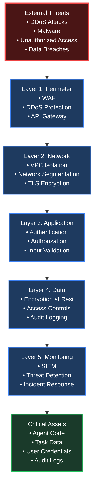
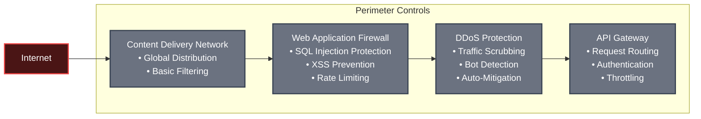
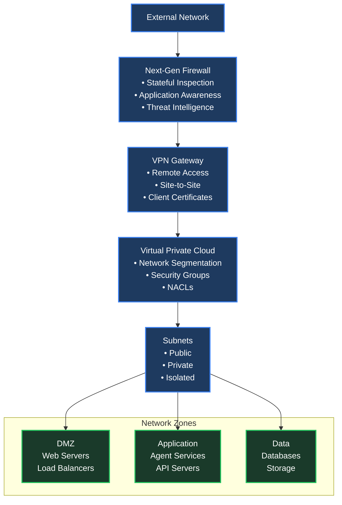
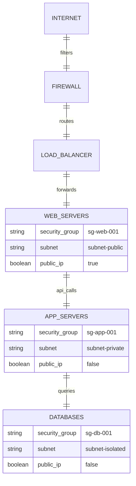
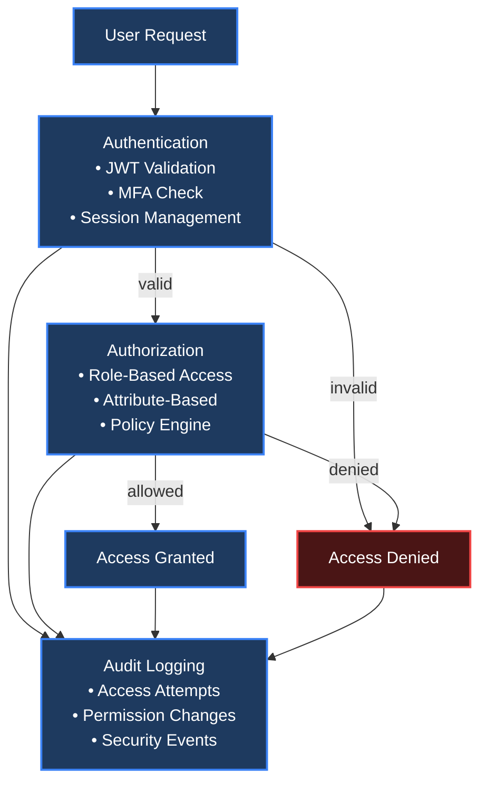
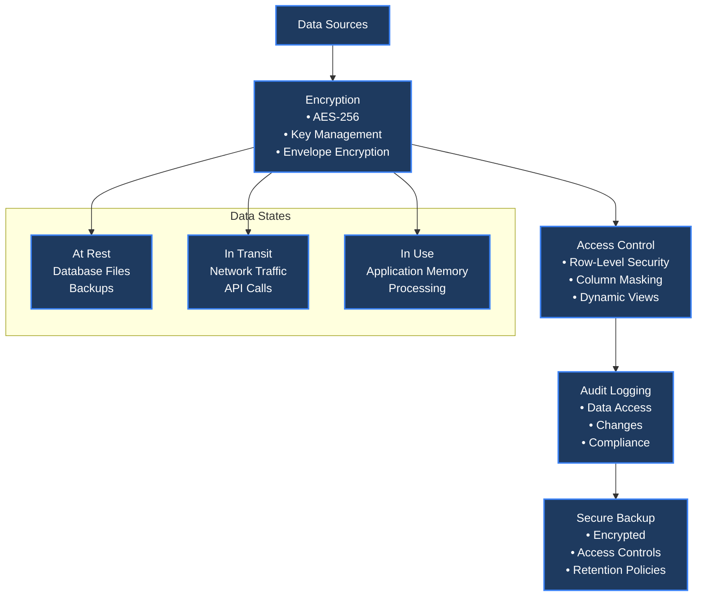
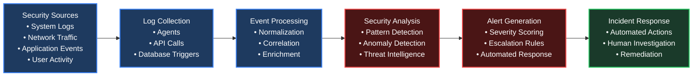
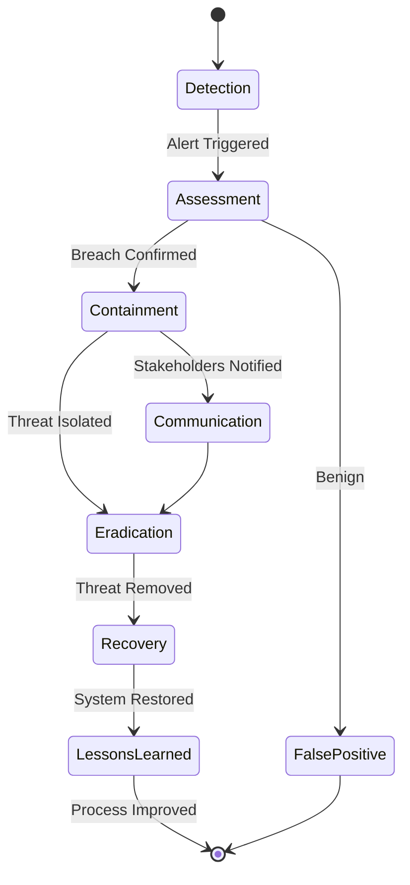

# Security Architecture — Fortress Layers

This document outlines the multi-layered security architecture designed as a "fortress" to protect the Postgres-based agent system against various threats and attacks.

---

## Fortress Concept Overview

The fortress architecture implements **defense in depth** with multiple independent security layers. Each layer provides protection against different types of threats, ensuring that if one layer is breached, subsequent layers continue to protect critical assets.



### Key Principles

- **No Single Point of Failure**: Each layer operates independently
- **Fail-Safe Defaults**: Security controls default to "deny" when in doubt
- **Zero Trust**: Every request is verified regardless of origin
- **Continuous Monitoring**: All layers generate security events for analysis
- **Automated Response**: Security incidents trigger automated remediation

---

## Layer 1: Perimeter Security

The outermost layer protects against external threats before they reach internal systems.

### Architecture



### Components

| Component | Purpose | Technologies | Threat Protection |
|-----------|---------|--------------|-------------------|
| **CDN** | Global content distribution and basic filtering | Cloudflare, Akamai | Basic DDoS, geographic blocking |
| **WAF** | Application-layer attack prevention | ModSecurity, AWS WAF | SQL injection, XSS, CSRF |
| **DDoS Protection** | Volumetric attack mitigation | Cloudflare Spectrum, AWS Shield | SYN floods, UDP amplification |
| **API Gateway** | Request orchestration and basic auth | Kong, AWS API Gateway | Unauthorized access, request flooding |

### Configuration Example

```yaml
# WAF Rules Configuration
waf_rules:
  - name: "SQL Injection Protection"
    pattern: "(\\b(union|select|insert|update|delete|drop|create)\\b)"
    action: "block"
    severity: "high"

  - name: "Rate Limiting"
    requests_per_minute: 100
    burst_limit: 20
    action: "throttle"

# DDoS Protection Settings
ddos_protection:
  enabled: true
  scrubbing_centers: ["us-east-1", "eu-west-1", "ap-southeast-1"]
  mitigation_mode: "always_on"
  alert_threshold: 1000000  # requests per second
```

---

## Layer 2: Network Security

Network-level isolation and encryption protect data in transit and prevent lateral movement.

### Architecture



### Network Segmentation



### Encryption Implementation

```json
{
  "tls_configuration": {
    "version": "TLS 1.3",
    "cipher_suites": [
      "TLS_AES_256_GCM_SHA384",
      "TLS_CHACHA20_POLY1305_SHA256"
    ],
    "certificate_authority": "Let's Encrypt",
    "hsts": {
      "enabled": true,
      "max_age": 31536000,
      "include_subdomains": true
    },
    "certificate_pinning": {
      "enabled": true,
      "pins": ["sha256-hash1", "sha256-hash2"]
    }
  },
  "mutual_tls": {
    "client_certificates": {
      "required": true,
      "ca_certificate": "internal-ca.pem",
      "revocation_check": "OCSP"
    }
  }
}
```

---

## Layer 3: Application Security

Application-level controls protect against code-level vulnerabilities and unauthorized access.

### Authentication & Authorization



### Input Validation & Sanitization

```python
class InputValidator:
    def __init__(self):
        self.sanitizers = {
            'sql': self._sanitize_sql,
            'html': self._sanitize_html,
            'json': self._sanitize_json,
            'file_path': self._sanitize_path
        }

    def validate_request(self, request_data):
        """Comprehensive input validation"""
        validated = {}

        for field, value in request_data.items():
            field_type = self._get_field_type(field)

            # Type checking
            if not self._validate_type(value, field_type):
                raise ValidationError(f"Invalid type for {field}")

            # Length limits
            if len(str(value)) > self._get_max_length(field):
                raise ValidationError(f"Value too long for {field}")

            # Sanitization
            if field_type in self.sanitizers:
                value = self.sanitizers[field_type](value)

            # Business rule validation
            self._validate_business_rules(field, value)

            validated[field] = value

        return validated

    def _sanitize_sql(self, value):
        """Prevent SQL injection"""
        # Remove dangerous characters and patterns
        dangerous_patterns = [
            r';\s*--',  # SQL comments
            r';\s*/\*',  # Block comments
            r'union\s+select',  # Union attacks
            r'exec\s*\(',  # Dynamic SQL
        ]
        for pattern in dangerous_patterns:
            value = re.sub(pattern, '', value, flags=re.IGNORECASE)
        return value

    def _sanitize_html(self, value):
        """Prevent XSS attacks"""
        return bleach.clean(value, tags=[], strip=True)

    def _sanitize_path(self, value):
        """Prevent path traversal"""
        # Remove .. and absolute paths
        value = re.sub(r'\.\.', '', value)
        if value.startswith('/'):
            raise ValidationError("Absolute paths not allowed")
        return value
```

### Session Management

```json
{
  "session_security": {
    "session_timeout": 3600,
    "absolute_timeout": 28800,
    "idle_timeout": 1800,
    "regenerate_on_login": true,
    "secure_cookie": {
      "http_only": true,
      "secure": true,
      "same_site": "strict"
    },
    "csrf_protection": {
      "enabled": true,
      "token_length": 32,
      "regenerate_per_request": false
    }
  }
}
```

---

## Layer 4: Data Security

Protects data at rest, in use, and during transmission.

### Data Protection Architecture



### Encryption Implementation

```python
class DataEncryption:
    def __init__(self, kms_client):
        self.kms = kms_client
        self.algorithm = 'AES-256-GCM'

    async def encrypt_data(self, plaintext, context=None):
        """Envelope encryption with KMS"""
        # Generate data key
        data_key = await self.kms.generate_data_key(
            key_id=self.master_key_id,
            key_spec='AES_256'
        )

        # Encrypt data with data key
        encrypted_data = await self._encrypt_with_data_key(
            plaintext, data_key['Plaintext']
        )

        # Encrypt data key with master key
        encrypted_key = await self.kms.encrypt(
            key_id=self.master_key_id,
            plaintext=data_key['CiphertextBlob']
        )

        return {
            'encrypted_data': encrypted_data,
            'encrypted_key': encrypted_key['CiphertextBlob'],
            'algorithm': self.algorithm,
            'context': context
        }

    async def decrypt_data(self, encrypted_package):
        """Decrypt envelope-encrypted data"""
        # Decrypt data key
        decrypted_key = await self.kms.decrypt(
            ciphertext_blob=encrypted_package['encrypted_key']
        )

        # Decrypt data
        plaintext = await self._decrypt_with_data_key(
            encrypted_package['encrypted_data'],
            decrypted_key['Plaintext']
        )

        return plaintext

    async def rotate_keys(self, old_key_id, new_key_id):
        """Key rotation for enhanced security"""
        # Find all data encrypted with old key
        affected_records = await self._find_records_by_key(old_key_id)

        # Re-encrypt with new key
        for record in affected_records:
            decrypted = await self.decrypt_data(record['encrypted_package'])
            new_encrypted = await self.encrypt_data(decrypted, record['context'])

            await self._update_record(record['id'], new_encrypted)

        # Mark old key for deletion
        await self.kms.schedule_key_deletion(old_key_id, 30)
```

### Row-Level Security (RLS)

```sql
-- Implement RLS in PostgreSQL
CREATE POLICY user_data_policy ON task_entries
    FOR ALL
    USING (user_id = current_user_id() OR role = 'admin');

CREATE POLICY agent_data_policy ON agent_output
    FOR SELECT
    USING (agent_name IN (
        SELECT agent_name FROM user_agent_permissions
        WHERE user_id = current_user_id()
    ));

-- Dynamic data masking
CREATE FUNCTION mask_sensitive_data(column_value text, user_role text)
RETURNS text AS $$
BEGIN
    IF user_role IN ('admin', 'auditor') THEN
        RETURN column_value;
    ELSIF user_role = 'user' THEN
        RETURN overlay(column_value placing '****' from 1 for length(column_value) - 4);
    ELSE
        RETURN '****';
    END IF;
END;
$$ LANGUAGE plpgsql;
```

---

## Layer 5: Monitoring & Response

Continuous monitoring and automated response complete the fortress.

### Security Information and Event Management (SIEM)



### Threat Detection Rules

```json
{
  "threat_detection_rules": [
    {
      "name": "Brute Force Attack",
      "condition": "failed_login_attempts > 5 AND time_window = 300",
      "severity": "high",
      "actions": ["block_ip", "notify_security_team", "require_mfa"]
    },
    {
      "name": "Data Exfiltration",
      "condition": "large_data_download AND unusual_time AND external_ip",
      "severity": "critical",
      "actions": ["block_user", "isolate_system", "alert_executive"]
    },
    {
      "name": "Privilege Escalation",
      "condition": "role_change AND no_approval AND high_privilege_role",
      "severity": "high",
      "actions": ["revoke_access", "audit_investigation", "password_reset"]
    },
    {
      "name": "Anomalous API Usage",
      "condition": "api_calls_per_minute > baseline * 3 AND unusual_endpoints",
      "severity": "medium",
      "actions": ["throttle_requests", "require_additional_auth"]
    }
  ]
}
```

### Automated Response System

```python
class AutomatedResponse:
    def __init__(self, security_orchestrator):
        self.orchestrator = security_orchestrator
        self.response_actions = {
            'block_ip': self._block_ip,
            'revoke_access': self._revoke_access,
            'isolate_system': self._isolate_system,
            'throttle_requests': self._throttle_requests,
            'notify_team': self._notify_team
        }

    async def handle_alert(self, alert):
        """Execute automated response based on alert severity and type"""
        severity = alert.get('severity', 'low')
        actions = alert.get('actions', [])

        # High and critical alerts get immediate automated response
        if severity in ['high', 'critical']:
            for action in actions:
                if action in self.response_actions:
                    try:
                        await self.response_actions[action](alert)
                        logger.info(f"Executed automated response: {action}")
                    except Exception as e:
                        logger.error(f"Failed to execute {action}: {e}")

        # All alerts get logged and potentially escalated
        await self._log_incident(alert)
        await self._escalate_if_needed(alert)

    async def _block_ip(self, alert):
        """Block suspicious IP address"""
        ip = alert.get('source_ip')
        if ip:
            await self.orchestrator.block_ip(ip, duration=3600)  # 1 hour

    async def _revoke_access(self, alert):
        """Revoke user access temporarily"""
        user_id = alert.get('user_id')
        if user_id:
            await self.orchestrator.revoke_user_sessions(user_id)
            await self.orchestrator.require_password_reset(user_id)

    async def _isolate_system(self, alert):
        """Isolate compromised system"""
        system_id = alert.get('system_id')
        if system_id:
            await self.orchestrator.quarantine_system(system_id)
            await self.orchestrator.disable_outbound_traffic(system_id)

    async def _throttle_requests(self, alert):
        """Throttle API requests from suspicious source"""
        client_id = alert.get('client_id')
        if client_id:
            await self.orchestrator.set_rate_limit(client_id, requests_per_minute=10)

    async def _notify_team(self, alert):
        """Notify security team"""
        await self.orchestrator.send_alert_notification(
            team='security',
            alert=alert,
            priority=alert.get('severity', 'medium')
        )
```

---

## Security Metrics & Compliance

### Key Security Metrics

```mermaid
gauge title Security Health Score
%% Overall security posture
95

pie title Threat Distribution
    "Blocked Attacks" : 85
    "Investigated Incidents" : 12
    "Successful Breaches" : 3

pie title Response Times
    "< 5 minutes" : 60
    "5-30 minutes" : 30
    "> 30 minutes" : 10
```

### Compliance Frameworks

| Framework | Coverage | Implementation |
|-----------|----------|----------------|
| **GDPR** | Data protection, consent, breach notification | Data encryption, audit logging, consent management |
| **ISO 27001** | Information security management | Risk assessments, security controls, continuous improvement |
| **SOC 2** | Security, availability, confidentiality | Access controls, monitoring, incident response |
| **NIST CSF** | Cybersecurity framework | Identify, protect, detect, respond, recover |

### Regular Security Assessments

- **Vulnerability Scanning**: Weekly automated scans
- **Penetration Testing**: Quarterly external assessments
- **Code Reviews**: All changes require security review
- **Compliance Audits**: Annual third-party audits
- **Security Training**: Mandatory annual training for all personnel

---

## Incident Response Plan

### Phases



### Response Timeline

| Phase | Timeframe | Responsible | Actions |
|-------|-----------|-------------|---------|
| **Detection** | Immediate | Monitoring System | Alert generation, initial triage |
| **Assessment** | < 30 minutes | Security Team | Threat analysis, impact evaluation |
| **Containment** | < 1 hour | Security + IT | Isolate affected systems, stop bleeding |
| **Eradication** | < 4 hours | Security Team | Remove malware, close vulnerabilities |
| **Recovery** | < 24 hours | IT + Business | Restore systems, validate integrity |
| **Lessons Learned** | < 1 week | All Teams | Post-mortem, process improvements |

---

This fortress-layered security architecture provides comprehensive protection against modern cyber threats while maintaining system availability and performance. Each layer builds upon the previous one, creating multiple barriers that must be breached for an attack to succeed.
