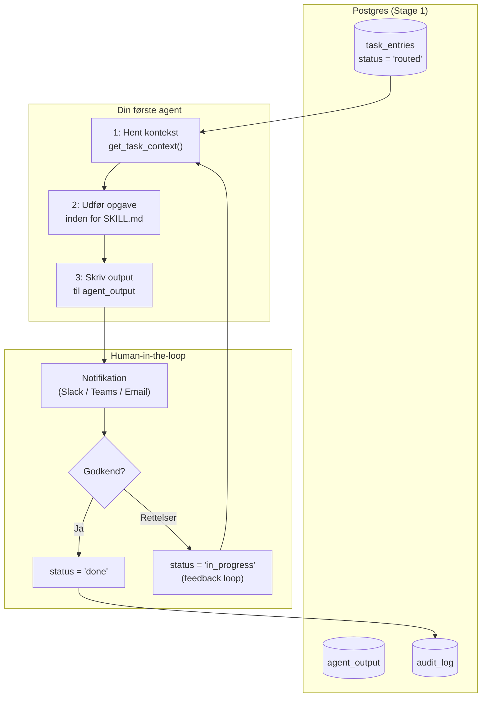
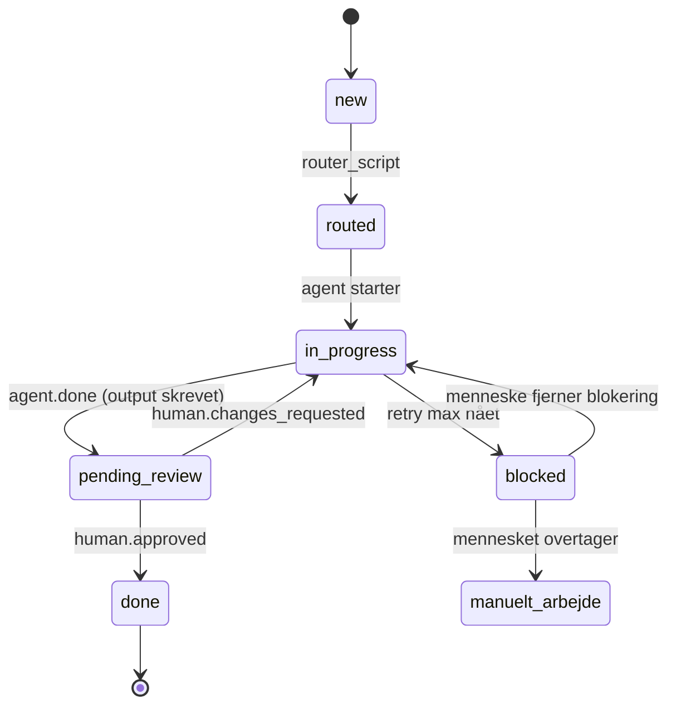

# Stage 2 — Din første AI-agent

> **Forudsætning:** Stage 1 er gennemført. `task_entries` indeholder routed opgaver, `agent_registry` er populeret, og `audit_log` er aktiv.
>
> **Scope:** Stage 2 tilslutter den første AI-agent til fundamentet. Agenten henter kontekst fra Postgres, udfører sit arbejde, og skriver struktureret output tilbage — alt inden for sin SKILL.md-kontrakt. Human-in-the-loop introduceres.

---

## Hvad vi bygger i Stage 2



**Resultatet af Stage 2:**
- En fungerende agent med en defineret SKILL.md-kontrakt
- `get_task_context()` — agentens eneste indgang til data
- Et human-in-the-loop godkendelsesflow
- Retry-logik og struktureret fejlhåndtering
- State machine der styrer hvad der *må* ske hvornår

---

## Trin 1 — Definer agentens SKILL.md

Før du skriver én linje kode, definér hvad agenten *må* og *ikke må*. SKILL.md er kontrakten — den styrer adfærd uanset hvad prompt-instruktioner siger.

Opret filen i din agents mappe:

```
agents/
└── tdd_agent/
    ├── SKILL.md      ← start her
    ├── agent.py
    └── prompts/
        └── system.md
```

**Eksempel — TDD Agent SKILL.md:**

```markdown
# Agent Name: TDD Agent

## Purpose
Reproducér bugs med en fejlende test, implementér fix, og lever en grøn test med ≥80% coverage.
Må kun aktiveres på opgaver af type 'bug' med status 'routed'.

## Capabilities
- Læse kodebase (read-only)
- Generere og køre tests i isoleret sandkasse
- Skrive test-rapport til agent_output
- Eskalere til menneske ved høj risiko eller usikkerhed

## Allowed
- Læse task_entries, agent_output, task_embeddings
- Skrive til agent_output og audit_log
- Køre scripts i sandkasse-miljø

## Forbidden
- Modificere produktionskode direkte
- Deploye til staging eller produktion
- Skrive til task_entries (kun routing-scriptet må det)
- Tilgå andre agenters output uden eksplicit kontekst-request
- Ignorere en fejlende test og markere opgaven som done

## Output Format
{
  "test_suite": ["test_filnavn.py"],
  "test_results": {"passed": int, "failed": int, "coverage": float},
  "suggested_fix": "beskrivelse",
  "confidence": float,        // 0.0 – 1.0
  "risk_level": "low|medium|high",
  "next_action": "human_review|auto_approve|escalate"
}

## Metrics
- Coverage ≥ 80% (blocker)
- Runtime < 120 sek
- Confidence < 0.7 → eskalér automatisk til menneske

## Failure Handling
- Retry 1 → øjeblikkeligt
- Retry 2 → 2 sek delay
- Retry 3 → 10 sek delay
- Retry 4 → eskalér til menneske + log struktureret fejl

## Risk Threshold
- risk_level = 'high' → altid human_review, aldrig auto_approve
- Usikkerhed om opgavens scope → stop og notificér
```

> **Tilpasning:** Brug dette som skabelon for alle agenter. Ændr `Purpose`, `Capabilities`, `Allowed`, `Forbidden` og `Output Format` per agent. `Forbidden`-sektionen er governance — den er ikke vejledende, den er bindende.

---

## Trin 2 — Implementér `get_task_context()`

Dette er agentens eneste kanal ind til data. Agenten kalder denne funktion — den læser aldrig direkte fra Postgres.

```python
# agents/shared/context.py
import os
import psycopg2
import psycopg2.extras
from typing import Optional

DB_URL = os.environ["DATABASE_URL"]

def get_task_context(task_id: str) -> dict:
    """
    Returnerer en samlet kontekstpakke til agenten.
    Agenter møder aldrig rå data — kun normaliseret kontekst.
    """
    conn = psycopg2.connect(DB_URL)
    cur  = conn.cursor(cursor_factory=psycopg2.extras.RealDictCursor)

    # Hoved-opgave
    cur.execute("""
        SELECT te.id, te.source_ref, te.title, te.raw_text, te.summary,
               te.type, te.priority, te.status, te.agent_pointer,
               uc.name  AS assigned_name,
               uc.role  AS assigned_role,
               uc.sla_hours
        FROM task_entries te
        LEFT JOIN user_chain uc ON uc.id = te.assigned_to
        WHERE te.id = %s
    """, (task_id,))
    task = cur.fetchone()

    if not task:
        raise ValueError(f"Task {task_id} not found")

    # Tidligere agent-output på samme opgave (til feedback-loop)
    cur.execute("""
        SELECT agent_name, result, status, created_at
        FROM agent_output
        WHERE task_entry_id = %s
        ORDER BY created_at DESC
        LIMIT 5
    """, (task_id,))
    prior_outputs = cur.fetchall()

    # Semantisk nabo-søgning: lignende opgaver løst tidligere
    cur.execute("""
        SELECT te2.source_ref, te2.title, te2.type, te2.priority,
               ao.result->>'suggested_fix' AS previous_fix
        FROM task_embeddings emb1
        JOIN task_embeddings emb2
            ON emb1.task_entry_id = %s
           AND emb2.task_entry_id != %s
        JOIN task_entries te2  ON te2.id = emb2.task_entry_id
        JOIN agent_output ao   ON ao.task_entry_id = te2.id AND ao.status = 'done'
        ORDER BY emb1.embedding <=> emb2.embedding
        LIMIT 3
    """, (task_id, task_id))
    similar_tasks = cur.fetchall()

    cur.close()
    conn.close()

    return {
        "task":          dict(task),
        "prior_outputs": [dict(r) for r in prior_outputs],
        "similar_tasks": [dict(r) for r in similar_tasks],
    }
```

---

## Trin 3 — Skriv agenten

```python
# agents/tdd_agent/agent.py
import os
import json
import psycopg2
from anthropic import Anthropic          # udskift med din LLM-klient
from agents.shared.context import get_task_context

DB_URL = os.environ["DATABASE_URL"]
client = Anthropic(api_key=os.environ["LLM_API_KEY"])

SYSTEM_PROMPT = open("agents/tdd_agent/prompts/system.md").read()

def run(task_id: str) -> dict:
    """
    Henter kontekst, kalder LLM inden for SKILL.md-kontrakten,
    og returnerer struktureret output.
    """
    ctx = get_task_context(task_id)

    # Byg prompt fra kontekst — ingen rå data, kun normaliserede felter
    user_message = f"""
Opgave: {ctx['task']['source_ref']} — {ctx['task']['title']}
Type: {ctx['task']['type']} | Prioritet: {ctx['task']['priority']}

Beskrivelse:
{ctx['task']['raw_text'] or ctx['task']['summary'] or '(ingen beskrivelse)'}

Tidligere forsøg på denne opgave:
{json.dumps(ctx['prior_outputs'], indent=2, default=str) or 'Ingen'}

Lignende løste opgaver:
{json.dumps(ctx['similar_tasks'], indent=2, default=str) or 'Ingen'}

Følg SKILL.md-kontrakten. Returnér output som valid JSON i det definerede format.
"""

    response = client.messages.create(
        model="claude-opus-4-5",
        max_tokens=4096,
        system=SYSTEM_PROMPT,
        messages=[{"role": "user", "content": user_message}]
    )

    raw = response.content[0].text
    result = json.loads(raw)           # LLM returnerer JSON jf. SKILL.md
    return result


def write_output(task_id: str, result: dict, status: str = "done") -> None:
    """Skriv agentens output til Postgres og log til audit."""
    conn = psycopg2.connect(DB_URL)
    cur  = conn.cursor()

    cur.execute("""
        INSERT INTO agent_output (task_entry_id, agent_name, result, status)
        VALUES (%s, 'tdd_agent', %s::jsonb, %s)
    """, (task_id, json.dumps(result), status))

    cur.execute("""
        UPDATE task_entries SET status = 'in_progress' WHERE id = %s
    """, (task_id,))

    cur.execute("""
        INSERT INTO audit_log (event_type, entity_id, actor, payload)
        VALUES ('agent.done', %s, 'tdd_agent', %s::jsonb)
    """, (task_id, json.dumps({"status": status, "risk_level": result.get("risk_level")})))

    conn.commit()
    cur.close()
    conn.close()
```

---

## Trin 4 — Tilføj retry-logik

Agenter fejler. Retry er ikke valgfrit — det er arkitektur.

```python
# agents/shared/retry.py
import time
import logging
from typing import Callable, Any

logger = logging.getLogger(__name__)

RETRY_DELAYS = [0, 2, 10]   # sekunder mellem forsøg (0 = øjeblikkeligt)

def with_retry(fn: Callable, task_id: str, max_attempts: int = 4) -> Any:
    """
    Kør fn med eksponentiel backoff.
    Efter max_attempts eskaleres til menneske.
    """
    last_error = None

    for attempt in range(1, max_attempts + 1):
        try:
            return fn(task_id)
        except Exception as e:
            last_error = e
            logger.warning(f"Attempt {attempt} failed for {task_id}: {e}")

            if attempt < max_attempts:
                delay = RETRY_DELAYS[min(attempt - 1, len(RETRY_DELAYS) - 1)]
                if delay:
                    time.sleep(delay)
            else:
                escalate_to_human(task_id, str(last_error))
                raise

def escalate_to_human(task_id: str, reason: str) -> None:
    """Markér opgaven som blokeret og log eskalering."""
    import psycopg2, os
    conn = psycopg2.connect(os.environ["DATABASE_URL"])
    cur  = conn.cursor()

    cur.execute("""
        UPDATE task_entries SET status = 'blocked' WHERE id = %s
    """, (task_id,))

    cur.execute("""
        INSERT INTO audit_log (event_type, entity_id, actor, payload)
        VALUES ('task.escalated', %s, 'retry_handler', %s::jsonb)
    """, (task_id, f'{{"reason": "{reason[:200]}"}}'))

    conn.commit()
    cur.close()
    conn.close()
```


---

## Trin 5 — State machine

States defineres *før* agenter tilføjes. Reglerne styrer hvad der *må* ske i hvert state.



Tilføj `pending_review` og `blocked` som gyldige states i databasen med en check constraint:

```sql
ALTER TABLE task_entries
    ADD CONSTRAINT valid_status CHECK (
        status IN ('new', 'routed', 'in_progress', 'pending_review', 'done', 'blocked')
    );
```

---

## Trin 6 — Human-in-the-loop

Agenten har skrevet output til `agent_output`. Nu skal et menneske notificeres og have mulighed for at godkende eller sende tilbage.

### Notifikationsscript

```python
# agents/shared/notify.py
import os
import requests
import psycopg2
import psycopg2.extras

DB_URL        = os.environ["DATABASE_URL"]
SLACK_TOKEN   = os.environ["SLACK_BOT_TOKEN"]   # udskift med Teams webhook etc.

def notify_reviewer(task_id: str) -> None:
    conn = psycopg2.connect(DB_URL)
    cur  = conn.cursor(cursor_factory=psycopg2.extras.RealDictCursor)

    cur.execute("""
        SELECT te.source_ref, te.title, te.priority,
               uc.external_user_id AS slack_user,
               ao.result
        FROM task_entries te
        JOIN user_chain   uc ON uc.id = te.assigned_to
        JOIN agent_output ao ON ao.task_entry_id = te.id AND ao.agent_name = 'tdd_agent'
        WHERE te.id = %s
        ORDER BY ao.created_at DESC
        LIMIT 1
    """, (task_id,))
    row = dict(cur.fetchone())

    result  = row["result"]
    message = (
        f"*Ny opgave klar til review* — {row['source_ref']}\n"
        f">{row['title']}\n"
        f"Prioritet: `{row['priority']}` | Risiko: `{result.get('risk_level', '?')}`\n"
        f"Confidence: `{result.get('confidence', '?')}`\n"
        f"Foreslået fix: {result.get('suggested_fix', '(se output)')}\n\n"
        f"Godkend: `/approve {task_id}` | Afvis: `/reject {task_id} <besked>`"
    )

    requests.post(
        "https://slack.com/api/chat.postMessage",
        headers={"Authorization": f"Bearer {SLACK_TOKEN}"},
        json={"channel": row["slack_user"], "text": message},
        timeout=5
    )

    cur.execute("""
        UPDATE task_entries SET status = 'pending_review' WHERE id = %s
    """, (task_id,))

    cur.execute("""
        INSERT INTO audit_log (event_type, entity_id, actor, payload)
        VALUES ('human.notified', %s, 'notify_script', %s::jsonb)
    """, (task_id, f'{{"channel": "{row["slack_user"]}"}}'))

    conn.commit()
    cur.close()
    conn.close()
```

### Godkendelseshandler (webhook endpoint)

```python
# api/approve.py  — tilslut til din webhook-handler (Flask / FastAPI etc.)
import os
import psycopg2
from flask import request, jsonify

DB_URL = os.environ["DATABASE_URL"]

def handle_approval():
    data      = request.json
    task_id   = data["task_id"]
    decision  = data["decision"]   # 'approved' eller 'changes_requested'
    actor     = data["actor"]      # brugerens ID
    feedback  = data.get("feedback", "")

    conn = psycopg2.connect(DB_URL)
    cur  = conn.cursor()

    if decision == "approved":
        cur.execute("""
            UPDATE task_entries SET status = 'done' WHERE id = %s
        """, (task_id,))
        event = "human.approved"
    else:
        cur.execute("""
            UPDATE task_entries SET status = 'in_progress' WHERE id = %s
        """, (task_id,))
        event = "human.changes_requested"

    cur.execute("""
        INSERT INTO audit_log (event_type, entity_id, actor, payload)
        VALUES (%s, %s, %s, %s::jsonb)
    """, (event, task_id, actor,
           f'{{"decision": "{decision}", "feedback": "{feedback[:500]}"}}'))

    conn.commit()
    cur.close()
    conn.close()

    return jsonify({"ok": True, "status": decision})
```

---

## Trin 7 — Sæt det hele sammen

```python
# agents/tdd_agent/run.py
from agents.tdd_agent.agent import run, write_output
from agents.shared.retry    import with_retry
from agents.shared.notify   import notify_reviewer
import psycopg2, os

DB_URL = os.environ["DATABASE_URL"]

def process_routed_tasks() -> None:
    """Hent alle routed opgaver til tdd_agent og kør dem."""
    conn = psycopg2.connect(DB_URL)
    cur  = conn.cursor()

    cur.execute("""
        SELECT id FROM task_entries
        WHERE status = 'routed' AND agent_pointer = 'tdd_agent'
        ORDER BY
            CASE priority
                WHEN 'critical' THEN 1
                WHEN 'high'     THEN 2
                WHEN 'normal'   THEN 3
                WHEN 'low'      THEN 4
            END,
            created_at ASC
        LIMIT 5
    """)
    task_ids = [str(row[0]) for row in cur.fetchall()]
    cur.close()
    conn.close()

    for task_id in task_ids:
        try:
            result = with_retry(run, task_id)
            write_output(task_id, result)
            notify_reviewer(task_id)
            print(f"[OK] {task_id} → pending_review")
        except Exception as e:
            print(f"[ESCALATED] {task_id}: {e}")

if __name__ == "__main__":
    process_routed_tasks()
```

---

## Trin 8 — Verificér Stage 2

```sql
-- Er der opgaver i pending_review?
SELECT source_ref, title, priority, status
FROM task_entries
WHERE status = 'pending_review';

-- Hvad skrev agenten?
SELECT ao.agent_name, ao.status, ao.result, ao.created_at
FROM agent_output ao
JOIN task_entries te ON te.id = ao.task_entry_id
WHERE te.status IN ('pending_review', 'done')
ORDER BY ao.created_at DESC
LIMIT 10;

-- Er human-in-the-loop aktiv?
SELECT event_type, actor, payload, occurred_at
FROM audit_log
WHERE event_type IN ('agent.done', 'human.notified', 'human.approved', 'human.changes_requested')
ORDER BY occurred_at DESC
LIMIT 20;

-- Er der eskalerede opgaver?
SELECT source_ref, title, priority, status
FROM task_entries
WHERE status = 'blocked';
```

---

## Problemet med loops

Stage 2 introducerer et feedback-loop: agenten kører → mennesket sender tilbage → agenten kører igen. For at undgå at samme opgave kører i evighed:

```sql
-- Tilføj forsøgs-tæller til task_entries
ALTER TABLE task_entries ADD COLUMN attempt_count INTEGER DEFAULT 0;

-- Increment i run.py inden hvert forsøg
UPDATE task_entries SET attempt_count = attempt_count + 1 WHERE id = %s;

-- Eskalér automatisk hvis > 3 forsøg
SELECT id, source_ref, attempt_count
FROM task_entries
WHERE attempt_count > 3 AND status = 'in_progress';
```

---

## Mappestruktur efter Stage 2

```
project/
├── .env
├── .env.example
├── db/
│   └── schema.sql
├── sync/
│   ├── task_sync.py
│   ├── router.py
│   └── embed_tasks.py
├── agents/
│   ├── shared/
│   │   ├── context.py      ← Trin 2
│   │   ├── retry.py        ← Trin 4
│   │   └── notify.py       ← Trin 6
│   └── tdd_agent/
│       ├── SKILL.md        ← Trin 1
│       ├── agent.py        ← Trin 3
│       ├── run.py          ← Trin 7
│       └── prompts/
│           └── system.md
└── api/
    └── approve.py          ← Trin 6
```

---

## Stage 2 — Tjekliste

- [ ] SKILL.md oprettet med `Purpose`, `Allowed`, `Forbidden`, `Output Format`, `Failure Handling`
- [ ] `get_task_context()` henter opgave, tidligere output og semantiske naboer
- [ ] Agent henter kontekst, kalder LLM, returnerer struktureret JSON
- [ ] `write_output()` skriver til `agent_output` og `audit_log`
- [ ] Retry-logik med 4 forsøg og eskalering til `status = 'blocked'`
- [ ] State machine har `pending_review` og `blocked` som gyldige states
- [ ] Notifikation sendes til reviewer ved `agent.done`
- [ ] Godkendelseshandler opdaterer status og logger `human.approved` / `human.changes_requested`
- [ ] `attempt_count` forhindrer evige loops
- [ ] Alle API-nøgler er environment variables

---

> **Næste skridt (Stage 3):** Tilslut en event bus (Redis / Kafka) så agenter ikke poller Postgres, men reagerer på events i realtid. Introducer multi-database isolation: `routing_db`, `agent_db`, `user_db` og `audit_db` som uafhængige services — fejl i én stopper ikke de andre.
