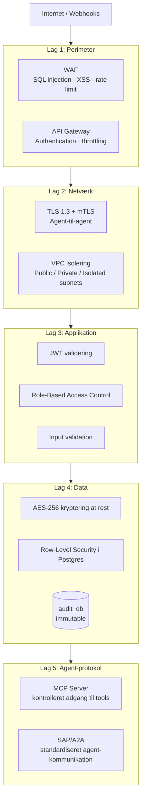
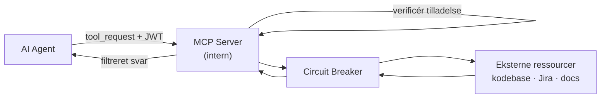

# Stage 4 — Sikkerhed, MCP og Agent-til-Agent Protokol

> **Forudsætning:** Stage 1–3 er gennemført. Systemet har en event bus, fire isolerede databaser og resiliens-mønstre.
>
> **Scope:** Stage 4 tilføjer de sikkerhedslag der er nødvendige for et produktionssystem: perimeter (WAF/API Gateway), netværksisolering (TLS 1.3, mTLS), applikationssikkerhed (input validation, JWT), datasikkerhed (kryptering, row-level security), og en standardiseret agent-til-agent protokol (SAP/A2A) med MCP-kontrolleret adgang til eksterne ressourcer.

---

## Hvad vi bygger i Stage 4



Hvert lag er uafhængigt. Et brud på ét lag stopper ikke de øvrige.

---

## Trin 1 — Perimeter: WAF og API Gateway

### API Gateway (FastAPI + middleware-stack)

```python
# api/gateway.py
import os
import re
import time
import hashlib
from collections import defaultdict
from fastapi import FastAPI, Request, HTTPException
from fastapi.middleware.trustedhost import TrustedHostMiddleware
from fastapi.middleware.httpsredirect import HTTPSRedirectMiddleware

app = FastAPI()

# Tillad kun kendte hosts — afvis alt andet
app.add_middleware(TrustedHostMiddleware,
                   allowed_hosts=os.environ["ALLOWED_HOSTS"].split(","))

# Tving HTTPS i produktion
if os.environ.get("ENV") == "production":
    app.add_middleware(HTTPSRedirectMiddleware)

# ── Rate limiting ────────────────────────────────────────────────
_request_counts: dict[str, list[float]] = defaultdict(list)
RATE_LIMIT      = int(os.environ.get("RATE_LIMIT_PER_MIN", "100"))

@app.middleware("http")
async def rate_limit(request: Request, call_next):
    client_ip = request.client.host
    now       = time.time()
    window    = 60.0

    # Ryd gamle timestamps
    _request_counts[client_ip] = [
        t for t in _request_counts[client_ip] if now - t < window
    ]

    if len(_request_counts[client_ip]) >= RATE_LIMIT:
        raise HTTPException(status_code=429, detail="Rate limit exceeded")

    _request_counts[client_ip].append(now)
    return await call_next(request)

# ── WAF: blokér kendte angrebsmønstre ───────────────────────────
_BLOCKED_PATTERNS = [
    re.compile(r"(union\s+select|insert\s+into|drop\s+table)", re.IGNORECASE),
    re.compile(r"(<script|javascript:|onerror=)",               re.IGNORECASE),
    re.compile(r"\.\./|\.\.\\"),                                # path traversal
]

@app.middleware("http")
async def waf(request: Request, call_next):
    body = await request.body()
    raw  = (str(request.url) + body.decode("utf-8", errors="ignore")).lower()

    for pattern in _BLOCKED_PATTERNS:
        if pattern.search(raw):
            raise HTTPException(status_code=400, detail="Request blocked")

    return await call_next(request)

# ── Security headers ────────────────────────────────────────────
@app.middleware("http")
async def security_headers(request: Request, call_next):
    response = await call_next(request)
    response.headers["Strict-Transport-Security"] = "max-age=31536000; includeSubDomains"
    response.headers["X-Content-Type-Options"]    = "nosniff"
    response.headers["X-Frame-Options"]           = "DENY"
    response.headers["Content-Security-Policy"]   = "default-src 'self'"
    response.headers["Referrer-Policy"]           = "strict-origin-when-cross-origin"
    return response
```

---

## Trin 2 — Netværk: TLS 1.3 og mTLS mellem agenter

Al trafik — også intern agent-til-agent kommunikation — krypteres. Agenter bruger klientcertifikater (mTLS) til at bevise identitet over for hinanden.

### Generér interne certifikater (lokal CA)

```bash
# Opret intern Certificate Authority
openssl req -x509 -newkey rsa:4096 -days 365 -nodes \
  -keyout certs/ca.key -out certs/ca.crt \
  -subj "/CN=agent-internal-ca"

# Generér certifikat per agent
for AGENT in tdd_agent review_agent po_agent api_gateway; do
  openssl req -newkey rsa:4096 -nodes \
    -keyout certs/${AGENT}.key -out certs/${AGENT}.csr \
    -subj "/CN=${AGENT}"

  openssl x509 -req -days 365 \
    -CA certs/ca.crt -CAkey certs/ca.key -CAcreateserial \
    -in certs/${AGENT}.csr -out certs/${AGENT}.crt
done
```

### mTLS-klient til agent-kald

```python
# agents/shared/mtls_client.py
import os
import httpx

def get_mtls_client(agent_name: str) -> httpx.Client:
    """
    Returnerer en HTTP-klient med mTLS.
    Agenten præsenterer sit eget certifikat og verificerer modtageren.
    """
    cert_dir = os.environ["CERT_DIR"]      # eks. /app/certs/
    return httpx.Client(
        cert=(
            f"{cert_dir}/{agent_name}.crt",
            f"{cert_dir}/{agent_name}.key",
        ),
        verify=f"{cert_dir}/ca.crt",
        timeout=30.0,
    )

# Brug:
# client = get_mtls_client("tdd_agent")
# response = client.post("https://review_agent:8001/handover", json=payload)
```

### TLS-konfiguration til Postgres-forbindelser

```python
# db/connections.py — tilføj SSL til alle forbindelser
import ssl

def _build_ssl_context(db_name: str) -> ssl.SSLContext:
    ctx = ssl.create_default_context()
    ctx.load_verify_locations(os.environ["DB_CA_CERT"])
    ctx.minimum_version = ssl.TLSVersion.TLSv1_3
    return ctx

# I psycopg2 connect:
conn = psycopg2.connect(
    _URLS[name],
    sslmode="verify-full",
    sslrootcert=os.environ["DB_CA_CERT"],
)
```

---

## Trin 3 — Applikation: JWT, RBAC og input validation

### JWT-validering (webhook og API-endpoints)

```python
# api/auth.py
import os
import jwt
from functools import wraps
from fastapi import Request, HTTPException

JWT_SECRET    = os.environ["JWT_SECRET"]    # min. 32 bytes tilfældig streng
JWT_ALGORITHM = "HS256"
ALLOWED_ROLES = {"developer", "senior_dev", "product_owner", "qa", "agent"}

def require_auth(required_role: str | None = None):
    """Decorator der validerer JWT og tjekker rolle."""
    def decorator(fn):
        @wraps(fn)
        async def wrapper(request: Request, *args, **kwargs):
            auth = request.headers.get("Authorization", "")
            if not auth.startswith("Bearer "):
                raise HTTPException(status_code=401, detail="Missing token")

            token = auth[7:]
            try:
                payload = jwt.decode(token, JWT_SECRET, algorithms=[JWT_ALGORITHM])
            except jwt.ExpiredSignatureError:
                raise HTTPException(status_code=401, detail="Token expired")
            except jwt.InvalidTokenError:
                raise HTTPException(status_code=401, detail="Invalid token")

            role = payload.get("role")
            if role not in ALLOWED_ROLES:
                raise HTTPException(status_code=403, detail="Unknown role")

            if required_role and role != required_role:
                raise HTTPException(status_code=403, detail="Insufficient role")

            request.state.actor = payload.get("sub")
            request.state.role  = role
            return await fn(request, *args, **kwargs)
        return wrapper
    return decorator
```

### Input validation på alle indgangspunkter

```python
# api/validators.py
import re
from pydantic import BaseModel, field_validator, UUID4

class ApprovalRequest(BaseModel):
    task_id:  UUID4
    decision: str
    feedback: str = ""

    @field_validator("decision")
    @classmethod
    def decision_must_be_valid(cls, v: str) -> str:
        if v not in {"approved", "changes_requested"}:
            raise ValueError("decision must be 'approved' or 'changes_requested'")
        return v

    @field_validator("feedback")
    @classmethod
    def sanitize_feedback(cls, v: str) -> str:
        # Fjern HTML/script — ingen XSS i audit-log
        v = re.sub(r"<[^>]+>", "", v)
        return v[:1000]   # max længde

class WebhookPayload(BaseModel):
    event_type: str
    source_ref: str
    title:      str
    raw_text:   str = ""

    @field_validator("source_ref")
    @classmethod
    def no_path_traversal(cls, v: str) -> str:
        if ".." in v or v.startswith("/"):
            raise ValueError("Invalid source_ref")
        return v

    @field_validator("event_type")
    @classmethod
    def event_type_allowlist(cls, v: str) -> str:
        allowed = {"task.created", "task.updated", "task.closed"}
        if v not in allowed:
            raise ValueError(f"Unknown event_type: {v}")
        return v
```

---

## Trin 4 — Data: kryptering og Row-Level Security

### Row-Level Security i Postgres

RLS sikrer at en agent kun kan se de rækker den har adgang til — også selvom den kompromitteres.

```sql
-- routing_db: aktiver RLS på task_entries
ALTER TABLE task_entries ENABLE ROW LEVEL SECURITY;

-- Database-roller per agent
CREATE ROLE tdd_agent_role   LOGIN PASSWORD '...' CONNECTION LIMIT 5;
CREATE ROLE review_agent_role LOGIN PASSWORD '...' CONNECTION LIMIT 5;
CREATE ROLE readonly_role     LOGIN PASSWORD '...' CONNECTION LIMIT 10;

-- tdd_agent må kun se opgaver der er assigneret til den
CREATE POLICY tdd_agent_policy ON task_entries
    FOR ALL
    TO tdd_agent_role
    USING (agent_pointer = 'tdd_agent');

-- review_agent må kun se review-opgaver
CREATE POLICY review_agent_policy ON task_entries
    FOR ALL
    TO review_agent_role
    USING (agent_pointer = 'review_agent');

-- Readonly-rolle til monitoring og PO-forespørgsler
CREATE POLICY readonly_policy ON task_entries
    FOR SELECT
    TO readonly_role
    USING (true);

-- audit_db: ingen agent må DELETE eller UPDATE — kun INSERT
REVOKE DELETE, UPDATE, TRUNCATE ON audit_log FROM PUBLIC;
GRANT INSERT, SELECT ON audit_log TO tdd_agent_role, review_agent_role;
```

### Kryptering af følsomme felter (application-level)

```python
# db/encryption.py
import os
import base64
from cryptography.hazmat.primitives.ciphers.aead import AESGCM
from cryptography.hazmat.primitives import hashes
from cryptography.hazmat.backends import default_backend

def _get_key() -> bytes:
    raw = os.environ["FIELD_ENCRYPTION_KEY"]   # 32-byte base64-kodet nøgle
    return base64.b64decode(raw)

def encrypt_field(plaintext: str) -> str:
    """Kryptér et tekstfelt med AES-256-GCM. Output er base64."""
    key   = _get_key()
    nonce = os.urandom(12)
    ct    = AESGCM(key).encrypt(nonce, plaintext.encode(), None)
    return base64.b64encode(nonce + ct).decode()

def decrypt_field(ciphertext: str) -> str:
    key    = _get_key()
    data   = base64.b64decode(ciphertext)
    nonce  = data[:12]
    ct     = data[12:]
    return AESGCM(key).decrypt(nonce, ct, None).decode()
```

Brug på `raw_text` og andre felter der kan indeholde persondata:

```python
# I sync/task_sync.py — kryptér inden indsættelse
from db.encryption import encrypt_field

cur.execute("""
    INSERT INTO task_entries (source, source_ref, title, raw_text, type, priority)
    VALUES (%s, %s, %s, %s, %s, %s)
    ON CONFLICT (source, source_ref) DO UPDATE SET raw_text = EXCLUDED.raw_text
""", ("jira", source_ref, title, encrypt_field(raw_text), task_type, priority))
```

---

## Trin 5 — MCP: kontrolleret adgang til eksterne ressourcer

MCP (Model Context Protocol) er agenternes eneste tilladte kanal til eksterne ressourcer — kodebase, dokumentation, ekstern API. Agenter må ikke kalde eksterne services direkte.



### MCP-server

```python
# mcp/server.py
import os
import jwt
import subprocess
from fastapi import FastAPI, HTTPException, Header
from pydantic import BaseModel

app       = FastAPI()
JWT_SECRET = os.environ["JWT_SECRET"]

# Tool-definition: hvem må hvad
TOOL_REGISTRY: dict[str, dict] = {
    "codebase_search": {
        "allowed_agents": ["context_agent", "tdd_agent"],
        "permissions":    ["read_files", "search_code"],
        "rate_limit":     100,
    },
    "run_tests": {
        "allowed_agents": ["tdd_agent"],
        "permissions":    ["execute_sandbox"],
        "rate_limit":     20,
    },
    "read_jira": {
        "allowed_agents": ["tdd_agent", "po_agent", "context_agent"],
        "permissions":    ["read_issues"],
        "rate_limit":     200,
    },
}

class ToolRequest(BaseModel):
    tool_name: str
    params:    dict

def _verify_agent(authorization: str, tool_name: str) -> str:
    if not authorization.startswith("Bearer "):
        raise HTTPException(401, "Missing token")
    try:
        payload    = jwt.decode(authorization[7:], JWT_SECRET, algorithms=["HS256"])
        agent_name = payload["sub"]
    except jwt.InvalidTokenError:
        raise HTTPException(401, "Invalid token")

    tool = TOOL_REGISTRY.get(tool_name)
    if not tool:
        raise HTTPException(404, f"Unknown tool: {tool_name}")
    if agent_name not in tool["allowed_agents"]:
        raise HTTPException(403, f"{agent_name} not allowed to use {tool_name}")

    return agent_name

@app.post("/tool")
async def call_tool(req: ToolRequest, authorization: str = Header(...)):
    agent_name = _verify_agent(authorization, req.tool_name)

    if req.tool_name == "codebase_search":
        result = _codebase_search(req.params.get("query", ""))
    elif req.tool_name == "run_tests":
        result = _run_tests_sandboxed(req.params.get("test_file", ""))
    else:
        raise HTTPException(400, "Tool not implemented")

    return {"tool": req.tool_name, "agent": agent_name, "result": result}

def _codebase_search(query: str) -> list[str]:
    """Søg i kodebasen — read-only, ingen shell-injection."""
    if not query or len(query) > 200:
        raise HTTPException(400, "Invalid query")
    # Brug kun foruddefinerede parametre — ingen user-controlled shell-args
    result = subprocess.run(
        ["grep", "-r", "--include=*.py", "-l", query, "/app/src"],
        capture_output=True, text=True, timeout=10
    )
    return result.stdout.strip().split("\n")[:20]   # max 20 filer

def _run_tests_sandboxed(test_file: str) -> dict:
    """Kør tests i isoleret Docker-container — ingen adgang til produktion."""
    if not test_file.endswith(".py") or ".." in test_file:
        raise HTTPException(400, "Invalid test file")
    result = subprocess.run(
        ["docker", "run", "--rm", "--network=none",   # ingen netværksadgang
         "--memory=256m", "--cpus=0.5",
         "-v", f"/app/tests:/tests:ro",
         "python:3.12-slim", "python", "-m", "pytest", f"/tests/{test_file}", "--tb=short"],
        capture_output=True, text=True, timeout=120
    )
    return {"stdout": result.stdout[-3000:], "returncode": result.returncode}
```

### Agent-siden: kald MCP via token

```python
# agents/shared/mcp_client.py
import os
import httpx

MCP_URL    = os.environ["MCP_SERVER_URL"]
AGENT_TOKEN = os.environ["AGENT_JWT_TOKEN"]   # udstedt ved opstart

def call_tool(tool_name: str, params: dict) -> dict:
    r = httpx.post(
        f"{MCP_URL}/tool",
        json={"tool_name": tool_name, "params": params},
        headers={"Authorization": f"Bearer {AGENT_TOKEN}"},
        timeout=30
    )
    r.raise_for_status()
    return r.json()["result"]
```

---

## Trin 6 — SAP/A2A: standardiseret agent-til-agent protokol

Når en agent afslutter sit arbejde og sender artefakter videre til næste agent, bruges SAP (Shared Agent Protocol). Det er en struktureret JSON-kontrakt med eksplicit retry-politik og session-kontekst.

### SAP-beskedformat

```python
# agents/shared/sap.py
import uuid
from datetime import datetime, timezone
from dataclasses import dataclass, asdict, field
from typing import Any

@dataclass
class SAPMessage:
    sender_agent:   str
    receiver_agent: str
    message_type:   str         # 'task_handover' | 'context_request' | 'escalation'
    task_id:        str
    payload:        dict[str, Any]
    sap_version:    str = "1.0"
    message_id:     str = field(default_factory=lambda: str(uuid.uuid4()))
    timestamp:      str = field(
        default_factory=lambda: datetime.now(timezone.utc).isoformat()
    )
    session_id:     str | None = None
    retry_policy: dict = field(default_factory=lambda: {
        "max_retries": 3,
        "backoff":     "exponential",
        "timeout_sec": 300,
    })

    def to_dict(self) -> dict:
        return asdict(self)
```

### Afsendelses-helper

```python
# agents/shared/sap.py (fortsat)
import os
import httpx
from agents.shared.circuit_breaker import CircuitBreaker

_breakers: dict[str, CircuitBreaker] = {}

def send(msg: SAPMessage) -> dict:
    """
    Send en SAP-besked til modtager-agentens endpoint via mTLS.
    Bruger circuit breaker per modtager.
    """
    from agents.shared.mtls_client import get_mtls_client

    if msg.receiver_agent not in _breakers:
        _breakers[msg.receiver_agent] = CircuitBreaker()

    agent_url = os.environ[f"{msg.receiver_agent.upper()}_URL"]
    client    = get_mtls_client(msg.sender_agent)

    return _breakers[msg.receiver_agent].call(
        client.post,
        f"{agent_url}/receive",
        json=msg.to_dict(),
    )
```

### Eksempel: TDD-agent sender til Review-agent

```python
# I agents/tdd_agent/agent.py — efter grøn test
from agents.shared.sap import SAPMessage, send

handover = SAPMessage(
    sender_agent   = "tdd_agent",
    receiver_agent = "review_agent",
    message_type   = "task_handover",
    task_id        = task_id,
    session_id     = session_id,
    payload        = {
        "artifacts": {
            "test_suite":     result["test_suite"],
            "coverage":       result["test_results"]["coverage"],
            "suggested_fix":  result["suggested_fix"],
        },
        "risk_level":   result["risk_level"],
        "confidence":   result["confidence"],
        "next_action":  result["next_action"],
    }
)

send(handover)
```

### Modtager-endpoint (review_agent)

```python
# agents/review_agent/api.py
from fastapi import APIRouter, Request
from agents.shared.sap import SAPMessage
from api.auth import require_auth

router = APIRouter()

@router.post("/receive")
@require_auth()
async def receive_handover(request: Request):
    data = await request.json()
    msg  = SAPMessage(**{k: data[k] for k in
                         ("sender_agent","receiver_agent","message_type",
                          "task_id","payload","session_id","retry_policy",
                          "sap_version","message_id","timestamp")})

    # Log modtagelse i audit_db
    from db.connections import db
    import json
    with db("audit") as (_, cur):
        cur.execute("""
            INSERT INTO audit_log (event_type, entity_id, actor, payload)
            VALUES ('sap.received', %s, %s, %s::jsonb)
        """, (msg.task_id, msg.sender_agent, json.dumps(msg.to_dict())))

    # Sæt i kø til review_agent's event loop via Redis
    from bus.publisher import publish
    publish("task.routed", msg.task_id,
            payload={"agent": "review_agent", "session_id": msg.session_id},
            actor=msg.sender_agent)

    return {"ok": True, "message_id": msg.message_id}
```

---

## Trin 7 — Verificér Stage 4

### Sikkerhedstjek

```bash
# Verificér TLS-version på API Gateway
openssl s_client -connect localhost:8000 -tls1_3 2>/dev/null | grep "Protocol"

# Test mTLS — afvis uden klientcertifikat
curl -k https://localhost:8000/tool  # bør fejle med 400/401

# Test med gyldigt certifikat
curl --cert certs/tdd_agent.crt --key certs/tdd_agent.key \
     --cacert certs/ca.crt https://localhost:8000/health

# Test WAF: SQL injection skal returnere 400
curl -X POST https://localhost:8000/webhook \
     -H "Content-Type: application/json" \
     -d '{"event_type":"task.created","source_ref":"PROJ-1 UNION SELECT 1","title":"x","raw_text":""}'
```

### Database RLS-tjek

```sql
-- Skift til tdd_agent_rolle og verificér at den kun ser sine egne opgaver
SET ROLE tdd_agent_role;
SELECT id, source_ref, agent_pointer FROM task_entries;
-- Bør KUN returnere rækker med agent_pointer = 'tdd_agent'

-- Bekræft at audit_log er append-only
SET ROLE tdd_agent_role;
DELETE FROM audit_log WHERE id = (SELECT id FROM audit_log LIMIT 1);
-- Bør fejle med: permission denied
```

### SAP-audit trail

```sql
-- Er alle agent-til-agent handovers logget?
SELECT actor, payload->>'receiver_agent' AS til, occurred_at
FROM audit_log
WHERE event_type = 'sap.received'
ORDER BY occurred_at DESC
LIMIT 20;

-- Er der ubehandlede SAP-fejl?
SELECT event_type, COUNT(*) FROM audit_log
WHERE event_type LIKE 'sap.%'
  AND occurred_at > NOW() - INTERVAL '1 hour'
GROUP BY event_type;
```

---

## Mappestruktur efter Stage 4

```
project/
├── .env
├── .env.example
├── certs/                      ← Trin 2
│   ├── ca.crt
│   ├── tdd_agent.crt / .key
│   └── review_agent.crt / .key
├── docker-compose.yml
├── db/
│   ├── schema_*.sql
│   ├── connections.py
│   └── encryption.py           ← Trin 4
├── bus/
│   ├── publisher.py
│   └── consumer.py
├── mcp/
│   └── server.py               ← Trin 5
├── api/
│   ├── gateway.py              ← Trin 1
│   ├── auth.py                 ← Trin 3
│   ├── validators.py           ← Trin 3
│   └── approve.py
├── agents/
│   ├── shared/
│   │   ├── context.py
│   │   ├── retry.py
│   │   ├── notify.py
│   │   ├── circuit_breaker.py
│   │   ├── bulkhead.py
│   │   ├── metrics.py
│   │   ├── mtls_client.py      ← Trin 2
│   │   ├── mcp_client.py       ← Trin 5
│   │   └── sap.py              ← Trin 6
│   ├── tdd_agent/
│   │   ├── SKILL.md
│   │   ├── agent.py
│   │   ├── run.py
│   │   └── prompts/system.md
│   └── review_agent/
│       ├── SKILL.md
│       ├── agent.py
│       ├── api.py              ← Trin 6
│       └── prompts/system.md
└── sync/
    ├── task_sync.py
    ├── router.py
    └── embed_tasks.py
```

---

## Stage 4 — Tjekliste

- [ ] API Gateway med WAF-middleware blokerer SQL injection, XSS og path traversal
- [ ] Rate limiting aktiv (standard: 100 req/min)
- [ ] HTTPS-redirect og security headers (HSTS, CSP, X-Frame-Options)
- [ ] Intern CA oprettet og certifikater genereret per agent
- [ ] mTLS bruges til al agent-til-agent og agent-til-Postgres kommunikation
- [ ] TLS 1.3 minimum sat på alle Postgres-forbindelser
- [ ] JWT-validering på alle API-endpoints med rolle-tjek
- [ ] Pydantic-validators med allowlist og sanitering på alle indgangspunkter
- [ ] Row-Level Security aktiveret — agenter ser kun egne rækker
- [ ] `audit_db` og `audit_log` har `REVOKE DELETE/UPDATE` fra alle roller
- [ ] Følsomme felter krypteres med AES-256-GCM inden de skrives til Postgres
- [ ] MCP-server er agenternes eneste kanal til eksterne ressourcer
- [ ] Tests kører i sandkasse-container med `--network=none`
- [ ] SAP/A2A bruges til alle agent-til-agent handovers
- [ ] Alle SAP-beskeder logges i `audit_db` med `sap.received`-event

---

> **Systemet er nu produktionsklart.** De fire stages udgør tilsammen et komplet, auditerbart og sikkert AI agent-framework: deterministisk datafundament (Stage 1), første agent med human-in-the-loop (Stage 2), resilient event-driven arkitektur (Stage 3), og perimeter-til-data sikkerhed med standardiseret agent-protokol (Stage 4).
