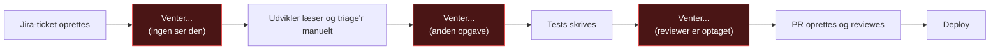
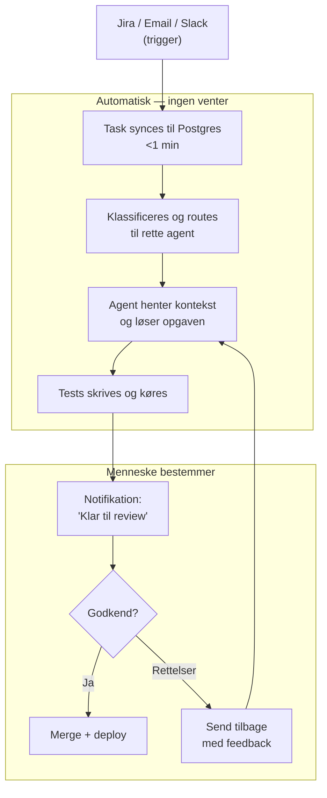
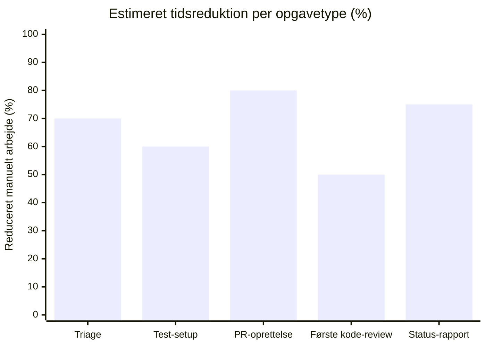
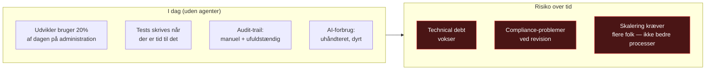
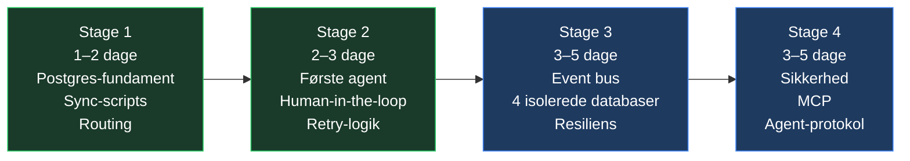

# TL;DR — Hvad er dette, og hvorfor er det relevant for dig?

> Du arbejder i IT. Du har ikke implementeret AI-agenter endnu. Her er det du behøver at vide — ingen filosofi, ingen buzzwords.

---

## Det korteste svar

Dine kolleger bruger i dag tid på opgaver der er trivielle men tidskrævende: triage af Jira-tickets, skrivning af de første tests, opsætning af pull requests, status-opdateringer til stakeholders. AI-agenter kan gøre det i stedet — automatisk, auditerbart og inden for regler I selv definerer.

Dette repository er en komplet, praktisk guide til at bygge det.

---

## Problemet du kender

Det røde er ventetid. Ventetid er ikke dovenskab — det er systemdesign. Og det kan fikses.

---

## Løsningen i ét diagram

Mennesket er stadig suverænt. Det er bare ikke spild af tid på det trivielle.

---

## De fem ting systemet gør

| # | Hvad | Hvem gør det i dag | Hvad sker med det |
|---|------|-------------------|------------------|
| 1 | Triage og prioritering af nye opgaver | Udvikler / PO | Automatisk script + deterministisk routing |
| 2 | Skrive tests (TDD) | Udvikler | TDD-agent — tests skrives *før* kode |
| 3 | Oprette pull request med beskrivelse | Udvikler | PR-agent |
| 4 | Første gennemgang af kode | Senior dev | Review-assistant præsenterer fund |
| 5 | Statusopdatering til PO / stakeholder | Alle | Delivery-assistant, PO godkender |

---

## Estimeret værdiforøgelse

Tallene er konservative estimater baseret på typiske IT-teams (5–20 udviklere). De forudsætter ikke at alt automatiseres — kun at de mest gentagne opgaver håndteres af agenter.

| Område | Nuværende situation | Med agenter | Estimeret gevinst |
|--------|--------------------|-----------|--------------------|
| **Triage-tid per ticket** | 10–20 min manuelt | < 1 min automatisk | ~85% tidsreduktion |
| **Test-coverage** | Afhænger af disciplin | ≥ 80% håndhævet af agent | Konsistent baseline |
| **PR-turnaround** | Timer til dage | Samme dag (agent + async review) | 50–70% hurtigere |
| **Onboarding af ny udvikler** | Kontekst-indsamling dage | Kontekst leveret af Context-agent | 2–3 dage → halv dag |
| **Fejl i produktion** | Varierer | Reduce med testpyramide + TDD | 30–50% færre regressions |
| **Audit-trail** | Sporadisk / manuel | 100% automatisk via immutable log | Compliance uden overhead |
| **Token-forbrug (AI)** | ETL per agent-kørsel | ETL én gang, delt via Postgres | 40–60% lavere AI-omkostning |

> Tallene er retningsgivende. Det afgørende er at *gevinsten akkumulerer* — hvert sprint der kører med agenter, er et sprint med mere konsistente tests, hurtigere reviews og fuld sporbarhed.

---

## Hvad koster det ikke at gøre det

---

## Hvad det *ikke* er

| Misforståelse | Realitet |
|---------------|---------|
| "AI bestemmer alt" | Nej. Mennesket godkender alle kritiske beslutninger. Human-in-the-loop er ikke valgfrit. |
| "Black box — vi ved ikke hvad der sker" | Alt logges i en immutable audit-log. Intet sker uden sporing. |
| "Kræver stor omskrivning af vores setup" | Stage 1 er 7 SQL-tabeller og ét sync-script. I kan starte i dag. |
| "Dyre GPU-servere og ML-infrastruktur" | Nej. Postgres + Redis + standard LLM API. Kører på en enkelt server. |
| "AI-agenter er ustabile" | Systemet er deterministisk — AI bruges kun der hvor der er reel ambiguitet. Routing, logging og audit er ren kode. |

---

## Hvor starter man?

**Stage 1 giver allerede uafhængig værdi** — selv uden en eneste agent er et struktureret, auditerbart datalag med automatisk sync fra Jira/Slack/email bedre end det de fleste teams har i dag.

Agenter tilføjes i Stage 2. Sikkerhed og skalerbarhed i Stage 3–4. Hvert trin er selvstændigt — og man kan stoppe når man har nok.

---

## Det afgørende princip

> Sæt AI der hvor der er reel ambiguitet.  
> Sæt deterministisk kode alle andre steder.  
> Postgres er det sted hvor de to mødes.

Det er ikke et AI-projekt. Det er et softwareprojekt, der bruger AI præcis der hvor det hjælper — og holder det ude af alt andet.

---

## Videre

| Hvad | Fil |
|------|-----|
| Fuld introduktion til agenter | [CGI_Agent/Intro.md](https://github.com/chrisstineline/CGI_Agent/blob/main/Intro.md) |
| Avanceret pipeline og governance | [CGI_Agent/Advanced.md](https://github.com/chrisstineline/CGI_Agent/blob/main/Advanced.md) |
| Postgres-løsningen forklaret | [CGI_Agent/Postgres_løsningen.md](Chttps://github.com/chrisstineline/CGI_Agent/blob/main/Postgres_l%C3%B8sningen.md) |
| Eksempel: CFO håndterer RFP på 50M DKK | [CGI_Agent/Eksempler/Lederen.md](https://github.com/chrisstineline/CGI_Agent/blob/main/Eksempler/Lederen.md) |
| Eksempel: Kritisk bug på sygehus | [CGI_Agent/Eksempler/RegNord.md](https://github.com/chrisstineline/CGI_Agent/blob/main/Eksempler/RegNord.md) |
| Trin-for-trin guide (Stage 1–4) | [CGI_Agent/Step_by_step/](https://github.com/chrisstineline/CGI_Agent/tree/main/Step_by_step) |
