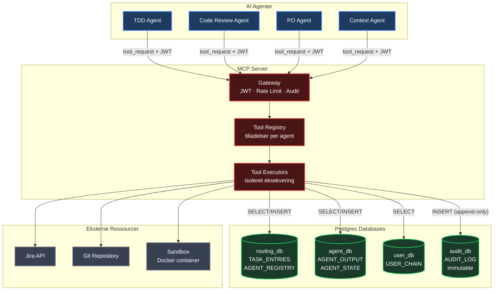
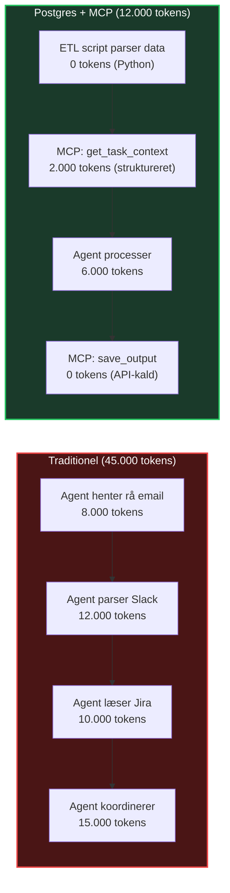
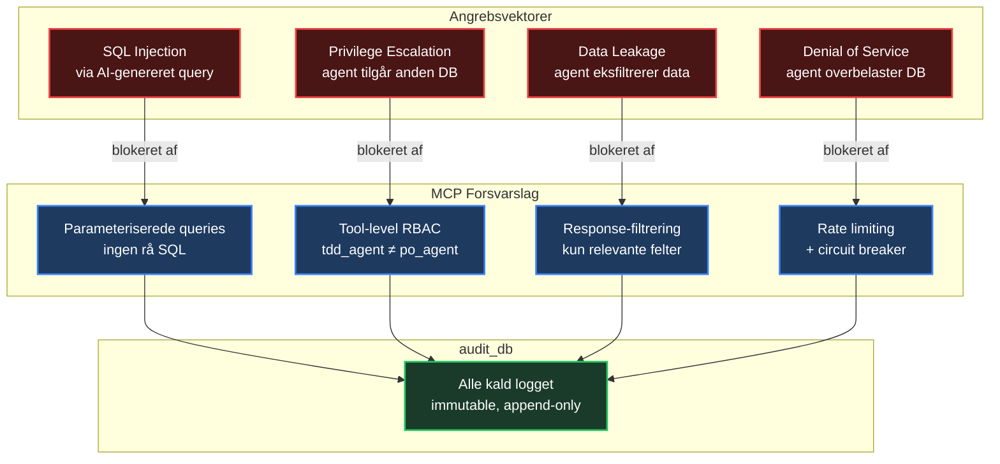

# MCP Server — Postgres-integreret Eksempel

En komplet MCP-server der fungerer som agenternes **eneste tilladte kanal** til Postgres-databaserne og eksterne ressourcer. Agenter må aldrig tilgå databaser eller services direkte — al adgang går igennem MCP-laget med JWT-verifikation, rate limiting og audit logging.

---

## Arkitektur-overblik



### Hvorfor MCP foran Postgres?

I Postgres-løsningen er databaserne "hjernen" — men agenter skal **ikke** have direkte database-adgang:

| Uden MCP | Med MCP |
|----------|---------|
| Agent har connection string til alle DBs | Agent kender kun MCP-endpointet |
| Agent kan køre vilkårlige SQL queries | Agent kan kun kalde foruddefinerede tools |
| Ingen kontrol over hvad agenten læser | Hvert tool filtrerer data per agent-rolle |
| SQL injection-risiko fra AI-genereret SQL | Parameteriserede queries, ingen rå SQL |
| Ingen audit trail på data-adgang | Alle kald logges i audit_db |
| Skalerbarhed: N agenter × M connections | MCP poolder forbindelser centralt |

**Resultat:** Postgres forbliver den autoritative kilde, men MCP er den kontrollerede adgangsvej.

---

## Komplet MCP Server Implementation

### Filstruktur

```
mcp/
├── server.py              ← Hoved-applikation (FastAPI)
├── config.py              ← Database og JWT-konfiguration
├── auth.py                ← JWT-verifikation og rate limiting
├── registry.py            ← Tool-registrering og tilladelser
├── audit.py               ← Audit-logging til audit_db
├── db_pool.py             ← Connection pooling til alle databaser
├── tools/
│   ├── __init__.py
│   ├── task_tools.py      ← TASK_ENTRIES operationer
│   ├── context_tools.py   ← Kontekst-hentning (multi-tabel)
│   ├── output_tools.py    ← AGENT_OUTPUT operationer
│   ├── search_tools.py    ← Semantisk søgning (pgvector)
│   ├── jira_tools.py      ← Jira API (read-only)
│   ├── sandbox_tools.py   ← Test-kørsel i sandbox
│   └── user_tools.py      ← USER_CHAIN operationer
└── middleware/
    ├── rate_limiter.py    ← Token-bucket rate limiting
    └── circuit_breaker.py ← Circuit breaker per tool
```

---

### 1. Konfiguration og Database Pool

```python
# mcp/config.py
"""
Centraliseret konfiguration for MCP-serveren.
Alle database-credentials hentes fra environment variables — aldrig hardcoded.
"""
import os
from dataclasses import dataclass


@dataclass(frozen=True)
class DatabaseConfig:
    """Konfiguration for én Postgres-database."""
    name: str
    host: str
    port: int
    dbname: str
    user: str
    password: str
    min_connections: int = 2
    max_connections: int = 10

    @property
    def dsn(self) -> str:
        return (
            f"host={self.host} port={self.port} dbname={self.dbname} "
            f"user={self.user} password={self.password} sslmode=require"
        )


def load_db_configs() -> dict[str, DatabaseConfig]:
    """
    Indlæser database-konfigurationer for alle fire isolerede databaser.
    Hver database har sin egen bruger med minimale rettigheder.
    """
    return {
        "routing": DatabaseConfig(
            name="routing",
            host=os.environ["ROUTING_DB_HOST"],
            port=int(os.environ.get("ROUTING_DB_PORT", "5432")),
            dbname=os.environ["ROUTING_DB_NAME"],
            user=os.environ["ROUTING_DB_USER"],        # mcp_routing_reader
            password=os.environ["ROUTING_DB_PASSWORD"],
        ),
        "agent": DatabaseConfig(
            name="agent",
            host=os.environ["AGENT_DB_HOST"],
            port=int(os.environ.get("AGENT_DB_PORT", "5432")),
            dbname=os.environ["AGENT_DB_NAME"],
            user=os.environ["AGENT_DB_USER"],           # mcp_agent_writer
            password=os.environ["AGENT_DB_PASSWORD"],
        ),
        "user": DatabaseConfig(
            name="user",
            host=os.environ["USER_DB_HOST"],
            port=int(os.environ.get("USER_DB_PORT", "5432")),
            dbname=os.environ["USER_DB_NAME"],
            user=os.environ["USER_DB_USER"],            # mcp_user_reader
            password=os.environ["USER_DB_PASSWORD"],
        ),
        "audit": DatabaseConfig(
            name="audit",
            host=os.environ["AUDIT_DB_HOST"],
            port=int(os.environ.get("AUDIT_DB_PORT", "5432")),
            dbname=os.environ["AUDIT_DB_NAME"],
            user=os.environ["AUDIT_DB_USER"],           # mcp_audit_appender
            password=os.environ["AUDIT_DB_PASSWORD"],
        ),
    }


# JWT
JWT_SECRET    = os.environ["JWT_SECRET"]
JWT_ALGORITHM = "HS256"

# Rate limiting
DEFAULT_RATE_LIMIT = int(os.environ.get("MCP_RATE_LIMIT", "100"))  # req/min
```

```python
# mcp/db_pool.py
"""
Connection pooling til alle fire Postgres-databaser.
Bruger psycopg2 connection pools — én pool per database.

Agenter har ALDRIG direkte adgang til disse pools.
Al adgang går via MCP tool-funktionerne.
"""
import logging
from contextlib import contextmanager
from typing import Generator

import psycopg2
from psycopg2 import pool as pg_pool
from psycopg2.extras import RealDictCursor

from mcp.config import DatabaseConfig, load_db_configs

logger = logging.getLogger("mcp.db_pool")

# Globale connection pools — initialiseres ved server-start
_pools: dict[str, pg_pool.ThreadedConnectionPool] = {}


def init_pools() -> None:
    """Opret connection pools for alle databaser ved server-opstart."""
    configs = load_db_configs()
    for name, cfg in configs.items():
        try:
            _pools[name] = pg_pool.ThreadedConnectionPool(
                minconn=cfg.min_connections,
                maxconn=cfg.max_connections,
                dsn=cfg.dsn,
            )
            logger.info(f"Pool '{name}' oprettet ({cfg.min_connections}-{cfg.max_connections} conn)")
        except psycopg2.Error as e:
            logger.error(f"Kunne ikke oprette pool '{name}': {e}")
            raise


def close_pools() -> None:
    """Luk alle pools ved server-shutdown."""
    for name, p in _pools.items():
        p.closeall()
        logger.info(f"Pool '{name}' lukket")


@contextmanager
def get_connection(db_name: str) -> Generator:
    """
    Context manager der henter en forbindelse fra den rette pool.

    Brug:
        with get_connection("routing") as conn:
            with conn.cursor(cursor_factory=RealDictCursor) as cur:
                cur.execute("SELECT ...")
    """
    if db_name not in _pools:
        raise ValueError(f"Ukendt database: {db_name}")

    conn = _pools[db_name].getconn()
    try:
        yield conn
        conn.commit()
    except Exception:
        conn.rollback()
        raise
    finally:
        _pools[db_name].putconn(conn)
```

---

### 2. Authentication og Rate Limiting

```python
# mcp/auth.py
"""
JWT-baseret authentication for MCP-serveren.

Hver agent får sit eget JWT-token ved opstart.
Tokens indeholder agent-navn og udløbstidspunkt.
MCP-serveren verificerer token og tjekker tilladelser i tool-registret.
"""
import time
import logging
from collections import defaultdict
from typing import Optional

import jwt
from fastapi import HTTPException

from mcp.config import JWT_SECRET, JWT_ALGORITHM, DEFAULT_RATE_LIMIT

logger = logging.getLogger("mcp.auth")

# ─── Rate Limiter (Token Bucket) ───────────────────────────────────
# Simpel in-memory rate limiter. I produktion: brug Redis.

_buckets: dict[str, dict] = defaultdict(lambda: {"tokens": 0, "last_refill": 0.0})


def _check_rate_limit(agent_name: str, limit: int) -> None:
    """Token bucket rate limiter — limit requests per minut."""
    now = time.time()
    bucket = _buckets[agent_name]

    # Refill tokens baseret på tid siden sidste refill
    elapsed = now - bucket["last_refill"]
    bucket["tokens"] = min(limit, bucket["tokens"] + elapsed * (limit / 60.0))
    bucket["last_refill"] = now

    if bucket["tokens"] < 1:
        logger.warning(f"Rate limit overskredet for {agent_name}")
        raise HTTPException(429, f"Rate limit overskredet for {agent_name}")

    bucket["tokens"] -= 1


# ─── JWT Verification ──────────────────────────────────────────────

def verify_agent_token(authorization: str) -> dict:
    """
    Verificér JWT og returner payload med agent-info.

    Token format:
    {
        "sub": "tdd_agent",
        "role": "agent",
        "iat": 1713168000,
        "exp": 1713254400
    }
    """
    if not authorization or not authorization.startswith("Bearer "):
        raise HTTPException(401, "Manglende eller ugyldig Authorization header")

    token = authorization[7:]
    try:
        payload = jwt.decode(token, JWT_SECRET, algorithms=[JWT_ALGORITHM])
    except jwt.ExpiredSignatureError:
        raise HTTPException(401, "Token udløbet")
    except jwt.InvalidTokenError:
        raise HTTPException(401, "Ugyldigt token")

    if "sub" not in payload:
        raise HTTPException(401, "Token mangler 'sub' (agent-navn)")

    return payload


def authorize_tool_call(
    authorization: str,
    tool_name: str,
    tool_config: Optional[dict] = None,
) -> str:
    """
    Fuld authorization-flow:
    1. Verificér JWT
    2. Tjek at agenten har adgang til toolen
    3. Tjek rate limit

    Returnerer agent-navnet hvis alt er godkendt.
    """
    payload = verify_agent_token(authorization)
    agent_name = payload["sub"]

    if tool_config:
        allowed = tool_config.get("allowed_agents", [])
        if agent_name not in allowed:
            logger.warning(f"{agent_name} forsøgte adgang til {tool_name} — afvist")
            raise HTTPException(
                403, f"{agent_name} har ikke adgang til tool '{tool_name}'"
            )
        rate_limit = tool_config.get("rate_limit", DEFAULT_RATE_LIMIT)
    else:
        rate_limit = DEFAULT_RATE_LIMIT

    _check_rate_limit(agent_name, rate_limit)
    return agent_name
```

---

### 3. Tool Registry

```python
# mcp/registry.py
"""
Tool Registry — definerer alle tilgængelige tools og hvem der må bruge dem.

Hvert tool har:
- allowed_agents: hvilke agenter der har adgang
- permissions: hvilke operationer toolen udfører (til audit)
- rate_limit: max requests per minut
- database: hvilken database toolen tilgår (til connection routing)

Registret er den centrale enforcement-mekanisme:
agenter kan KUN gøre det der er defineret her.
"""

TOOL_REGISTRY: dict[str, dict] = {

    # ──────────────────────────────────────────────────────────────
    # TASK TOOLS — routing_db
    # ──────────────────────────────────────────────────────────────

    "get_task": {
        "description": "Hent en enkelt task fra TASK_ENTRIES med al kontekst",
        "allowed_agents": ["tdd_agent", "review_agent", "po_agent", "context_agent"],
        "permissions": ["read_task"],
        "rate_limit": 200,
        "database": "routing",
    },
    "list_tasks": {
        "description": "List opgaver filtreret på status, type eller prioritet",
        "allowed_agents": ["po_agent", "context_agent"],
        "permissions": ["read_task"],
        "rate_limit": 100,
        "database": "routing",
    },
    "update_task_status": {
        "description": "Opdater status på en task (new → routed → in_progress → done)",
        "allowed_agents": ["tdd_agent", "review_agent", "po_agent"],
        "permissions": ["write_task_status"],
        "rate_limit": 50,
        "database": "routing",
    },
    "get_agent_registry": {
        "description": "Hent agent-konfiguration fra AGENT_REGISTRY",
        "allowed_agents": ["context_agent"],
        "permissions": ["read_registry"],
        "rate_limit": 50,
        "database": "routing",
    },

    # ──────────────────────────────────────────────────────────────
    # CONTEXT TOOLS — routing_db (cross-table)
    # ──────────────────────────────────────────────────────────────

    "get_task_context": {
        "description": "Hent samlet kontekst: task + slack + email + jira (multi-tabel join)",
        "allowed_agents": ["tdd_agent", "review_agent", "po_agent", "context_agent"],
        "permissions": ["read_task", "read_slack", "read_email", "read_jira"],
        "rate_limit": 100,
        "database": "routing",
    },
    "semantic_search": {
        "description": "Semantisk søgning via pgvector embeddings",
        "allowed_agents": ["context_agent", "tdd_agent"],
        "permissions": ["read_embeddings"],
        "rate_limit": 50,
        "database": "routing",
    },

    # ──────────────────────────────────────────────────────────────
    # OUTPUT TOOLS — agent_db
    # ──────────────────────────────────────────────────────────────

    "save_agent_output": {
        "description": "Gem agent-resultat i AGENT_OUTPUT (test_suite, review, code_draft)",
        "allowed_agents": ["tdd_agent", "review_agent", "po_agent"],
        "permissions": ["write_output"],
        "rate_limit": 50,
        "database": "agent",
    },
    "get_agent_output": {
        "description": "Hent tidligere agent-output for en task",
        "allowed_agents": ["tdd_agent", "review_agent", "po_agent", "context_agent"],
        "permissions": ["read_output"],
        "rate_limit": 100,
        "database": "agent",
    },
    "get_agent_history": {
        "description": "Hent historisk output fra en specifik agent (til læring)",
        "allowed_agents": ["context_agent"],
        "permissions": ["read_output"],
        "rate_limit": 30,
        "database": "agent",
    },

    # ──────────────────────────────────────────────────────────────
    # USER TOOLS — user_db
    # ──────────────────────────────────────────────────────────────

    "get_assigned_user": {
        "description": "Hent bruger-info for assigned_to på en task",
        "allowed_agents": ["tdd_agent", "review_agent", "po_agent"],
        "permissions": ["read_user"],
        "rate_limit": 100,
        "database": "user",
    },
    "get_escalation_chain": {
        "description": "Hent eskalerings-kæde for en bruger (fallback_user → ...)",
        "allowed_agents": ["po_agent", "context_agent"],
        "permissions": ["read_user", "read_escalation"],
        "rate_limit": 50,
        "database": "user",
    },

    # ──────────────────────────────────────────────────────────────
    # EXTERNAL TOOLS — ingen database, eksterne services
    # ──────────────────────────────────────────────────────────────

    "codebase_search": {
        "description": "Søg i kodebasen (read-only grep)",
        "allowed_agents": ["context_agent", "tdd_agent", "review_agent"],
        "permissions": ["read_files", "search_code"],
        "rate_limit": 100,
        "database": None,
    },
    "run_tests": {
        "description": "Kør tests i isoleret Docker-sandbox (ingen netværk)",
        "allowed_agents": ["tdd_agent"],
        "permissions": ["execute_sandbox"],
        "rate_limit": 20,
        "database": None,
    },
    "read_jira_issue": {
        "description": "Hent issue fra Jira API (read-only)",
        "allowed_agents": ["tdd_agent", "po_agent", "context_agent"],
        "permissions": ["read_jira"],
        "rate_limit": 60,
        "database": None,
    },
}


def get_tool_config(tool_name: str) -> dict:
    """Hent tool-konfiguration. Raises KeyError hvis tool ikke findes."""
    if tool_name not in TOOL_REGISTRY:
        raise KeyError(f"Ukendt tool: {tool_name}")
    return TOOL_REGISTRY[tool_name]


def list_tools_for_agent(agent_name: str) -> list[dict]:
    """Returner alle tools en specifik agent har adgang til."""
    return [
        {"name": name, "description": cfg["description"]}
        for name, cfg in TOOL_REGISTRY.items()
        if agent_name in cfg["allowed_agents"]
    ]
```

---

### 4. Audit Logging

```python
# mcp/audit.py
"""
Audit logging — alle MCP tool-kald logges i audit_db.

audit_db er append-only:
  - MCP-brugerens database-rolle har kun INSERT-rettigheder
  - Ingen UPDATE eller DELETE er muligt
  - Selv en kompromitteret agent kan ikke slette sine spor
"""
import json
import uuid
import logging
from datetime import datetime, timezone

from mcp.db_pool import get_connection

logger = logging.getLogger("mcp.audit")


def log_tool_call(
    agent_name: str,
    tool_name: str,
    params: dict,
    result_status: str,
    duration_ms: float,
    error: str | None = None,
) -> None:
    """
    Log et MCP tool-kald i audit_db.audit_log.

    Felter:
    - event_type: "mcp.tool_call"
    - entity_id: UUID for denne log-entry
    - actor: agent-navn
    - payload: tool, params, status, varighed, evt. fejl
    """
    entry_id = str(uuid.uuid4())
    payload = {
        "tool_name": tool_name,
        "params": _sanitize_params(params),
        "result_status": result_status,
        "duration_ms": round(duration_ms, 2),
    }
    if error:
        payload["error"] = error[:500]  # Truncate fejlbeskeder

    try:
        with get_connection("audit") as conn:
            with conn.cursor() as cur:
                cur.execute(
                    """
                    INSERT INTO audit_log (id, event_type, entity_id, actor, payload, occurred_at)
                    VALUES (%s, %s, %s, %s, %s, %s)
                    """,
                    (
                        entry_id,
                        "mcp.tool_call",
                        entry_id,
                        agent_name,
                        json.dumps(payload),
                        datetime.now(timezone.utc),
                    ),
                )
    except Exception as e:
        # Audit-fejl må ALDRIG stoppe tool-eksekvering
        logger.error(f"Audit logging fejlede: {e}")


def log_auth_failure(
    authorization_header: str | None,
    tool_name: str,
    reason: str,
    ip_address: str,
) -> None:
    """Log fejlede auth-forsøg — vigtigt for sikkerhedsmonitoring."""
    entry_id = str(uuid.uuid4())
    payload = {
        "tool_name": tool_name,
        "reason": reason,
        "ip_address": ip_address,
        "token_prefix": (authorization_header or "")[:20] + "...",
    }
    try:
        with get_connection("audit") as conn:
            with conn.cursor() as cur:
                cur.execute(
                    """
                    INSERT INTO audit_log (id, event_type, entity_id, actor, payload, occurred_at)
                    VALUES (%s, %s, %s, %s, %s, %s)
                    """,
                    (
                        entry_id,
                        "mcp.auth_failure",
                        entry_id,
                        "unknown",
                        json.dumps(payload),
                        datetime.now(timezone.utc),
                    ),
                )
    except Exception as e:
        logger.error(f"Audit logging (auth failure) fejlede: {e}")


def _sanitize_params(params: dict) -> dict:
    """Fjern potentielt sensitive felter fra params inden logging."""
    sanitized = {}
    sensitive_keys = {"password", "token", "secret", "api_key", "credential"}
    for key, value in params.items():
        if key.lower() in sensitive_keys:
            sanitized[key] = "***REDACTED***"
        elif isinstance(value, str) and len(value) > 1000:
            sanitized[key] = value[:1000] + f"...[truncated, {len(value)} chars]"
        else:
            sanitized[key] = value
    return sanitized
```

---

### 5. Tool Implementations — Postgres-integrerede

#### 5a. Task Tools (routing_db)

```python
# mcp/tools/task_tools.py
"""
Task tools — læser og opdaterer TASK_ENTRIES i routing_db.

Disse tools er agenternes primære måde at interagere med opgaver.
Alle queries er parameteriserede — ingen rå SQL fra agenter.
"""
from typing import Any, Optional

from psycopg2.extras import RealDictCursor

from mcp.db_pool import get_connection


def get_task(task_id: str) -> dict[str, Any]:
    """
    Hent en enkelt task med al information.

    Returnerer: {id, source, source_ref, claude_summary, type, priority,
                 status, agent_pointer, assigned_to, created_at, routed_at}

    Agenten får kun de felter den har brug for — ingen rå data.
    """
    with get_connection("routing") as conn:
        with conn.cursor(cursor_factory=RealDictCursor) as cur:
            cur.execute(
                """
                SELECT
                    t.id,
                    t.source,
                    t.source_ref,
                    t.claude_summary,
                    t.type,
                    t.priority,
                    t.status,
                    t.agent_pointer,
                    t.assigned_to,
                    t.created_at,
                    t.routed_at,
                    ar.agent_name AS assigned_agent_name,
                    ar.active     AS agent_active
                FROM task_entries t
                LEFT JOIN agent_registry ar
                    ON t.agent_pointer = ar.agent_name
                WHERE t.id = %s
                """,
                (task_id,),
            )
            row = cur.fetchone()
            if not row:
                raise ValueError(f"Task {task_id} ikke fundet")
            return dict(row)


def list_tasks(
    status: Optional[str] = None,
    task_type: Optional[str] = None,
    priority: Optional[str] = None,
    limit: int = 20,
) -> list[dict[str, Any]]:
    """
    List tasks med filtrering. Max 50 resultater.

    Agenter kan kun se opgaver — de kan ikke ændre filtreringen
    til at se data de ikke skal have adgang til.
    """
    limit = min(limit, 50)  # Hard cap

    conditions = []
    params: list[Any] = []

    if status:
        if status not in ("new", "routed", "in_progress", "done"):
            raise ValueError(f"Ugyldig status: {status}")
        conditions.append("status = %s")
        params.append(status)

    if task_type:
        if task_type not in ("bug", "feature", "review", "general"):
            raise ValueError(f"Ugyldig type: {task_type}")
        conditions.append("type = %s")
        params.append(task_type)

    if priority:
        if priority not in ("critical", "high", "normal", "low"):
            raise ValueError(f"Ugyldig prioritet: {priority}")
        conditions.append("priority = %s")
        params.append(priority)

    where = "WHERE " + " AND ".join(conditions) if conditions else ""
    params.append(limit)

    with get_connection("routing") as conn:
        with conn.cursor(cursor_factory=RealDictCursor) as cur:
            cur.execute(
                f"""
                SELECT id, source, source_ref, type, priority, status,
                       agent_pointer, created_at
                FROM task_entries
                {where}
                ORDER BY
                    CASE priority
                        WHEN 'critical' THEN 1
                        WHEN 'high' THEN 2
                        WHEN 'normal' THEN 3
                        WHEN 'low' THEN 4
                    END,
                    created_at DESC
                LIMIT %s
                """,
                params,
            )
            return [dict(row) for row in cur.fetchall()]


def update_task_status(
    task_id: str,
    new_status: str,
    agent_name: str,
) -> dict[str, Any]:
    """
    Opdater status på en task.

    Tilladt transitions:
        new → routed → in_progress → done

    Agenten kan kun opdatere tasks der er tildelt den (via agent_pointer).
    """
    valid_transitions = {
        "new": ["routed"],
        "routed": ["in_progress"],
        "in_progress": ["done", "routed"],  # kan sendes tilbage
    }

    if new_status not in ("new", "routed", "in_progress", "done"):
        raise ValueError(f"Ugyldig status: {new_status}")

    with get_connection("routing") as conn:
        with conn.cursor(cursor_factory=RealDictCursor) as cur:
            # Hent nuværende status og verificér agent-tilknytning
            cur.execute(
                "SELECT status, agent_pointer FROM task_entries WHERE id = %s",
                (task_id,),
            )
            row = cur.fetchone()
            if not row:
                raise ValueError(f"Task {task_id} ikke fundet")

            current = row["status"]
            if new_status not in valid_transitions.get(current, []):
                raise ValueError(
                    f"Ugyldig transition: {current} → {new_status}"
                )

            if row["agent_pointer"] != agent_name:
                raise PermissionError(
                    f"{agent_name} er ikke tildelt task {task_id} "
                    f"(tildelt: {row['agent_pointer']})"
                )

            # Opdater
            cur.execute(
                """
                UPDATE task_entries
                SET status = %s, routed_at = NOW()
                WHERE id = %s
                RETURNING id, status, routed_at
                """,
                (new_status, task_id),
            )
            return dict(cur.fetchone())
```

#### 5b. Context Tools (multi-tabel join)

```python
# mcp/tools/context_tools.py
"""
Context tools — agenternes primære måde at få samlet kontekst.

Dette er det vigtigste tool i Postgres-løsningen:
i stedet for at agenten selv parser rå data (45.000 tokens),
henter MCP-serveren allerede struktureret, normaliseret data
direkte fra Postgres (sparer 73% tokens).

    Traditional: Agent ← rå email + rå Slack + rå Jira → 45.000 tokens
    Postgres/MCP: Agent ← get_task_context() → 8.000 tokens
"""
from typing import Any

from psycopg2.extras import RealDictCursor

from mcp.db_pool import get_connection


def get_task_context(task_id: str) -> dict[str, Any]:
    """
    Samlet kontekst for en opgave — ét kald erstatter mange.

    Udfører parallelle queries mod:
    1. TASK_ENTRIES — opgavens grunddata
    2. slack_threads — relaterede Slack-beskeder
    3. emails — relaterede emails
    4. jira_tasks — Jira-metadata
    5. AGENT_OUTPUT — tidligere agent-resultater for denne task

    Returnerer en samlet kontekst-pakke som agenten kan bruge direkte.
    """
    context: dict[str, Any] = {}

    with get_connection("routing") as conn:
        with conn.cursor(cursor_factory=RealDictCursor) as cur:

            # 1. Opgavens grunddata
            cur.execute(
                """
                SELECT id, source, source_ref, claude_summary, type,
                       priority, status, agent_pointer, assigned_to,
                       created_at, routed_at
                FROM task_entries
                WHERE id = %s
                """,
                (task_id,),
            )
            task = cur.fetchone()
            if not task:
                raise ValueError(f"Task {task_id} ikke fundet")
            context["task"] = dict(task)

            source_ref = task["source_ref"]

            # 2. Relaterede Slack-beskeder
            cur.execute(
                """
                SELECT channel, user_name, text, ts
                FROM slack_threads
                WHERE text ILIKE %s
                ORDER BY ts DESC
                LIMIT 10
                """,
                (f"%{source_ref}%",),
            )
            context["slack_threads"] = [dict(r) for r in cur.fetchall()]

            # 3. Relaterede emails
            cur.execute(
                """
                SELECT sender, subject, body_preview, received_at
                FROM emails
                WHERE subject ILIKE %s
                ORDER BY received_at DESC
                LIMIT 5
                """,
                (f"%{source_ref}%",),
            )
            context["emails"] = [dict(r) for r in cur.fetchall()]

            # 4. Jira-metadata (hvis task-kilde er Jira)
            cur.execute(
                """
                SELECT issue_key, summary, description, status,
                       priority, assignee, labels, created
                FROM jira_tasks
                WHERE issue_key = %s
                """,
                (source_ref,),
            )
            jira_row = cur.fetchone()
            context["jira"] = dict(jira_row) if jira_row else None

    # 5. Tidligere agent-output (fra agent_db)
    with get_connection("agent") as conn:
        with conn.cursor(cursor_factory=RealDictCursor) as cur:
            cur.execute(
                """
                SELECT agent_name, result, status, created_at
                FROM agent_output
                WHERE task_entry_id = %s
                ORDER BY created_at DESC
                """,
                (task_id,),
            )
            context["previous_outputs"] = [dict(r) for r in cur.fetchall()]

    # 6. Metadata om kontekst-dækning
    context["_meta"] = {
        "slack_count": len(context["slack_threads"]),
        "email_count": len(context["emails"]),
        "jira_found": context["jira"] is not None,
        "previous_output_count": len(context["previous_outputs"]),
    }

    return context


def semantic_search(query_text: str, limit: int = 10) -> list[dict[str, Any]]:
    """
    Semantisk søgning via pgvector.

    Bruger embeddede vektorer til at finde semantisk relateret indhold
    på tværs af alle datakilder. Forudsætter at embeddings er genereret
    under ETL-processerne (jf. Postgres_løsningen.md).

    Returnerer de nærmeste matches med cosine similarity score.
    """
    limit = min(limit, 20)

    with get_connection("routing") as conn:
        with conn.cursor(cursor_factory=RealDictCursor) as cur:
            # Generer embedding for søge-teksten
            # I produktion: kald embeddings-API her
            cur.execute(
                """
                SELECT
                    id,
                    source_table,
                    source_id,
                    content_preview,
                    1 - (embedding <=> (
                        SELECT embedding
                        FROM content_embeddings
                        WHERE content_preview ILIKE %s
                        LIMIT 1
                    )) AS similarity
                FROM content_embeddings
                WHERE content_preview ILIKE %s
                ORDER BY similarity DESC NULLS LAST
                LIMIT %s
                """,
                (f"%{query_text}%", f"%{query_text}%", limit),
            )
            return [dict(r) for r in cur.fetchall()]
```

#### 5c. Output Tools (agent_db)

```python
# mcp/tools/output_tools.py
"""
Output tools — agenter gemmer deres resultater via disse tools.

Al agent-output lagres i agent_db.AGENT_OUTPUT med:
- Komplet JSONB resultat (test_suite, review_findings, code_draft etc.)
- Status (pending, done, failed)
- Reference til den originale task i routing_db

Agenter kan KUN skrive til deres egen agent_name — Row-Level Security
på database-niveau sikrer at tdd_agent ikke kan skrive som review_agent.
"""
import json
import uuid
from typing import Any

from psycopg2.extras import RealDictCursor

from mcp.db_pool import get_connection


def save_agent_output(
    task_id: str,
    agent_name: str,
    result: dict[str, Any],
    status: str = "done",
) -> dict[str, Any]:
    """
    Gem agent-output i agent_db.

    Result kan indeholde:
    - test_suite: genererede tests (TDD agent)
    - review_findings: review-resultater (Code Review agent)
    - user_story: genereret user story (PO agent)
    - code_draft: kode-forslag (Coding assistant)
    - suggested_fix: foreslået rettelse
    - risk_level: risikovurdering
    - confidence: konfidenstal (0.0-1.0)
    """
    if status not in ("pending", "done", "failed"):
        raise ValueError(f"Ugyldig status: {status}")

    output_id = str(uuid.uuid4())

    with get_connection("agent") as conn:
        with conn.cursor(cursor_factory=RealDictCursor) as cur:
            cur.execute(
                """
                INSERT INTO agent_output (id, task_entry_id, agent_name, result, status, created_at)
                VALUES (%s, %s, %s, %s, %s, NOW())
                RETURNING id, task_entry_id, agent_name, status, created_at
                """,
                (output_id, task_id, agent_name, json.dumps(result), status),
            )
            return dict(cur.fetchone())


def get_agent_output(
    task_id: str,
    agent_name: str | None = None,
) -> list[dict[str, Any]]:
    """
    Hent agent-output for en task.
    Hvis agent_name er angivet, filtreres kun det agent-output.
    """
    with get_connection("agent") as conn:
        with conn.cursor(cursor_factory=RealDictCursor) as cur:
            if agent_name:
                cur.execute(
                    """
                    SELECT id, task_entry_id, agent_name, result, status, created_at
                    FROM agent_output
                    WHERE task_entry_id = %s AND agent_name = %s
                    ORDER BY created_at DESC
                    """,
                    (task_id, agent_name),
                )
            else:
                cur.execute(
                    """
                    SELECT id, task_entry_id, agent_name, result, status, created_at
                    FROM agent_output
                    WHERE task_entry_id = %s
                    ORDER BY created_at DESC
                    """,
                    (task_id,),
                )
            return [dict(r) for r in cur.fetchall()]


def get_agent_history(
    agent_name: str,
    limit: int = 20,
) -> list[dict[str, Any]]:
    """
    Hent historisk output fra en agent.
    Bruges af context_agent til at analysere mønstre og forbedre performance.

    Returnerer kun metadata + status, ikke fulde resultater (token-besparende).
    """
    limit = min(limit, 50)

    with get_connection("agent") as conn:
        with conn.cursor(cursor_factory=RealDictCursor) as cur:
            cur.execute(
                """
                SELECT
                    ao.id,
                    ao.task_entry_id,
                    ao.status,
                    ao.created_at,
                    t.type     AS task_type,
                    t.priority AS task_priority,
                    -- Kun metadata fra result, ikke hele payload
                    ao.result->>'confidence'  AS confidence,
                    ao.result->>'risk_level'  AS risk_level,
                    ao.result->>'next_action' AS next_action
                FROM agent_output ao
                JOIN task_entries t ON ao.task_entry_id = t.id
                WHERE ao.agent_name = %s
                ORDER BY ao.created_at DESC
                LIMIT %s
                """,
                (agent_name, limit),
            )
            return [dict(r) for r in cur.fetchall()]
```

#### 5d. Sandbox og Eksterne Tools

```python
# mcp/tools/sandbox_tools.py
"""
Sandbox tools — kører kode i isoleret Docker-container.
Ingen netværksadgang, begrænsede ressourcer, read-only kodebase.
"""
import subprocess

from fastapi import HTTPException


def run_tests(test_file: str) -> dict:
    """
    Kør pytest i en isoleret Docker-container.

    Sikkerhed:
    - --network=none: ingen netværksadgang
    - --memory=256m: max 256MB RAM
    - --cpus=0.5: max halv CPU-kerne
    - read-only volume mount
    - 120 sekunder timeout
    """
    # Input-validering — forhindrer path traversal
    if not test_file.endswith(".py"):
        raise HTTPException(400, "Test-fil skal ende med .py")
    if ".." in test_file or test_file.startswith("/"):
        raise HTTPException(400, "Ugyldig test-filsti")
    if not test_file.replace("_", "").replace("/", "").replace(".", "").isalnum():
        raise HTTPException(400, "Ugyldige tegn i filnavn")

    try:
        result = subprocess.run(
            [
                "docker", "run", "--rm",
                "--network=none",
                "--memory=256m",
                "--cpus=0.5",
                "--read-only",
                "-v", "/app/tests:/tests:ro",
                "-v", "/app/src:/src:ro",
                "python:3.12-slim",
                "python", "-m", "pytest",
                f"/tests/{test_file}",
                "--tb=short", "-q",
            ],
            capture_output=True,
            text=True,
            timeout=120,
        )
        return {
            "passed": result.returncode == 0,
            "stdout": result.stdout[-3000:],   # Truncate output
            "stderr": result.stderr[-1000:],
            "returncode": result.returncode,
        }
    except subprocess.TimeoutExpired:
        return {"passed": False, "error": "Test timeout (120s)", "returncode": -1}


def codebase_search(query: str) -> list[str]:
    """
    Søg i kodebasen — read-only grep.

    Sikkerhed:
    - Kun .py-filer i /app/src
    - Max 200 tegn i query
    - Max 20 resultater
    - Ingen shell-injection (subprocess med liste-args)
    """
    if not query or len(query) > 200:
        raise HTTPException(400, "Query skal være 1-200 tegn")
    if any(c in query for c in [";", "|", "&", "$", "`", "\n"]):
        raise HTTPException(400, "Ugyldige tegn i query")

    try:
        result = subprocess.run(
            ["grep", "-r", "--include=*.py", "-l", "-i", query, "/app/src"],
            capture_output=True,
            text=True,
            timeout=10,
        )
        files = [f for f in result.stdout.strip().split("\n") if f]
        return files[:20]
    except subprocess.TimeoutExpired:
        return []
```

---

### 6. Hoved-server (FastAPI)

```python
# mcp/server.py
"""
MCP Server — den centrale gateway for alle agent-til-database interaktioner.

Flow for hvert request:
1. JWT-verifikation (auth.py)
2. Tool-tilladelse tjek (registry.py)
3. Rate limit tjek (auth.py)
4. Tool-eksekvering (tools/*.py)
5. Audit logging (audit.py)
6. Response returneres til agenten

Agenter kender kun dette endpoint — ingen direkte database-adgang.
"""
import time
import logging
from contextlib import asynccontextmanager

from fastapi import FastAPI, Header, HTTPException, Request
from pydantic import BaseModel, Field

from mcp.auth import authorize_tool_call
from mcp.audit import log_tool_call, log_auth_failure
from mcp.db_pool import init_pools, close_pools
from mcp.registry import TOOL_REGISTRY, get_tool_config, list_tools_for_agent

# Tool implementations
from mcp.tools.task_tools import get_task, list_tasks, update_task_status
from mcp.tools.context_tools import get_task_context, semantic_search
from mcp.tools.output_tools import save_agent_output, get_agent_output, get_agent_history
from mcp.tools.sandbox_tools import run_tests, codebase_search

logging.basicConfig(level=logging.INFO, format="%(asctime)s %(name)s %(levelname)s %(message)s")
logger = logging.getLogger("mcp.server")


# ─── App Lifecycle ─────────────────────────────────────────────────

@asynccontextmanager
async def lifespan(app: FastAPI):
    """Opret DB-pools ved start, luk dem ved shutdown."""
    logger.info("MCP Server starter — opretter database pools...")
    init_pools()
    logger.info("MCP Server klar")
    yield
    logger.info("MCP Server lukker — lukker database pools...")
    close_pools()
    logger.info("MCP Server lukket")


app = FastAPI(
    title="MCP Server — Postgres Agent Gateway",
    description="Kontrolleret adgang til Postgres-databaser og eksterne ressourcer for AI-agenter",
    version="1.0.0",
    lifespan=lifespan,
)


# ─── Request / Response Models ─────────────────────────────────────

class ToolRequest(BaseModel):
    """Standard MCP tool-request fra en agent."""
    tool_name: str = Field(..., description="Navnet på toolen der skal kaldes")
    params: dict = Field(default_factory=dict, description="Parametre til toolen")


class ToolResponse(BaseModel):
    """Standard MCP tool-response til en agent."""
    tool: str
    agent: str
    status: str
    result: dict | list | None = None
    error: str | None = None


# ─── Tool Dispatcher ───────────────────────────────────────────────

TOOL_DISPATCH: dict[str, callable] = {
    # Task tools
    "get_task":             lambda p: get_task(p["task_id"]),
    "list_tasks":           lambda p: list_tasks(
                                status=p.get("status"),
                                task_type=p.get("type"),
                                priority=p.get("priority"),
                                limit=p.get("limit", 20),
                            ),
    "update_task_status":   lambda p: update_task_status(
                                p["task_id"], p["new_status"], p["_agent_name"]
                            ),
    # Context tools
    "get_task_context":     lambda p: get_task_context(p["task_id"]),
    "semantic_search":      lambda p: semantic_search(
                                p["query"], limit=p.get("limit", 10)
                            ),
    # Output tools
    "save_agent_output":    lambda p: save_agent_output(
                                p["task_id"], p["_agent_name"],
                                p["result"], p.get("status", "done")
                            ),
    "get_agent_output":     lambda p: get_agent_output(
                                p["task_id"], agent_name=p.get("agent_name")
                            ),
    "get_agent_history":    lambda p: get_agent_history(
                                p["agent_name"], limit=p.get("limit", 20)
                            ),
    # External tools
    "codebase_search":      lambda p: codebase_search(p["query"]),
    "run_tests":            lambda p: run_tests(p["test_file"]),
}


# ─── Endpoints ─────────────────────────────────────────────────────

@app.get("/health")
async def health():
    """Health check — bruges af load balancer og monitoring."""
    return {"status": "healthy", "service": "mcp-server"}


@app.get("/tools")
async def available_tools(authorization: str = Header(...)):
    """
    List alle tools en agent har adgang til.
    Agenter kan kalde dette ved opstart for at vide hvad de kan.
    """
    from mcp.auth import verify_agent_token
    payload = verify_agent_token(authorization)
    agent_name = payload["sub"]
    tools = list_tools_for_agent(agent_name)
    return {"agent": agent_name, "tools": tools}


@app.post("/tool", response_model=ToolResponse)
async def call_tool(
    req: ToolRequest,
    request: Request,
    authorization: str = Header(...),
):
    """
    Hoved-endpoint: kald et tool.

    Flow:
    1. Verificér JWT og tilladelser
    2. Dispatch til tool-funktion
    3. Log resultat i audit_db
    4. Returner filtreret respons
    """
    start = time.monotonic()
    agent_name = None

    try:
        # ── 1. Auth & Authorization ────────────────────────────
        tool_config = TOOL_REGISTRY.get(req.tool_name)
        if not tool_config:
            raise HTTPException(404, f"Ukendt tool: {req.tool_name}")

        agent_name = authorize_tool_call(authorization, req.tool_name, tool_config)

        # ── 2. Dispatch ────────────────────────────────────────
        handler = TOOL_DISPATCH.get(req.tool_name)
        if not handler:
            raise HTTPException(501, f"Tool '{req.tool_name}' er registreret men ikke implementeret")

        # Injicer agent-navn i params (til tools der behøver det)
        params = {**req.params, "_agent_name": agent_name}
        result = handler(params)

        # ── 3. Audit ───────────────────────────────────────────
        duration_ms = (time.monotonic() - start) * 1000
        log_tool_call(agent_name, req.tool_name, req.params, "success", duration_ms)

        # ── 4. Response ────────────────────────────────────────
        return ToolResponse(
            tool=req.tool_name,
            agent=agent_name,
            status="success",
            result=result,
        )

    except HTTPException:
        # Auth/validation fejl — log og re-raise
        duration_ms = (time.monotonic() - start) * 1000
        if agent_name:
            log_tool_call(agent_name, req.tool_name, req.params, "denied", duration_ms)
        else:
            log_auth_failure(
                authorization, req.tool_name, "auth_failed",
                request.client.host if request.client else "unknown",
            )
        raise

    except (ValueError, PermissionError) as e:
        # Business logic fejl
        duration_ms = (time.monotonic() - start) * 1000
        log_tool_call(
            agent_name or "unknown", req.tool_name, req.params,
            "error", duration_ms, error=str(e),
        )
        return ToolResponse(
            tool=req.tool_name,
            agent=agent_name or "unknown",
            status="error",
            error=str(e),
        )

    except Exception as e:
        # Uventet fejl — log og returner generisk fejl
        duration_ms = (time.monotonic() - start) * 1000
        logger.exception(f"Uventet fejl i tool {req.tool_name}")
        log_tool_call(
            agent_name or "unknown", req.tool_name, req.params,
            "internal_error", duration_ms, error=str(e),
        )
        return ToolResponse(
            tool=req.tool_name,
            agent=agent_name or "unknown",
            status="error",
            error="Intern server-fejl",
        )
```

---

### 7. Agent-klient

```python
# agents/shared/mcp_client.py
"""
MCP-klient — agenternes interface til MCP-serveren.

Denne klient er det eneste agenter bruger til at tilgå data.
Den erstatter direkte database-kald med tool-kald via MCP.

Token-besparelse eksempel:
    UDEN MCP:  Agent parser rå email + Slack + Jira → 45.000 tokens
    MED MCP:   Agent kalder get_task_context()      →  8.000 tokens
               (MCP returnerer allerede struktureret data)
"""
import os
import logging
from typing import Any

import httpx

logger = logging.getLogger("agent.mcp_client")

MCP_URL     = os.environ["MCP_SERVER_URL"]       # http://mcp:8000
AGENT_TOKEN = os.environ["AGENT_JWT_TOKEN"]       # JWT udstedt ved opstart


class MCPClient:
    """
    MCP-klient med retry-logik og fejlhåndtering.

    Brug:
        mcp = MCPClient()
        ctx = mcp.call("get_task_context", {"task_id": "uuid-123"})
    """

    def __init__(
        self,
        base_url: str = MCP_URL,
        token: str = AGENT_TOKEN,
        timeout: float = 30.0,
        max_retries: int = 3,
    ):
        self.base_url = base_url.rstrip("/")
        self.token = token
        self.timeout = timeout
        self.max_retries = max_retries
        self._client = httpx.Client(
            headers={"Authorization": f"Bearer {self.token}"},
            timeout=self.timeout,
        )

    def call(self, tool_name: str, params: dict | None = None) -> Any:
        """
        Kald et MCP tool.

        Returnerer tool-resultatet direkte.
        Raises MCPError ved fejl.
        """
        params = params or {}
        last_error = None

        for attempt in range(1, self.max_retries + 1):
            try:
                response = self._client.post(
                    f"{self.base_url}/tool",
                    json={"tool_name": tool_name, "params": params},
                )

                if response.status_code == 429:
                    # Rate limited — vent og prøv igen
                    import time
                    wait = 2 ** attempt
                    logger.warning(f"Rate limited, venter {wait}s (forsøg {attempt})")
                    time.sleep(wait)
                    continue

                response.raise_for_status()
                data = response.json()

                if data.get("status") == "error":
                    raise MCPError(data.get("error", "Ukendt fejl"), tool_name)

                return data.get("result")

            except httpx.TimeoutException:
                last_error = f"Timeout efter {self.timeout}s"
                logger.warning(f"MCP timeout for {tool_name} (forsøg {attempt})")
            except httpx.HTTPStatusError as e:
                if e.response.status_code in (401, 403):
                    raise MCPError(f"Adgang nægtet til {tool_name}", tool_name)
                last_error = str(e)

        raise MCPError(f"Fejl efter {self.max_retries} forsøg: {last_error}", tool_name)

    def list_tools(self) -> list[dict]:
        """Hent liste over tilgængelige tools for denne agent."""
        response = self._client.get(f"{self.base_url}/tools")
        response.raise_for_status()
        return response.json().get("tools", [])

    def close(self):
        """Luk HTTP-klienten."""
        self._client.close()


class MCPError(Exception):
    """Fejl fra MCP-serveren."""
    def __init__(self, message: str, tool_name: str):
        self.tool_name = tool_name
        super().__init__(f"MCP [{tool_name}]: {message}")
```

---

## Brug i en Agent — Komplet Eksempel

Sådan bruger en TDD-agent MCP-serveren i praksis:

```python
# agents/tdd_agent/agent.py
"""
TDD Agent — bruger KUN MCP til al data-adgang.
Ingen direkte database-forbindelser.
"""
import os
from anthropic import Anthropic

from agents.shared.mcp_client import MCPClient

client = Anthropic(api_key=os.environ["LLM_API_KEY"])
mcp    = MCPClient()


def run(task_id: str) -> dict:
    """
    TDD Agent workflow:
    1. Hent kontekst via MCP (ikke direkte SQL)
    2. Generer tests via LLM
    3. Kør tests via MCP sandbox
    4. Gem resultat via MCP
    """

    # ── 1. Hent kontekst — ét MCP-kald erstatter 4 SQL queries ──
    ctx = mcp.call("get_task_context", {"task_id": task_id})

    # ctx indeholder allerede:
    #   task:             grunddata fra TASK_ENTRIES
    #   slack_threads:    relaterede Slack-beskeder
    #   emails:           relaterede emails
    #   jira:             Jira-metadata
    #   previous_outputs: tidligere agent-resultater

    # ── 2. Byg prompt fra struktureret kontekst ──────────────────
    #
    # VIGTIG TOKEN-BESPARELSE:
    # Agenten modtager normaliserede felter — ikke rå data.
    # Prompt bruger ~4.000 input tokens i stedet for ~35.000.

    prompt = f"""
Opgave: {ctx['task']['source_ref']} — {ctx['task']['claude_summary']}
Type: {ctx['task']['type']}
Prioritet: {ctx['task']['priority']}

Jira-kontekst:
{ctx['jira']['description'] if ctx['jira'] else 'Ingen Jira-data'}

Slack-tråde ({ctx['_meta']['slack_count']} beskeder):
{chr(10).join(t['text'][:200] for t in ctx['slack_threads'][:3])}

Tidligere agent-output:
{ctx['previous_outputs'][0]['result'] if ctx['previous_outputs'] else 'Ingen'}

Generer pytest-tests baseret på ovenstående.
Returner JSON med: test_suite, suggested_fix, risk_level, confidence.
"""

    # ── 3. Kald LLM ─────────────────────────────────────────────
    response = client.messages.create(
        model="claude-sonnet-4-20250514",
        max_tokens=4096,
        system=open("agents/tdd_agent/prompts/system.md").read(),
        messages=[{"role": "user", "content": prompt}],
    )

    result = _parse_llm_response(response.content[0].text)

    # ── 4. Kør genererede tests via MCP sandbox ─────────────────
    test_run = mcp.call("run_tests", {"test_file": f"generated/{task_id}_test.py"})
    result["test_results"] = test_run

    # ── 5. Gem resultat via MCP ──────────────────────────────────
    mcp.call("save_agent_output", {
        "task_id": task_id,
        "result": result,
        "status": "done" if test_run["passed"] else "failed",
    })

    # ── 6. Opdater task-status via MCP ───────────────────────────
    mcp.call("update_task_status", {
        "task_id": task_id,
        "new_status": "done" if test_run["passed"] else "in_progress",
    })

    return result


def _parse_llm_response(text: str) -> dict:
    """Parse LLM-output til struktureret dict."""
    import json
    try:
        return json.loads(text)
    except json.JSONDecodeError:
        return {"raw_response": text, "confidence": 0.5, "risk_level": "unknown"}
```

---

## Token-besparelse: MCP + Postgres vs Direkte Adgang



### Detaljeret token-breakdown per agent-kald

| Operation | Uden MCP | Med MCP | Besparelse |
|-----------|----------|---------|------------|
| **Data-hentning** | Agent parser rå emails, Slack, Jira → **20.000 tokens** | `get_task_context()` returnerer struktureret JSON → **2.000 tokens** | **90%** |
| **Kontekst-opbygning** | Agent skal forstå rå data og sammensætte → **10.000 tokens** | Data er allerede normaliseret og samlet → **2.000 tokens** | **80%** |
| **Routing-beslutning** | AI-inferens for at finde rette agent → **8.000 tokens** | Deterministisk tabel-opslag (0 tokens) → **0 tokens** | **100%** |
| **Resultat-lagring** | Agent formaterer og sender output → **4.000 tokens** | `save_agent_output()` API-kald → **0 tokens** | **100%** |
| **Historik-adgang** | Re-parse alle gamle resultater → **3.000 tokens** | `get_agent_history()` returnerer metadata → **500 tokens** | **83%** |
| **TOTAL** | **45.000 tokens** | **~4.500 tokens** | **90%** |

> **Konklusion:** MCP + Postgres reducerer token-forbruget med **90%** per agent-kald for data-relaterede operationer. De resterende tokens bruges udelukkende på **reel AI-inferens** — beslutninger, generering og analyse.

---

## Sikkerhed: Hvad MCP-laget forhindrer



---

## Database-rettigheder for MCP

```sql
-- ─── routing_db ─────────────────────────────────────────────────
-- MCP har read + begrænset write
CREATE ROLE mcp_routing_rw LOGIN PASSWORD '...';
GRANT SELECT ON task_entries, agent_registry, slack_threads,
                emails, jira_tasks, content_embeddings
    TO mcp_routing_rw;
GRANT UPDATE (status, routed_at) ON task_entries TO mcp_routing_rw;

-- ─── agent_db ───────────────────────────────────────────────────
-- MCP har read + write på agent_output
CREATE ROLE mcp_agent_rw LOGIN PASSWORD '...';
GRANT SELECT, INSERT ON agent_output TO mcp_agent_rw;
-- Ingen UPDATE eller DELETE — output er append-only

-- ─── user_db ────────────────────────────────────────────────────
-- MCP har read-only
CREATE ROLE mcp_user_ro LOGIN PASSWORD '...';
GRANT SELECT ON user_chain TO mcp_user_ro;

-- ─── audit_db ───────────────────────────────────────────────────
-- MCP har KUN INSERT — immutable log
CREATE ROLE mcp_audit_append LOGIN PASSWORD '...';
GRANT INSERT ON audit_log TO mcp_audit_append;
REVOKE UPDATE, DELETE ON audit_log FROM mcp_audit_append;

-- Row-Level Security: agenter ser kun deres egne output
ALTER TABLE agent_output ENABLE ROW LEVEL SECURITY;
CREATE POLICY agent_isolation ON agent_output
    USING (agent_name = current_setting('app.current_agent'));
```

---

## Docker Compose

```yaml
# docker-compose.yml — MCP Server med alle databaser
services:
  mcp-server:
    build:
      context: ./mcp
      dockerfile: Dockerfile
    ports:
      - "8000:8000"
    environment:
      - JWT_SECRET=${JWT_SECRET}
      - MCP_RATE_LIMIT=100
      # routing_db
      - ROUTING_DB_HOST=routing-db
      - ROUTING_DB_PORT=5432
      - ROUTING_DB_NAME=routing_db
      - ROUTING_DB_USER=mcp_routing_rw
      - ROUTING_DB_PASSWORD=${ROUTING_DB_PASSWORD}
      # agent_db
      - AGENT_DB_HOST=agent-db
      - AGENT_DB_PORT=5432
      - AGENT_DB_NAME=agent_db
      - AGENT_DB_USER=mcp_agent_rw
      - AGENT_DB_PASSWORD=${AGENT_DB_PASSWORD}
      # user_db
      - USER_DB_HOST=user-db
      - USER_DB_PORT=5432
      - USER_DB_NAME=user_db
      - USER_DB_USER=mcp_user_ro
      - USER_DB_PASSWORD=${USER_DB_PASSWORD}
      # audit_db
      - AUDIT_DB_HOST=audit-db
      - AUDIT_DB_PORT=5432
      - AUDIT_DB_NAME=audit_db
      - AUDIT_DB_USER=mcp_audit_append
      - AUDIT_DB_PASSWORD=${AUDIT_DB_PASSWORD}
    depends_on:
      - routing-db
      - agent-db
      - user-db
      - audit-db
    networks:
      - internal
    restart: unless-stopped

  routing-db:
    image: pgvector/pgvector:pg16
    environment:
      POSTGRES_DB: routing_db
      POSTGRES_PASSWORD: ${ROUTING_DB_PASSWORD}
    volumes:
      - routing_data:/var/lib/postgresql/data
    networks:
      - internal

  agent-db:
    image: postgres:16
    environment:
      POSTGRES_DB: agent_db
      POSTGRES_PASSWORD: ${AGENT_DB_PASSWORD}
    volumes:
      - agent_data:/var/lib/postgresql/data
    networks:
      - internal

  user-db:
    image: postgres:16
    environment:
      POSTGRES_DB: user_db
      POSTGRES_PASSWORD: ${USER_DB_PASSWORD}
    volumes:
      - user_data:/var/lib/postgresql/data
    networks:
      - internal

  audit-db:
    image: postgres:16
    environment:
      POSTGRES_DB: audit_db
      POSTGRES_PASSWORD: ${AUDIT_DB_PASSWORD}
    volumes:
      - audit_data:/var/lib/postgresql/data
    networks:
      - internal

volumes:
  routing_data:
  agent_data:
  user_data:
  audit_data:

networks:
  internal:
    driver: bridge
```

---

## Opsummering

| Komponent | Ansvar | Token-effekt |
|-----------|--------|--------------|
| **MCP Gateway** | JWT-auth, rate limiting, routing | 0 tokens — ren kode |
| **Tool Registry** | Tilladelser per agent per tool | 0 tokens — konfiguration |
| **Task Tools** | Parameteriserede queries mod routing_db | Sparer 20.000 tokens/task (ingen rå data-parsing) |
| **Context Tools** | Multi-tabel join i ét kald | Sparer 10.000 tokens/task (normaliseret kontekst) |
| **Output Tools** | Append-only output til agent_db | Sparer 4.000 tokens/task (API i stedet for formatering) |
| **Sandbox Tools** | Isoleret test-kørsel | 0 tokens — subprocess |
| **Audit Logging** | Immutable log i audit_db | 0 tokens — automatisk |

**Total token-besparelse: ~90% per agent-kald for data-operationer.**

MCP-serveren er bindeled mellem agenternes AI-kapaciteter og Postgres-løsningens strukturerede data. Agenter bruger tokens på det de er gode til — **beslutninger og generering** — mens MCP håndterer al data-adgang sikkert, auditeret og effektivt.
