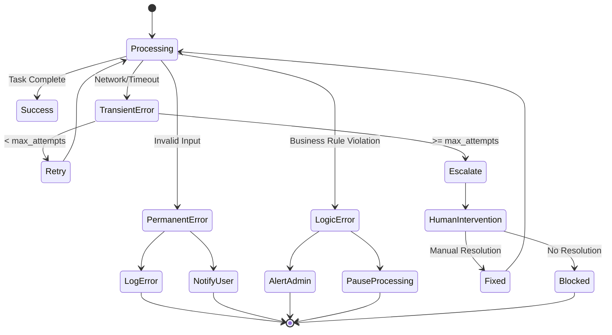
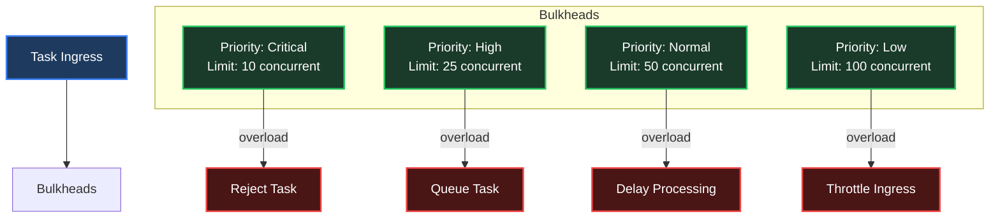
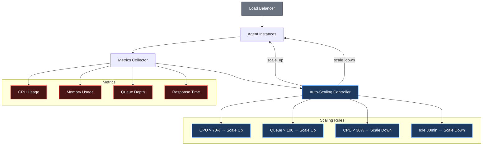
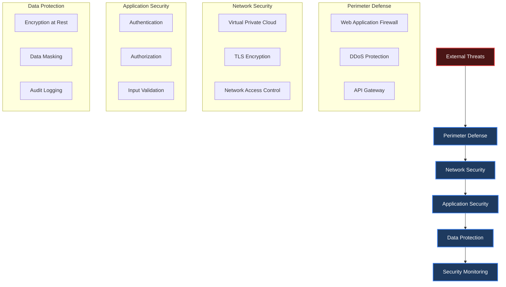
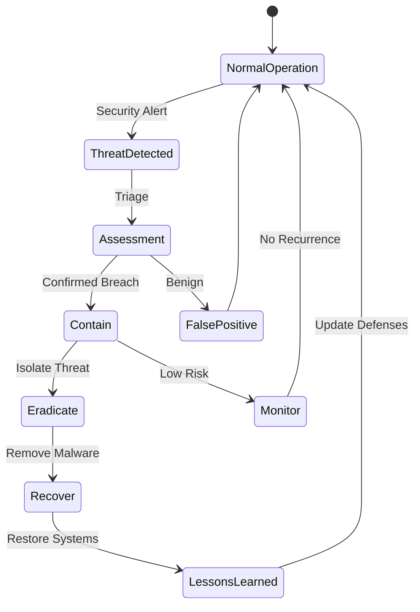
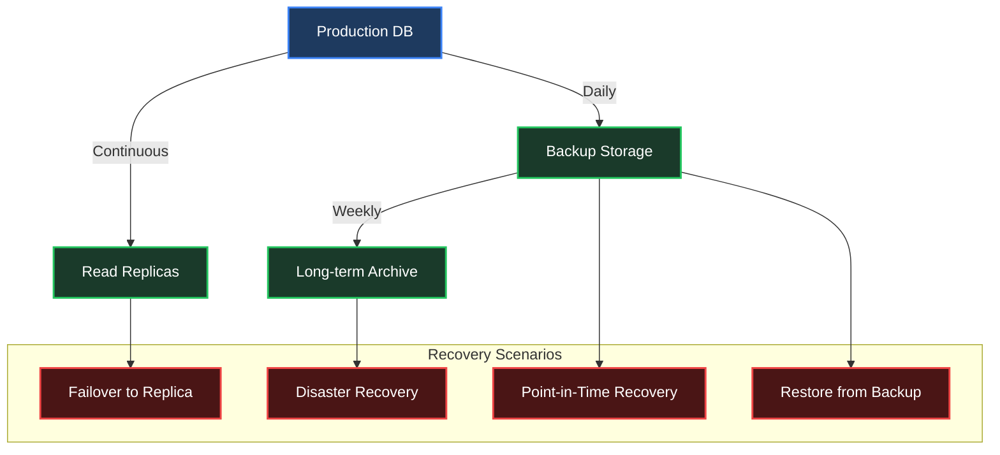
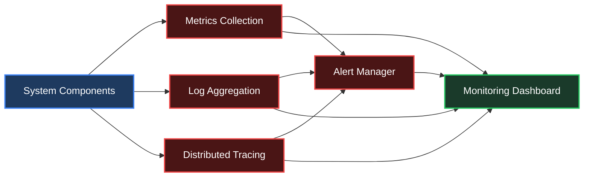
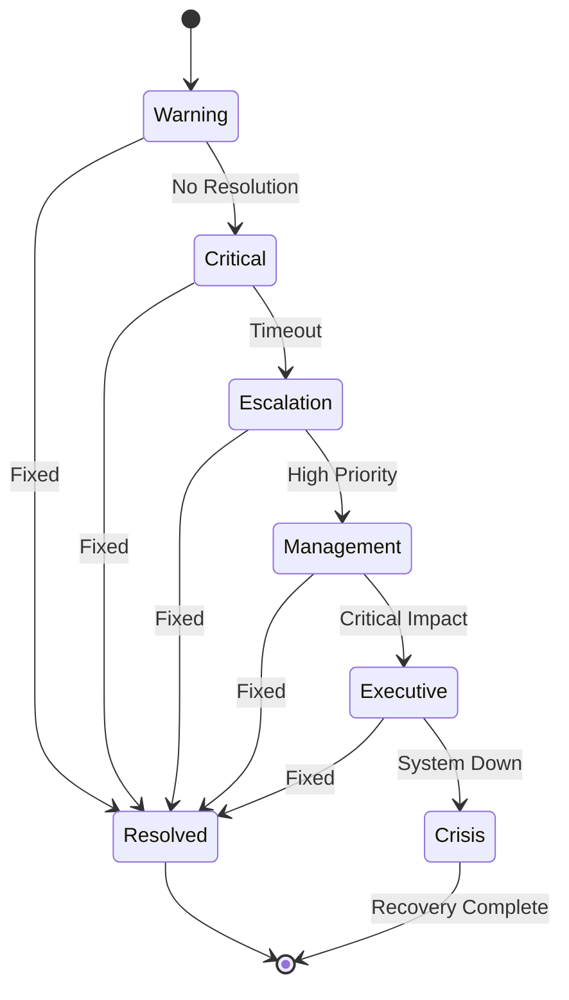

# System Resilience — Fault Tolerance & Recovery

This document outlines the resilience mechanisms built into the Postgres-based agent system, ensuring reliable operation under various failure scenarios and load conditions.

---

## 1. Error Handling & Retry Logic

The system implements comprehensive error handling with intelligent retry mechanisms.

### Retry Strategy Implementation



### Retry Configuration

```json
{
  "retry_policies": {
    "transient_errors": {
      "max_attempts": 3,
      "backoff_strategy": "exponential",
      "base_delay": 1000,  // milliseconds
      "max_delay": 30000,
      "jitter": true
    },
    "permanent_errors": {
      "max_attempts": 1,
      "notify_immediately": true
    },
    "logic_errors": {
      "max_attempts": 1,
      "escalate_to_admin": true,
      "pause_similar_tasks": true
    }
  },
  "error_classification": {
    "network_timeout": "transient",
    "service_unavailable": "transient",
    "invalid_credentials": "permanent",
    "permission_denied": "permanent",
    "data_validation_error": "logic",
    "business_rule_violation": "logic"
  }
}
```

### Circuit Breaker Pattern

```python
class CircuitBreaker:
    def __init__(self, failure_threshold=5, recovery_timeout=60):
        self.failure_count = 0
        self.failure_threshold = failure_threshold
        self.recovery_timeout = recovery_timeout
        self.state = 'CLOSED'  # CLOSED, OPEN, HALF_OPEN
        self.last_failure_time = None

    def call(self, func, *args, **kwargs):
        if self.state == 'OPEN':
            if time.time() - self.last_failure_time > self.recovery_timeout:
                self.state = 'HALF_OPEN'
            else:
                raise CircuitBreakerOpenException()

        try:
            result = func(*args, **kwargs)
            self.on_success()
            return result
        except Exception as e:
            self.on_failure()
            raise e

    def on_success(self):
        self.failure_count = 0
        self.state = 'CLOSED'

    def on_failure(self):
        self.failure_count += 1
        self.last_failure_time = time.time()
        if self.failure_count >= self.failure_threshold:
            self.state = 'OPEN'
```

---

## 2. Fault Isolation & Containment

Multi-database architecture prevents cascading failures.

### Database Failure Scenarios

| Component | Failure Impact | Recovery Time | Data Loss Risk |
|-----------|----------------|---------------|----------------|
| **routing_db** | New tasks rejected | < 5 minutes | None (replicated) |
| **agent_db** | Agent operations halt | < 10 minutes | Minimal (in-flight tasks) |
| **user_db** | User assignments fail | < 2 minutes | None |
| **audit_db** | Audit logging stops | Immediate (append-only) | None |

### Isolation Implementation

```sql
-- Database-level isolation with foreign key constraints
-- routing_db.task_entries references agent_db.agent_registry (via agent_pointer)
-- But failures in agent_db don't prevent routing_db operations

-- Graceful degradation: fallback to default agent
CREATE OR REPLACE FUNCTION get_agent_config(agent_name text)
RETURNS jsonb AS $$
DECLARE
    config jsonb;
BEGIN
    -- Try primary database
    SELECT configuration INTO config
    FROM agent_db.agent_registry
    WHERE name = agent_name;

    -- Fallback to cached/default config if agent_db unavailable
    IF config IS NULL THEN
        SELECT fallback_config INTO config
        FROM routing_db.agent_fallbacks
        WHERE agent_name = agent_name;
    END IF;

    RETURN config;
EXCEPTION
    WHEN OTHERS THEN
        -- Ultimate fallback
        RETURN '{"status": "degraded", "retry": true}'::jsonb;
END;
$$ LANGUAGE plpgsql;
```

### Bulkhead Pattern



---

## 3. Scalability & Load Handling

The system scales horizontally to handle increased load.

### Auto-Scaling Architecture



### Load Shedding Strategies

```python
class LoadShedder:
    def __init__(self, max_concurrent=100, queue_size=1000):
        self.max_concurrent = max_concurrent
        self.queue_size = queue_size
        self.semaphore = asyncio.Semaphore(max_concurrent)
        self.queue = asyncio.Queue(maxsize=queue_size)

    async def submit_task(self, task):
        if self.queue.qsize() >= self.queue_size:
            # Queue full - reject immediately
            raise SystemOverloadException("Queue full")

        await self.queue.put(task)
        # Process in background
        asyncio.create_task(self._process_queue())

    async def _process_queue(self):
        while not self.queue.empty():
            async with self.semaphore:
                task = await self.queue.get()
                try:
                    await self._execute_task(task)
                except Exception as e:
                    logger.error(f"Task failed: {e}")
                    # Continue processing other tasks
                finally:
                    self.queue.task_done()
```

### Performance Degradation Handling

```json
{
  "degradation_modes": {
    "high_load": {
      "actions": [
        "reduce_batch_sizes",
        "skip_optional_processing",
        "increase_cache_ttl",
        "enable_compression"
      ],
      "thresholds": {
        "cpu_usage": 80,
        "memory_usage": 85,
        "queue_depth": 500
      }
    },
    "memory_pressure": {
      "actions": [
        "clear_caches",
        "reduce_concurrency",
        "enable_gc_pressure_mode"
      ],
      "thresholds": {
        "memory_usage": 90,
        "gc_pause_time": 1000
      }
    },
    "network_saturation": {
      "actions": [
        "reduce_payload_sizes",
        "batch_requests",
        "enable_connection_pooling"
      ],
      "thresholds": {
        "network_io": 90,
        "connection_pool_usage": 95
      }
    }
  }
}
```

---

## 4. Security Resilience

Multiple security layers protect against attacks and breaches.

### Defense in Depth Architecture



### Incident Response



### Zero Trust Implementation

```json
{
  "zero_trust_principles": {
    "assume_breach": {
      "continuous_monitoring": true,
      "microsegmentation": true,
      "least_privilege": true
    },
    "verify_explicitly": {
      "multi_factor_auth": true,
      "device_certificates": true,
      "continuous_auth": true
    },
    "access_control": {
      "attribute_based": true,
      "context_aware": true,
      "time_based": true
    }
  }
}
```

---

## 5. Data Consistency & Recovery

Ensures data integrity across failures and concurrent operations.

### Consistency Models

| Operation Type | Consistency Level | Implementation |
|----------------|-------------------|----------------|
| **Task Creation** | Strong | ACID transactions |
| **Agent State** | Eventual | Event sourcing |
| **Audit Logs** | Strict | Append-only, immutable |
| **User Sessions** | Session | Sticky sessions |
| **Cache** | Weak | TTL-based invalidation |

### Distributed Transactions

```sql
-- Saga pattern for distributed consistency
BEGIN;

-- Step 1: Create task in routing_db
INSERT INTO routing_db.task_entries (id, status) VALUES ($1, 'created');

-- Step 2: Reserve agent in agent_db
INSERT INTO agent_db.agent_assignments (task_id, agent_id) VALUES ($1, $2);

-- Step 3: Log in audit_db
INSERT INTO audit_db.audit_log (event_type, entity_id) VALUES ('task_assigned', $1);

COMMIT;

-- Compensation actions if any step fails
-- DELETE FROM agent_db.agent_assignments WHERE task_id = $1;
-- UPDATE routing_db.task_entries SET status = 'failed' WHERE id = $1;
```

### Backup & Recovery Strategy



### Recovery Time Objectives (RTO/RPO)

| Component | RTO | RPO | Strategy |
|-----------|-----|-----|----------|
| **routing_db** | 5 minutes | 1 minute | Hot standby |
| **agent_db** | 10 minutes | 5 minutes | Warm standby |
| **user_db** | 2 minutes | 30 seconds | Active-active |
| **audit_db** | 15 minutes | 0 seconds | Append-only replication |

---

## 6. Monitoring & Alerting

Comprehensive monitoring enables proactive issue detection.

### Observability Stack



### Key Metrics & Alerts

```json
{
  "system_health": {
    "availability": {
      "metric": "uptime_percentage",
      "threshold": 99.9,
      "alert": "page_on_call"
    },
    "performance": {
      "metric": "p95_response_time",
      "threshold": 5000,
      "alert": "warn_team"
    },
    "errors": {
      "metric": "error_rate",
      "threshold": 1.0,
      "alert": "page_on_call"
    }
  },
  "business_metrics": {
    "task_completion": {
      "metric": "tasks_completed_per_hour",
      "threshold": 100,
      "alert": "notify_stakeholders"
    },
    "sla_compliance": {
      "metric": "sla_breach_percentage",
      "threshold": 5.0,
      "alert": "escalate_management"
    }
  },
  "security_metrics": {
    "failed_logins": {
      "metric": "failed_login_attempts",
      "threshold": 10,
      "alert": "security_team"
    },
    "anomalous_traffic": {
      "metric": "traffic_anomaly_score",
      "threshold": 0.8,
      "alert": "security_incident"
    }
  }
}
```

### Alert Escalation



---

## 7. Self-Healing Mechanisms

The system automatically recovers from common issues.

### Auto-Recovery Patterns

```python
class SelfHealingSystem:
    def __init__(self):
        self.health_checks = {}
        self.recovery_actions = {}

    def register_health_check(self, component, check_func, interval=60):
        self.health_checks[component] = {
            'check': check_func,
            'interval': interval,
            'last_check': 0,
            'failures': 0
        }

    def register_recovery_action(self, component, action_func, max_attempts=3):
        self.recovery_actions[component] = {
            'action': action_func,
            'max_attempts': max_attempts,
            'attempts': 0
        }

    async def monitor_and_heal(self):
        while True:
            for component, check_info in self.health_checks.items():
                if time.time() - check_info['last_check'] > check_info['interval']:
                    try:
                        healthy = await check_info['check']()
                        if healthy:
                            check_info['failures'] = 0
                            self.recovery_actions[component]['attempts'] = 0
                        else:
                            check_info['failures'] += 1
                            await self.attempt_recovery(component)
                    except Exception as e:
                        logger.error(f"Health check failed for {component}: {e}")
                        check_info['failures'] += 1
                        await self.attempt_recovery(component)

                    check_info['last_check'] = time.time()

            await asyncio.sleep(10)

    async def attempt_recovery(self, component):
        recovery = self.recovery_actions.get(component)
        if not recovery:
            return

        if recovery['attempts'] >= recovery['max_attempts']:
            logger.critical(f"Max recovery attempts reached for {component}")
            await self.escalate_to_human(component)
            return

        try:
            recovery['attempts'] += 1
            logger.info(f"Attempting recovery for {component} (attempt {recovery['attempts']})")
            await recovery['action']()
            logger.info(f"Recovery successful for {component}")
            recovery['attempts'] = 0
        except Exception as e:
            logger.error(f"Recovery failed for {component}: {e}")

    async def escalate_to_human(self, component):
        # Create high-priority task for human intervention
        await create_task({
            'type': 'system_recovery',
            'component': component,
            'priority': 'critical',
            'description': f'Automatic recovery failed for {component}'
        })
```

### Common Self-Healing Actions

| Issue Type | Detection Method | Recovery Action | Success Rate (Best case scenario) |
|------------|------------------|-----------------|--------------|
| **Service Crash** | Health check endpoint | Restart service | 95% |
| **Database Connection** | Connection pool monitoring | Reconnect with backoff | 90% |
| **Memory Leak** | Memory usage monitoring | Restart with cleanup | 85% |
| **Stale Cache** | Cache hit rate monitoring | Cache invalidation | 98% |
| **Queue Backlog** | Queue depth monitoring | Scale up workers | 92% |

---

## 8. Chaos Engineering & Resilience Testing

Proactive testing of failure scenarios.

### Chaos Experiment Framework

```python
class ChaosExperiment:
    def __init__(self, name, hypothesis, method, rollback):
        self.name = name
        self.hypothesis = hypothesis
        self.method = method
        self.rollback = rollback
        self.metrics_before = {}
        self.metrics_after = {}

    async def run(self):
        logger.info(f"Starting chaos experiment: {self.name}")
        logger.info(f"Hypothesis: {self.hypothesis}")

        # Measure baseline
        self.metrics_before = await self.collect_metrics()

        try:
            # Inject failure
            await self.method()

            # Wait for system to respond
            await asyncio.sleep(300)  # 5 minutes observation

            # Measure impact
            self.metrics_after = await self.collect_metrics()

            # Verify hypothesis
            success = await self.verify_hypothesis()

            if success:
                logger.info(f"✅ Experiment {self.name} confirmed hypothesis")
            else:
                logger.warning(f"❌ Experiment {self.name} disproved hypothesis")

        finally:
            # Always rollback
            await self.rollback()

        return {
            'experiment': self.name,
            'success': success,
            'metrics_before': self.metrics_before,
            'metrics_after': self.metrics_after
        }

# Example experiments
experiments = [
    ChaosExperiment(
        name="Database Failure",
        hypothesis="System remains operational with read-only mode during DB outage",
        method=lambda: isolate_database('routing_db'),
        rollback=lambda: restore_database('routing_db')
    ),
    ChaosExperiment(
        name="Agent Crash",
        hypothesis="Other agents continue processing when one agent fails",
        method=lambda: kill_agent_instance('tdd_agent_001'),
        rollback=lambda: restart_agent_instance('tdd_agent_001')
    ),
    ChaosExperiment(
        name="Network Partition",
        hypothesis="System maintains consistency across network failures",
        method=lambda: partition_network('agent_pool', 'database_cluster'),
        rollback=lambda: heal_network_partition()
    )
]
```

### Game Days & Failure Simulations

- **Quarterly Chaos Days:** Full-day exercises testing multiple failure scenarios
- **Automated Chaos:** Continuous small-scale experiments in production
- **Failure Injection:** Random pod kills, network delays, resource exhaustion
- **Recovery Drills:** Regular practice of disaster recovery procedures

---

This resilience framework could ensure the system can withstand failures, scale under load, and maintain security while providing self-healing capabilities and continuous monitoring. The layered approach prevents single points of failure and enables graceful degradation under adverse conditions.
